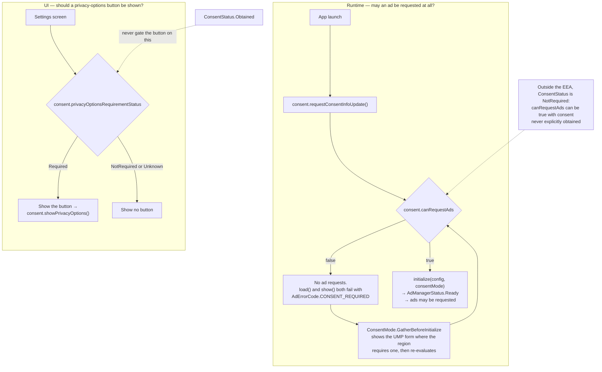

```mermaid
flowchart TD
    subgraph gate["Runtime — may an ad be requested at all?"]
        A["App launch"] --> B["consent.requestConsentInfoUpdate()"]
        B --> C{"consent.canRequestAds"}
        C -->|false| D["No ad requests.<br/>load() and show() both fail with<br/>AdErrorCode.CONSENT_REQUIRED"]
        C -->|true| E["initialize(config, consentMode)<br/>→ AdManagerStatus.Ready<br/>→ ads may be requested"]
        D --> F["ConsentMode.GatherBeforeInitialize<br/>shows the UMP form where the region<br/>requires one, then re-evaluates"]
        F --> C
    end

    subgraph ui["UI — should a privacy-options button be shown?"]
        G["Settings screen"] --> H{"consent.privacyOptionsRequirementStatus"}
        H -->|Required| I["Show the button →<br/>consent.showPrivacyOptions()"]
        H -->|NotRequired or Unknown| J["Show no button"]
    end

    X["ConsentStatus.Obtained"] -.->|never gate the button on this| H
    Y["Outside the EEA, ConsentStatus is NotRequired:<br/>canRequestAds can be true with consent<br/>never explicitly obtained"] -.-> C
```
