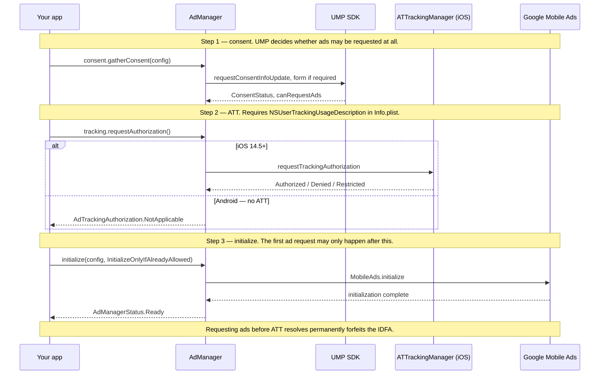

```mermaid
sequenceDiagram
    participant App as Your app
    participant Mgr as AdManager
    participant UMP as UMP SDK
    participant ATT as ATTrackingManager (iOS)
    participant GMA as Google Mobile Ads

    Note over App,GMA: Step 1 — consent. UMP decides whether ads may be requested at all.
    App->>Mgr: consent.gatherConsent(config)
    Mgr->>UMP: requestConsentInfoUpdate, form if required
    UMP-->>Mgr: ConsentStatus, canRequestAds

    Note over App,GMA: Step 2 — ATT. Requires NSUserTrackingUsageDescription in Info.plist.
    App->>Mgr: tracking.requestAuthorization()
    alt iOS 14.5+
        Mgr->>ATT: requestTrackingAuthorization
        ATT-->>Mgr: Authorized / Denied / Restricted
    else Android — no ATT
        Mgr-->>App: AdTrackingAuthorization.NotApplicable
    end

    Note over App,GMA: Step 3 — initialize. The first ad request may only happen after this.
    App->>Mgr: initialize(config, InitializeOnlyIfAlreadyAllowed)
    Mgr->>GMA: MobileAds.initialize
    GMA-->>Mgr: initialization complete
    Mgr-->>App: AdManagerStatus.Ready

    Note over App,GMA: Requesting ads before ATT resolves permanently forfeits the IDFA.
```
