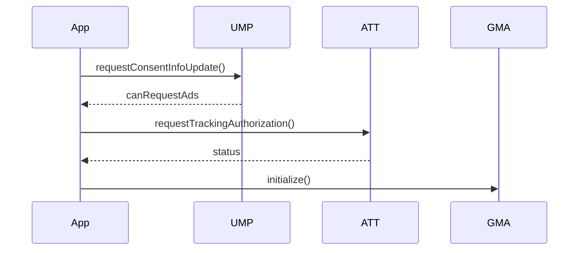

# Documentation Site Foundation Implementation Plan

> **For agentic workers:** REQUIRED SUB-SKILL: Use superpowers:subagent-driven-development (recommended) or superpowers:executing-plans to implement this plan task-by-task. Steps use checkbox (`- [ ]`) syntax for tracking.

**Goal:** Stand up `docs-site/` — an Astro + Starlight documentation site at `https://ads.avinya.dev` with the avinya.dev visual language, complete SEO plumbing, an AI-crawler-permissive `robots.txt`, `llms.txt`, build-time Mermaid SVG, a Dokka 2.2.0 API reference at `/api/`, and a Cloudflare Pages deploy workflow.

**Architecture:** A single Astro project rooted at `docs-site/` inside this repo. Starlight owns routing, search (Pagefind), and theming; `docs-site/src/styles/tokens.css` re-skins Starlight's `--sl-*` custom properties onto the avinya.dev palette. SEO extras Starlight does not emit (OG images, JSON-LD) come from a `components.Head` override backed by pure functions in `docs-site/src/lib/seo.ts`, which are unit-tested with Vitest. The Kotlin API reference is generated by the Dokka Gradle plugin in the existing Gradle build and `Sync`-copied into `docs-site/public/api/` so Astro ships it verbatim. GitHub Actions builds both halves on `macos-26` (Kotlin/Native cinterops for the iOS targets need macOS) and uploads the result to a Direct-Upload Cloudflare Pages project.

**Tech Stack:** Astro 7.1.6 · @astrojs/starlight 0.41.5 · @astrojs/sitemap 3.7.3 · starlight-llms-txt 0.11.0 · rehype-mermaid 3.0.0 + Playwright Chromium · astro-og-canvas 0.13.0 · Vitest 4.1.10 · Dokka Gradle plugin 2.2.0 · Cloudflare Pages + `cloudflare/wrangler-action@v4`

## Global Constraints

- **Docs site location:** `docs-site/` inside THIS repository. Never a separate repo.
- **Host:** `https://ads.avinya.dev` — a Cloudflare Pages project with a custom domain. Never `avinya.dev/docs/`.
- **URL shape:** landing page at `/`; documentation URLs carry **NO** `/docs/` prefix. Starlight maps `docs-site/src/content/docs/<dir>/<slug>.mdx` → `/<dir>/<slug>/`.
- **New repo URL:** `https://github.com/Meet-Miyani/admob-compose-multiplatform`. Every link, `editLink`, and `sourceLink` uses this, never `Meet-Miyani/Admob-CMP`.
- **AI crawlers are ALLOWED** on this host. `robots.txt` is permissive and Cloudflare's managed AI-crawler robots.txt must NOT be injected on this hostname.
- **Pinned versions — use exactly these, verified live 2026-07-31.** Write them into `package.json` without `^` or `~`:
  - `astro` 7.1.6
  - `@astrojs/starlight` 0.41.5
  - `@astrojs/sitemap` 3.7.3
  - `starlight-llms-txt` 0.11.0
  - `rehype-mermaid` 3.0.0
  - `astro-og-canvas` 0.13.0
  - `playwright` 1.62.1
  - `vitest` 4.1.10
  - Dokka Gradle plugin 2.2.0
- **Scaffold command:** `npm create astro@latest -- --template starlight`.
- **Dokka:** task `dokkaGenerate`, HTML output at `build/dokka/html`. The plugin is applied to each documented subproject — `admob-cmp`, `admob-cmp-core`, `admob-cmp-compose` — with aggregation declared in the root build.
- **Frozen ABI.** `explicitApi()` and `abiValidation` are on for `admob-cmp-core` and `admob-cmp-compose`. Dokka must not change the published API surface and `checkKotlinAbi` must keep passing. Invariant 12 in `admob-cmp/CLAUDE.md` holds.
- **Kotlin toolchain is pinned at 2.3.20 / AGP 9.2.1 / Gradle 9.4.1.** Do not bump any of them.
- **Node:** `>=22.12.0` (Astro 7 engine requirement). CI uses `node-version: "22"`.
- **Trademark line** appears in the site footer and in `llms.txt` `details`: “Not affiliated with or endorsed by Google. AdMob and Google Mobile Ads are trademarks of Google LLC.”
- **Shared file-path contract — other plans depend on these EXACT paths. Do not rename them:**
  ```
  docs-site/astro.config.mjs
  docs-site/src/content/docs/**              all doc pages (Plan 3)
  docs-site/src/components/diagrams/*.astro  Plan 4 produces, Plans 3 & 5 consume
  docs-site/src/components/landing/*.astro   Plan 5
  docs-site/src/assets/screenshots/**        Plan 7
  docs-site/src/styles/tokens.css            THIS plan produces; all other plans consume
  ```
- **`tokens.css` exports exactly these 19 custom properties.** Plans 4 and 5 style against them; never rename one:
  `--admob-paper` `--admob-surface` `--admob-code` `--admob-ink` `--admob-slate` `--admob-hair` `--admob-accent` `--admob-accent-contrast` `--admob-accent-soft` `--admob-font-display` `--admob-font-body` `--admob-font-mono` `--admob-tracking-tight` `--admob-tracking-tighter` `--admob-radius` `--admob-radius-lg` `--admob-border` `--admob-shadow` `--admob-content-max`
- **CI conventions to match** (`.github/workflows/release-readiness.yml`, `publish.yml`): `actions/checkout@v6`, `actions/setup-java@v5` with `distribution: temurin` / `java-version: "17"`, `gradle/actions/setup-gradle@v6`, `runs-on: macos-26` for anything touching iOS targets, an explicit “Assert Xcode 26” step on macOS runners, a `concurrency:` block, and `permissions:` scoped to the minimum.
- **Prerequisite:** Plan 1 must have landed. The GitHub repo must already be renamed to `admob-compose-multiplatform` and the `avinya.dev` canonical defect (spec §5) must already be fixed, or this site's outbound links feed authority to a hostname that disavows itself.

---

## File Structure

| Path | Responsibility |
|---|---|
| `docs-site/package.json` | Pinned dependency set and the `dev` / `build` / `preview` / `test` / `verify` / `check:overflow` scripts. |
| `docs-site/astro.config.mjs` | The single site configuration: `site`, markdown pipeline, sitemap, Starlight (IA, theming, plugins, Head override). |
| `docs-site/tsconfig.json` | Extends `astro/tsconfigs/strict`. |
| `docs-site/src/content.config.ts` | Starlight `docs` collection, extended with the `faq` frontmatter field that drives `FAQPage` JSON-LD. |
| `docs-site/src/styles/tokens.css` | `@font-face` declarations + the 19 `--admob-*` tokens + the `--sl-*` remapping. Consumed by Plans 3, 4, 5. |
| `docs-site/src/styles/mermaid.css` | Theme-aware overrides for the inline Mermaid SVGs. |
| `docs-site/src/lib/seo.ts` | Pure JSON-LD builders and the OG image path helper. Unit-tested. |
| `docs-site/src/components/Head.astro` | Starlight `components.Head` override — adds OG images and JSON-LD on top of Starlight's defaults. |
| `docs-site/src/pages/og/[...route].ts` | Generates one 1200×630 OG card per docs page. |
| `docs-site/src/content/docs/**` | 24 stub pages matching the spec §8 IA, plus the landing placeholder. Plan 3 rewrites the bodies; the paths are frozen here. |
| `docs-site/public/robots.txt` | Permissive, AI-crawler-friendly, with an explicit permissive `Content-Signal` line. |
| `docs-site/public/fonts/*.woff2` | Seven self-hosted fonts lifted from avinya.dev. |
| `docs-site/public/favicon.svg`, `docs-site/src/assets/logo.svg` | Brand mark. |
| `docs-site/functions/_middleware.js` | Cloudflare Pages Function: 301s `admob-cmp-docs.pages.dev` → `ads.avinya.dev`, `noindex`es branch previews. Prevents repeating the spec §5 duplicate-host defect. |
| `docs-site/scripts/verify-build.mjs` | Asserts the built `dist/` emits sitemap, robots, llms, canonical, OG, and JSON-LD correctly. |
| `docs-site/scripts/check-overflow.mjs` | Playwright check: no horizontal overflow at 375 px on every built page. |
| `docs-site/test/seo.test.ts` | Vitest unit tests for `src/lib/seo.ts`. |
| `build.gradle.kts` (root) | Applies Dokka, declares aggregation, registers `syncApiDocsToDocsSite`. |
| `admob-cmp/build.gradle.kts`, `admob-cmp-core/build.gradle.kts`, `admob-cmp-compose/build.gradle.kts` | Apply Dokka; pin the vanniktech publication so Dokka cannot change published artifacts. |
| `gradle/libs.versions.toml` | `dokka` plugin alias. |
| `.github/workflows/docs-site.yml` | Build + verify + deploy. |
| `.gitignore` | Ignores `docs-site/dist/`, `docs-site/.astro/`, `docs-site/public/api/`. |

---

### Task 1: Scaffold `docs-site/` with pinned dependencies

**Files:**
- Create: `docs-site/package.json`
- Create: `docs-site/tsconfig.json`
- Create: `docs-site/astro.config.mjs`
- Create: `docs-site/src/content.config.ts`
- Create: `docs-site/src/content/docs/index.mdx`
- Modify: `.gitignore`

**Interfaces:**
- Produces: an installable, buildable Astro project at `docs-site/`. `npm run build` (run from `docs-site/`) writes `docs-site/dist/`. Every later task in this plan runs its npm commands from `docs-site/`.
- Produces: the constants `SITE = 'https://ads.avinya.dev'`, `REPO = 'https://github.com/Meet-Miyani/admob-compose-multiplatform'`, `SITE_TITLE = 'AdMob CMP'` inside `astro.config.mjs`.

- [ ] **Step 1: Scaffold with the official template**

Run from the repository root. `--no-git` matters: this is already a git repo.

```bash
cd /Users/meetmiyani/Documents/MeetMiyani/MEET/AdmobCMP
npm create astro@latest docs-site -- --template starlight --no-install --no-git --skip-houston --typescript strict --yes
```

Expected: `docs-site/` now exists containing `package.json`, `astro.config.mjs`, `src/content.config.ts`, `src/content/docs/index.mdx`, `public/favicon.svg`.

- [ ] **Step 2: Replace `package.json` with the pinned set**

Overwrite `docs-site/package.json` entirely. Versions are exact — no `^`, no `~`.

```json
{
  "name": "admob-cmp-docs",
  "type": "module",
  "private": true,
  "version": "0.0.0",
  "engines": {
    "node": ">=22.12.0"
  },
  "scripts": {
    "dev": "astro dev",
    "build": "astro build",
    "preview": "astro preview",
    "astro": "astro",
    "test": "vitest run",
    "verify": "node scripts/verify-build.mjs",
    "check:overflow": "node scripts/check-overflow.mjs"
  },
  "dependencies": {
    "@astrojs/sitemap": "3.7.3",
    "@astrojs/starlight": "0.41.5",
    "astro": "7.1.6",
    "astro-og-canvas": "0.13.0",
    "rehype-mermaid": "3.0.0",
    "starlight-llms-txt": "0.11.0"
  },
  "devDependencies": {
    "playwright": "1.62.1",
    "vitest": "4.1.10"
  }
}
```

- [ ] **Step 3: Write `tsconfig.json`**

Overwrite `docs-site/tsconfig.json`:

```json
{
  "extends": "astro/tsconfigs/strict",
  "include": [".astro/types.d.ts", "**/*"],
  "exclude": ["dist"]
}
```

- [ ] **Step 4: Write the minimal `astro.config.mjs`**

Overwrite `docs-site/astro.config.mjs`. Task 3 replaces this with the full configuration; this version only has to build.

```js
// @ts-check
import { defineConfig } from 'astro/config';
import starlight from '@astrojs/starlight';

const SITE = 'https://ads.avinya.dev';
const SITE_TITLE = 'AdMob CMP';

export default defineConfig({
  site: SITE,
  build: { format: 'directory' },
  integrations: [
    starlight({
      title: SITE_TITLE,
      description:
        'Plug-and-play AdMob for Compose Multiplatform: banner, interstitial, rewarded, app-open and native ads with UMP consent on Android and iOS.',
    }),
  ],
});
```

- [ ] **Step 5: Write `src/content.config.ts`**

Overwrite `docs-site/src/content.config.ts`:

```ts
import { defineCollection } from 'astro:content';
import { docsLoader } from '@astrojs/starlight/loaders';
import { docsSchema } from '@astrojs/starlight/schema';

export const collections = {
  docs: defineCollection({ loader: docsLoader(), schema: docsSchema() }),
};
```

- [ ] **Step 6: Write the landing placeholder**

Overwrite `docs-site/src/content/docs/index.mdx`. Plan 5 replaces the body with the real landing page; the frontmatter contract established here (`template: splash`, the `head` override that flips `og:type` to `website`) must survive.

```mdx
---
title: AdMob CMP
description: Plug-and-play AdMob for Compose Multiplatform — banner, interstitial, rewarded, app-open and native ads with UMP consent on Android and iOS.
template: splash
hero:
  tagline: One Kotlin API for six AdMob formats on Android and iOS, with UMP consent wired into the init flow.
  actions:
    - text: Quickstart
      link: /start/quickstart/
      icon: right-arrow
    - text: View on GitHub
      link: https://github.com/Meet-Miyani/admob-compose-multiplatform
      icon: external
      variant: minimal
head:
  - tag: meta
    attrs:
      property: og:type
      content: website
---

Plan 5 replaces this page with the full landing page. The frontmatter above is the
contract: `template: splash`, the two hero actions, and the `og:type` override that
stops Starlight declaring the home page an `article`.

Not affiliated with or endorsed by Google. AdMob and Google Mobile Ads are trademarks of Google LLC.
```

- [ ] **Step 7: Ignore the generated directories**

Append to `/Users/meetmiyani/Documents/MeetMiyani/MEET/AdmobCMP/.gitignore`:

```gitignore

# docs-site (Astro + Starlight)
docs-site/dist/
docs-site/.astro/
docs-site/public/api/
```

`node_modules/` is already ignored by the existing entry.

- [ ] **Step 8: Install and build**

```bash
cd /Users/meetmiyani/Documents/MeetMiyani/MEET/AdmobCMP/docs-site
npm install
npm run build
```

Expected: `npm install` writes `docs-site/package-lock.json`; `npm run build` finishes with `Complete!` and no errors.

- [ ] **Step 9: Verify the build output**

```bash
cd /Users/meetmiyani/Documents/MeetMiyani/MEET/AdmobCMP/docs-site
test -f dist/index.html && echo "INDEX OK"
grep -c 'rel="canonical" href="https://ads.avinya.dev/"' dist/index.html
```

Expected: `INDEX OK` then `1`.

- [ ] **Step 10: Commit**

```bash
cd /Users/meetmiyani/Documents/MeetMiyani/MEET/AdmobCMP
git add .gitignore docs-site
git commit -m "feat(docs-site): scaffold Starlight with pinned dependencies"
```

---

### Task 2: Design tokens — port the avinya.dev visual language

**Files:**
- Create: `docs-site/public/fonts/space-grotesk-500.woff2`, `space-grotesk-600.woff2`, `inter-400.woff2`, `inter-500.woff2`, `inter-600.woff2`, `jetbrains-mono-400.woff2`, `jetbrains-mono-500.woff2`
- Create: `docs-site/src/styles/tokens.css`
- Create: `docs-site/src/assets/logo.svg`
- Create: `docs-site/public/favicon.svg`
- Modify: `docs-site/astro.config.mjs`

**Interfaces:**
- Consumes: the buildable project from Task 1.
- Produces: `docs-site/src/styles/tokens.css` exporting exactly the 19 `--admob-*` properties listed in Global Constraints, in both the light and dark Starlight themes. Plans 4 and 5 style against these names.
- Produces: `docs-site/src/assets/logo.svg` (32×32 viewBox) and `docs-site/public/favicon.svg`.

- [ ] **Step 1: Self-host the fonts**

The seven woff2 files are the exact ones avinya.dev serves. Byte sizes are the verified `content-length` values — the check in Step 2 fails loudly if a download is truncated.

```bash
cd /Users/meetmiyani/Documents/MeetMiyani/MEET/AdmobCMP/docs-site
mkdir -p public/fonts
for f in space-grotesk-500 space-grotesk-600 inter-400 inter-500 inter-600 jetbrains-mono-400 jetbrains-mono-500; do
  curl -sSL --fail --max-time 60 "https://avinya.dev/fonts/$f.woff2" -o "public/fonts/$f.woff2"
done
```

- [ ] **Step 2: Verify the font byte sizes**

```bash
cd /Users/meetmiyani/Documents/MeetMiyani/MEET/AdmobCMP/docs-site
wc -c public/fonts/*.woff2
```

Expected, exactly:

```
   23664 public/fonts/inter-400.woff2
   24272 public/fonts/inter-500.woff2
   24452 public/fonts/inter-600.woff2
   21168 public/fonts/jetbrains-mono-400.woff2
   21832 public/fonts/jetbrains-mono-500.woff2
   13312 public/fonts/space-grotesk-500.woff2
   13284 public/fonts/space-grotesk-600.woff2
```

- [ ] **Step 3: Write `src/styles/tokens.css`**

Create `docs-site/src/styles/tokens.css`. Starlight's own properties live in `@layer starlight.base`; this file is unlayered, so every rule here wins regardless of specificity. Starlight's `ThemeProvider` stamps `data-theme` on `<html>` from an inline script before first paint, so there is no flash.

```css
/* docs-site/src/styles/tokens.css
 *
 * The avinya.dev visual language, ported to Starlight.
 *
 * PUBLIC CONTRACT — Plans 4 (diagrams) and 5 (landing page) style against these
 * 19 custom properties. Do not rename one without updating those plans:
 *
 *   --admob-paper --admob-surface --admob-code --admob-ink --admob-slate
 *   --admob-hair --admob-accent --admob-accent-contrast --admob-accent-soft
 *   --admob-font-display --admob-font-body --admob-font-mono
 *   --admob-tracking-tight --admob-tracking-tighter
 *   --admob-radius --admob-radius-lg --admob-border --admob-shadow
 *   --admob-content-max
 *
 * This file is unlayered on purpose: Starlight ships its properties inside
 * `@layer starlight.base`, and unlayered author rules beat layered ones.
 */

/* ------------------------------------------------------------------ fonts */

@font-face {
  font-family: 'Space Grotesk';
  font-style: normal;
  font-weight: 500;
  font-display: swap;
  src: url('/fonts/space-grotesk-500.woff2') format('woff2');
}
@font-face {
  font-family: 'Space Grotesk';
  font-style: normal;
  font-weight: 600;
  font-display: swap;
  src: url('/fonts/space-grotesk-600.woff2') format('woff2');
}
@font-face {
  font-family: 'Inter';
  font-style: normal;
  font-weight: 400;
  font-display: swap;
  src: url('/fonts/inter-400.woff2') format('woff2');
}
@font-face {
  font-family: 'Inter';
  font-style: normal;
  font-weight: 500;
  font-display: swap;
  src: url('/fonts/inter-500.woff2') format('woff2');
}
@font-face {
  font-family: 'Inter';
  font-style: normal;
  font-weight: 600;
  font-display: swap;
  src: url('/fonts/inter-600.woff2') format('woff2');
}
@font-face {
  font-family: 'JetBrains Mono';
  font-style: normal;
  font-weight: 400;
  font-display: swap;
  src: url('/fonts/jetbrains-mono-400.woff2') format('woff2');
}
@font-face {
  font-family: 'JetBrains Mono';
  font-style: normal;
  font-weight: 500;
  font-display: swap;
  src: url('/fonts/jetbrains-mono-500.woff2') format('woff2');
}

/* ------------------------------------------------- tokens: dark (default) */
/* Starlight's bare `:root` IS the dark theme. Values lifted verbatim from
   avinya.dev's `[data-theme=dark]` block. */

:root,
:root[data-theme='dark'] {
  --admob-paper: #0e0f10;
  --admob-surface: #171819;
  --admob-code: #161719;
  --admob-ink: #edeeec;
  --admob-slate: #9a9f9c;
  --admob-hair: #2a2c2e;
  --admob-accent: #ee3a20;
  --admob-accent-contrast: #ffffff;
  --admob-accent-soft: rgba(238, 58, 32, 0.18);
}

/* ------------------------------------------------------- tokens: light */
/* Values lifted verbatim from avinya.dev's `:root` block. */

:root[data-theme='light'] {
  --admob-paper: #f3f4f2;
  --admob-surface: #ebecea;
  --admob-code: #edeeec;
  --admob-ink: #16181a;
  --admob-slate: #5a5f63;
  --admob-hair: #d8dad6;
  --admob-accent: #ee3a20;
  --admob-accent-contrast: #ffffff;
  --admob-accent-soft: rgba(238, 58, 32, 0.12);
}

/* -------------------------------------------- tokens: theme-independent */

:root {
  --admob-font-display: 'Space Grotesk', system-ui, sans-serif;
  --admob-font-body: 'Inter', system-ui, sans-serif;
  --admob-font-mono: 'JetBrains Mono', ui-monospace, SFMono-Regular, Menlo, monospace;
  --admob-tracking-tight: -0.02em;
  --admob-tracking-tighter: -0.04em;
  --admob-radius: 10px;
  --admob-radius-lg: 18px;
  --admob-border: 1px solid var(--admob-hair);
  --admob-shadow: 0 1px 2px rgba(0, 0, 0, 0.06), 0 8px 24px rgba(0, 0, 0, 0.08);
  --admob-content-max: 72rem;
}

/* ------------------------------------------- remap Starlight onto tokens */

:root,
:root[data-theme='dark'] {
  --sl-color-white: #f7f8f6;
  --sl-color-gray-1: #edeeec;
  --sl-color-gray-2: #c9ccc8;
  --sl-color-gray-3: #9a9f9c;
  --sl-color-gray-4: #6b706d;
  --sl-color-gray-5: #3d4042;
  --sl-color-gray-6: #171819;
  --sl-color-black: #0e0f10;

  --sl-color-accent: #ee3a20;
  --sl-color-accent-high: #ff9a88;
  --sl-color-accent-low: #4a150c;
  --sl-color-text-accent: var(--sl-color-accent-high);
  --sl-color-text-invert: var(--admob-paper);

  --sl-color-bg: var(--admob-paper);
  --sl-color-bg-nav: var(--admob-surface);
  --sl-color-bg-sidebar: var(--admob-paper);
  --sl-color-bg-inline-code: var(--admob-code);
  --sl-color-hairline: var(--admob-hair);
  --sl-color-hairline-light: var(--admob-hair);
  --sl-color-hairline-shade: var(--admob-hair);
}

:root[data-theme='light'] {
  --sl-color-white: #0b0c0d;
  --sl-color-gray-1: #16181a;
  --sl-color-gray-2: #2e3134;
  --sl-color-gray-3: #5a5f63;
  --sl-color-gray-4: #878c8f;
  --sl-color-gray-5: #d8dad6;
  --sl-color-gray-6: #ebecea;
  --sl-color-gray-7: #f3f4f2;
  --sl-color-black: #ffffff;

  --sl-color-accent: #ee3a20;
  --sl-color-accent-high: #9e2411;
  --sl-color-accent-low: #fbdcd6;
  /* #ee3a20 on #f3f4f2 is only ~3.5:1. Link text uses the darker ramp step. */
  --sl-color-text-accent: var(--sl-color-accent-high);
  --sl-color-text-invert: #ffffff;

  --sl-color-bg: var(--admob-paper);
  --sl-color-bg-nav: var(--admob-surface);
  --sl-color-bg-sidebar: var(--admob-paper);
  --sl-color-bg-inline-code: var(--admob-code);
  --sl-color-hairline: var(--admob-hair);
  --sl-color-hairline-light: var(--admob-hair);
  --sl-color-hairline-shade: var(--admob-hair);
}

:root {
  --sl-font: var(--admob-font-body);
  --sl-font-mono: var(--admob-font-mono);
  --sl-content-width: 48rem;
}

/* ------------------------------------------------------------ typography */

h1,
h2,
h3,
h4,
h5,
h6,
.site-title {
  font-family: var(--admob-font-display);
  font-weight: 600;
  letter-spacing: var(--admob-tracking-tight);
}

h1 {
  letter-spacing: var(--admob-tracking-tighter);
}

::selection {
  background: var(--admob-accent);
  color: var(--admob-accent-contrast);
}

:focus-visible {
  outline: 2px solid var(--admob-accent);
  outline-offset: 3px;
  border-radius: 2px;
}

/* Wide content must scroll inside its own box — the page body must never
   scroll horizontally. `scripts/check-overflow.mjs` enforces this. */
.sl-markdown-content table,
.sl-markdown-content pre {
  display: block;
  max-width: 100%;
  overflow-x: auto;
}

.sl-markdown-content img,
.sl-markdown-content svg {
  max-width: 100%;
  height: auto;
}
```

- [ ] **Step 4: Write the brand mark**

Create `docs-site/src/assets/logo.svg`:

```svg
<svg xmlns="http://www.w3.org/2000/svg" viewBox="0 0 32 32" width="32" height="32" role="img" aria-label="AdMob CMP">
  <rect width="32" height="32" rx="8" fill="#ee3a20"/>
  <path d="M9 23 16 9l7 14" fill="none" stroke="#ffffff" stroke-width="2.6" stroke-linecap="round" stroke-linejoin="round"/>
  <path d="M12.2 18.4h7.6" fill="none" stroke="#ffffff" stroke-width="2.6" stroke-linecap="round"/>
</svg>
```

Copy it to the favicon slot, overwriting the template's file:

```bash
cd /Users/meetmiyani/Documents/MeetMiyani/MEET/AdmobCMP/docs-site
cp src/assets/logo.svg public/favicon.svg
```

- [ ] **Step 5: Wire the stylesheet, logo, favicon and font preloads into the config**

In `docs-site/astro.config.mjs`, replace the whole `starlight({ ... })` call with:

```js
    starlight({
      title: SITE_TITLE,
      description:
        'Plug-and-play AdMob for Compose Multiplatform: banner, interstitial, rewarded, app-open and native ads with UMP consent on Android and iOS.',
      logo: { src: './src/assets/logo.svg', alt: 'AdMob CMP' },
      favicon: '/favicon.svg',
      customCss: ['./src/styles/tokens.css'],
      head: [
        {
          tag: 'link',
          attrs: {
            rel: 'preload',
            href: '/fonts/space-grotesk-600.woff2',
            as: 'font',
            type: 'font/woff2',
            crossorigin: 'anonymous',
          },
        },
        {
          tag: 'link',
          attrs: {
            rel: 'preload',
            href: '/fonts/inter-400.woff2',
            as: 'font',
            type: 'font/woff2',
            crossorigin: 'anonymous',
          },
        },
        { tag: 'meta', attrs: { name: 'theme-color', content: '#0e0f10' } },
      ],
    }),
```

- [ ] **Step 6: Build and verify the tokens reach the output**

```bash
cd /Users/meetmiyani/Documents/MeetMiyani/MEET/AdmobCMP/docs-site
npm run build
grep -rl -- '--admob-paper' dist/_astro/*.css | head -1
grep -o -- '--admob-[a-z-]*' dist/_astro/*.css | sort -u | wc -l
grep -c 'space-grotesk-600.woff2' dist/index.html
```

Expected: one CSS file path printed, then `19`, then `1`.

- [ ] **Step 7: Confirm both themes carry every token**

```bash
cd /Users/meetmiyani/Documents/MeetMiyani/MEET/AdmobCMP/docs-site
grep -o "data-theme='light'\|data-theme=\"light\"\|\[data-theme=light\]" dist/_astro/*.css | head -1
grep -c '#f3f4f2' dist/_astro/*.css
grep -c '#0e0f10' dist/_astro/*.css
```

Expected: a light-theme selector printed, then a non-zero count for each colour.

- [ ] **Step 8: Commit**

```bash
cd /Users/meetmiyani/Documents/MeetMiyani/MEET/AdmobCMP
git add docs-site
git commit -m "feat(docs-site): port the avinya.dev design tokens and self-hosted fonts"
```

---

### Task 3: Full `astro.config.mjs` — information architecture, sitemap, search

**Files:**
- Modify: `docs-site/astro.config.mjs`
- Create: `docs-site/src/content/docs/start/{what-is-admob-cmp,quickstart,installation,android-setup,ios-setup}.mdx`
- Create: `docs-site/src/content/docs/formats/{banner,interstitial,rewarded,app-open,native}.mdx`
- Create: `docs-site/src/content/docs/privacy/{consent,app-tracking-transparency,play-data-safety}.mdx`
- Create: `docs-site/src/content/docs/advanced/{mediation,revenue-events,caching-retry-timeouts,test-safety}.mdx`
- Create: `docs-site/src/content/docs/reference/{architecture,compatibility,troubleshooting,changelog}.mdx`
- Create: `docs-site/src/content/docs/project/{roadmap,contributing,ai-agents}.mdx`

**Interfaces:**
- Consumes: `tokens.css` from Task 2.
- Produces: 24 stub content files at the exact paths above. **Plan 3 rewrites their bodies but must not move or rename them** — the sidebar, the OG route, and the sitemap all key off these slugs.
- Produces: `/sitemap-index.xml` + `/sitemap-0.xml` at build time, and a Pagefind index under `dist/pagefind/`.

- [ ] **Step 1: Generate the 24 IA stubs**

Every stub carries a real `title` and a real `description` — the description feeds OG cards, `llms.txt`, and the sitemap-adjacent metadata, so it must never be empty. Run from `docs-site/`:

```bash
cd /Users/meetmiyani/Documents/MeetMiyani/MEET/AdmobCMP/docs-site
mkdir -p src/content/docs/{start,formats,privacy,advanced,reference,project}

write_stub() {
  local path="$1"; local title="$2"; local desc="$3"
  cat > "src/content/docs/$path.mdx" <<EOF
---
title: $title
description: $desc
---

Plan 3 writes this page. Target length is 800–1,500 words with worked examples,
question-based H2s, and explicit cross-links. The file path and the frontmatter
\`title\` / \`description\` above are fixed by Plan 2 — the sidebar, the sitemap and
the generated OpenGraph card all key off them.
EOF
}

write_stub start/what-is-admob-cmp "What is AdMob CMP?" "What AdMob CMP is, when to reach for it, and what it deliberately does not do."
write_stub start/quickstart "Quickstart" "Render your first AdMob test ad in a Compose Multiplatform app in five minutes."
write_stub start/installation "Installation" "Add AdMob CMP with Gradle, a version catalog, and the dev.avinya.ads.admob-cmp Gradle plugin."
write_stub start/android-setup "Android setup" "Manifest entries, the AD_ID permission, and the Play Data safety declaration for Android."
write_stub start/ios-setup "iOS setup" "Swift Package Manager, Info.plist, ATT, JavaScriptCore, and the doctorIos diagnostic."
write_stub formats/banner "Banner ads" "Adaptive banner sizes, collapsible banners, refresh, and how banner geometry is resolved."
write_stub formats/interstitial "Interstitial ads" "Loading, showing, caching, and retrying full-screen interstitial ads."
write_stub formats/rewarded "Rewarded ads" "Rewarded and rewarded interstitial ads, reward callbacks, and load/show sequencing."
write_stub formats/app-open "App-open ads" "AppOpenAdCoordinator, cooldowns, and blocking rules for app-open ads."
write_stub formats/native "Native ads" "The adLayout DSL, ad pooling, availableAds accounting, and media info for native ads."
write_stub privacy/consent "UMP consent" "UMP consent modes, the privacy options form, and canRequestAds in the initialization flow."
write_stub privacy/app-tracking-transparency "App Tracking Transparency" "The required iOS ordering: consent, then ATT, then initialize."
write_stub privacy/play-data-safety "Play Data safety" "How to fill in the Google Play Data safety declaration for an app using AdMob CMP."
write_stub advanced/mediation "Mediation" "Wiring mediation adapters and the initialization hooks AdMob CMP exposes for them."
write_stub advanced/revenue-events "Revenue and paid events" "AdValue, ResponseInfo, and consuming paid events for revenue analytics."
write_stub advanced/caching-retry-timeouts "Caching, retry and timeouts" "The TTL'd FIFO cache, generation counters, retry backoff, and load timeouts."
write_stub advanced/test-safety "Test safety" "testMode versus strictTestMode, and how AdMob CMP stops test ads reaching production."
write_stub reference/architecture "Architecture" "Module map, threading model, and the ad state machines behind AdMob CMP."
write_stub reference/compatibility "Compatibility matrix" "Supported Kotlin, Compose Multiplatform, Android minSdk and iOS deployment targets."
write_stub reference/troubleshooting "Troubleshooting" "Symptom to cause to fix, including undefined GAD symbols when linking Kotlin/Native iOS tests."
write_stub reference/changelog "Changelog" "Release history for dev.avinya.ads:admob-cmp."
write_stub project/roadmap "Roadmap" "What is planned, what is gated on upstream work, and why no dates are promised."
write_stub project/contributing "Contributing" "How to build, test, and propose changes to AdMob CMP."
write_stub project/ai-agents "Using with AI agents" "AGENTS.md, llms.txt, and how to point a coding assistant at AdMob CMP."

ls -1 src/content/docs/*/*.mdx | wc -l
```

Expected final line: `24`.

- [ ] **Step 2: Write the full `astro.config.mjs`**

Overwrite `docs-site/astro.config.mjs` completely. Tasks 4, 6 and 7 extend this file; the structure below is what they edit.

```js
// @ts-check
import { defineConfig } from 'astro/config';
import starlight from '@astrojs/starlight';
import sitemap from '@astrojs/sitemap';

/**
 * Canonical origin. `site` MUST be the custom domain, never the *.pages.dev
 * preview host — that mistake is exactly the defect documented in spec §5 for
 * the studio site, and `functions/_middleware.js` is the second line of defence.
 */
const SITE = 'https://ads.avinya.dev';
const REPO = 'https://github.com/Meet-Miyani/admob-compose-multiplatform';
const SITE_TITLE = 'AdMob CMP';
const SITE_DESCRIPTION =
  'Plug-and-play AdMob for Compose Multiplatform: banner, interstitial, rewarded, app-open and native ads with UMP consent on Android and iOS.';

export default defineConfig({
  site: SITE,
  build: { format: 'directory' },
  integrations: [
    starlight({
      title: SITE_TITLE,
      description: SITE_DESCRIPTION,
      logo: { src: './src/assets/logo.svg', alt: 'AdMob CMP' },
      favicon: '/favicon.svg',
      credits: false,
      pagefind: true,
      lastUpdated: true,
      tableOfContents: { minHeadingLevel: 2, maxHeadingLevel: 3 },
      social: [{ icon: 'github', label: 'GitHub', href: REPO }],
      // Starlight appends the entry path relative to the Astro project root,
      // which is `docs-site/`, so the base URL has to include that segment.
      editLink: { baseUrl: `${REPO}/edit/master/docs-site/` },
      customCss: ['./src/styles/tokens.css'],
      expressiveCode: {
        useStarlightUiThemeColors: true,
        useStarlightDarkModeSwitch: true,
        styleOverrides: {
          borderRadius: 'var(--admob-radius)',
          codeFontFamily: 'var(--admob-font-mono)',
          uiFontFamily: 'var(--admob-font-body)',
        },
      },
      head: [
        {
          tag: 'link',
          attrs: {
            rel: 'preload',
            href: '/fonts/space-grotesk-600.woff2',
            as: 'font',
            type: 'font/woff2',
            crossorigin: 'anonymous',
          },
        },
        {
          tag: 'link',
          attrs: {
            rel: 'preload',
            href: '/fonts/inter-400.woff2',
            as: 'font',
            type: 'font/woff2',
            crossorigin: 'anonymous',
          },
        },
        { tag: 'meta', attrs: { name: 'theme-color', content: '#0e0f10' } },
      ],
      // Information architecture — spec §8. Every path segment is a keyword and
      // there is deliberately no `/docs/` prefix.
      sidebar: [
        {
          label: 'Start here',
          items: [
            { slug: 'start/what-is-admob-cmp' },
            { slug: 'start/quickstart' },
            { slug: 'start/installation' },
            { slug: 'start/android-setup' },
            { slug: 'start/ios-setup' },
          ],
        },
        {
          label: 'Ad formats',
          items: [
            { slug: 'formats/banner' },
            { slug: 'formats/interstitial' },
            { slug: 'formats/rewarded' },
            { slug: 'formats/app-open' },
            { slug: 'formats/native' },
          ],
        },
        {
          label: 'Privacy and consent',
          items: [
            { slug: 'privacy/consent' },
            { slug: 'privacy/app-tracking-transparency' },
            { slug: 'privacy/play-data-safety' },
          ],
        },
        {
          label: 'Advanced',
          items: [
            { slug: 'advanced/mediation' },
            { slug: 'advanced/revenue-events' },
            { slug: 'advanced/caching-retry-timeouts' },
            { slug: 'advanced/test-safety' },
          ],
        },
        {
          label: 'Reference',
          items: [
            { slug: 'reference/architecture' },
            { slug: 'reference/compatibility' },
            { slug: 'reference/troubleshooting' },
            { slug: 'reference/changelog' },
            {
              label: 'API reference (Dokka)',
              link: '/api/',
              attrs: { target: '_blank', rel: 'noopener' },
            },
          ],
        },
        {
          label: 'Project',
          items: [
            { slug: 'project/roadmap' },
            { slug: 'project/contributing' },
            { slug: 'project/ai-agents' },
          ],
        },
      ],
    }),
    sitemap({
      // `/og/*.png` are image endpoints, not pages. `/api/**` is a generated
      // Dokka dump copied in via `public/`; only its entry point is listed.
      filter: (page) => !page.includes('/og/') && !page.includes('/api/'),
      customPages: [`${SITE}/api/`],
      changefreq: 'weekly',
    }),
  ],
});
```

- [ ] **Step 3: Build**

```bash
cd /Users/meetmiyani/Documents/MeetMiyani/MEET/AdmobCMP/docs-site
npm run build
```

Expected: build succeeds. A `[starlight] The following pages...` warning must NOT appear — if Starlight reports an unresolved sidebar `slug`, a stub filename is wrong.

- [ ] **Step 4: Verify the IA, sitemap and search index**

```bash
cd /Users/meetmiyani/Documents/MeetMiyani/MEET/AdmobCMP/docs-site
test -f dist/sitemap-index.xml && echo "SITEMAP INDEX OK"
grep -o '<loc>[^<]*</loc>' dist/sitemap-0.xml | wc -l
grep -c 'https://ads.avinya.dev/api/' dist/sitemap-0.xml
grep -o '<loc>[^<]*</loc>' dist/sitemap-0.xml | grep -c '/docs/' || echo "NO /docs/ PREFIX OK"
test -d dist/pagefind && echo "PAGEFIND OK"
test -f dist/start/quickstart/index.html && echo "URL SHAPE OK"
```

Expected: `SITEMAP INDEX OK`; `26` (24 stubs + landing + the `/api/` custom page); `1`; `NO /docs/ PREFIX OK`; `PAGEFIND OK`; `URL SHAPE OK`.

- [ ] **Step 5: Verify the edit link points at the new repo**

```bash
cd /Users/meetmiyani/Documents/MeetMiyani/MEET/AdmobCMP/docs-site
grep -o 'https://github.com/Meet-Miyani/admob-compose-multiplatform/edit/master/docs-site/src/content/docs/start/quickstart.mdx' dist/start/quickstart/index.html
grep -c 'Meet-Miyani/Admob-CMP' dist/start/quickstart/index.html || echo "NO OLD REPO URL OK"
```

Expected: the full edit URL echoed, then `NO OLD REPO URL OK`.

- [ ] **Step 6: Commit**

```bash
cd /Users/meetmiyani/Documents/MeetMiyani/MEET/AdmobCMP
git add docs-site
git commit -m "feat(docs-site): build out the spec section 8 information architecture and sitemap"
```

---

### Task 4: SEO plumbing — canonical, OpenGraph cards, JSON-LD

**Files:**
- Create: `docs-site/src/lib/seo.ts`
- Create: `docs-site/test/seo.test.ts`
- Create: `docs-site/src/components/Head.astro`
- Create: `docs-site/src/pages/og/[...route].ts`
- Modify: `docs-site/src/content.config.ts`
- Modify: `docs-site/astro.config.mjs`

**Interfaces:**
- Consumes: the 24 stubs and the config from Task 3.
- Produces: `docs-site/src/lib/seo.ts` exporting
  - `normalizeEntryId(id: string): string`
  - `ogImagePath(id: string): string`
  - `breadcrumbListJsonLd(pathname: string, pageTitle: string, siteUrl: string): object`
  - `techArticleJsonLd(args: { url: string; title: string; description: string; siteUrl: string; dateModified?: string }): object`
  - `softwareSourceCodeJsonLd(siteUrl: string, repoUrl: string): object`
  - `faqPageJsonLd(faq: Array<{ q: string; a: string }>, url: string): object`
- Produces: an optional `faq: Array<{ q: string; a: string }>` frontmatter field on every docs page. Plan 3 populates it to earn `FAQPage` rich results.
- Produces: one 1200×630 PNG per docs page at `/og/<entry-id>.png`.

Starlight already emits `<title>`, `<link rel="canonical">`, `og:title`, `og:type`, `og:url`, `og:locale`, `og:description`, `og:site_name`, `twitter:card`, and `<link rel="sitemap">`. This task adds only what is missing: the image tags and the structured data.

- [ ] **Step 1: Write the failing unit tests**

Create `docs-site/test/seo.test.ts`:

```ts
import { describe, expect, it } from 'vitest';
import {
  breadcrumbListJsonLd,
  faqPageJsonLd,
  normalizeEntryId,
  ogImagePath,
  softwareSourceCodeJsonLd,
  techArticleJsonLd,
} from '../src/lib/seo';

const SITE = 'https://ads.avinya.dev/';
const REPO = 'https://github.com/Meet-Miyani/admob-compose-multiplatform';

describe('normalizeEntryId', () => {
  it('maps the root entry to "index"', () => {
    expect(normalizeEntryId('')).toBe('index');
    expect(normalizeEntryId('index')).toBe('index');
  });

  it('leaves nested ids untouched', () => {
    expect(normalizeEntryId('start/quickstart')).toBe('start/quickstart');
  });
});

describe('ogImagePath', () => {
  it('builds a .png path under /og/', () => {
    expect(ogImagePath('start/quickstart')).toBe('/og/start/quickstart.png');
    expect(ogImagePath('')).toBe('/og/index.png');
  });
});

describe('breadcrumbListJsonLd', () => {
  it('emits Home only for the landing page', () => {
    const ld = breadcrumbListJsonLd('/', 'AdMob CMP', SITE) as any;
    expect(ld['@type']).toBe('BreadcrumbList');
    expect(ld.itemListElement).toHaveLength(1);
    expect(ld.itemListElement[0]).toEqual({
      '@type': 'ListItem',
      position: 1,
      name: 'Home',
      item: 'https://ads.avinya.dev/',
    });
  });

  it('expands section directories into readable crumbs', () => {
    const ld = breadcrumbListJsonLd('/formats/app-open/', 'App-open ads', SITE) as any;
    expect(ld.itemListElement).toEqual([
      { '@type': 'ListItem', position: 1, name: 'Home', item: 'https://ads.avinya.dev/' },
      {
        '@type': 'ListItem',
        position: 2,
        name: 'Ad formats',
        item: 'https://ads.avinya.dev/formats/',
      },
      {
        '@type': 'ListItem',
        position: 3,
        name: 'App-open ads',
        item: 'https://ads.avinya.dev/formats/app-open/',
      },
    ]);
  });
});

describe('techArticleJsonLd', () => {
  it('describes the page and names the publisher', () => {
    const ld = techArticleJsonLd({
      url: 'https://ads.avinya.dev/formats/native/',
      title: 'Native ads',
      description: 'The adLayout DSL.',
      siteUrl: SITE,
      dateModified: '2026-07-31T00:00:00.000Z',
    }) as any;
    expect(ld['@type']).toBe('TechArticle');
    expect(ld.headline).toBe('Native ads');
    expect(ld.mainEntityOfPage['@id']).toBe('https://ads.avinya.dev/formats/native/');
    expect(ld.dateModified).toBe('2026-07-31T00:00:00.000Z');
    expect(ld.publisher.name).toBe('Avinya');
  });

  it('omits dateModified when it is unknown', () => {
    const ld = techArticleJsonLd({
      url: 'https://ads.avinya.dev/formats/native/',
      title: 'Native ads',
      description: 'The adLayout DSL.',
      siteUrl: SITE,
    }) as any;
    expect('dateModified' in ld).toBe(false);
  });
});

describe('softwareSourceCodeJsonLd', () => {
  it('declares the Kotlin library and its repository', () => {
    const ld = softwareSourceCodeJsonLd(SITE, REPO) as any;
    expect(ld['@type']).toBe('SoftwareSourceCode');
    expect(ld.programmingLanguage).toBe('Kotlin');
    expect(ld.codeRepository).toBe(REPO);
    expect(ld.runtimePlatform).toEqual(['Android', 'iOS']);
    expect(ld.license).toBe('https://www.apache.org/licenses/LICENSE-2.0.txt');
  });
});

describe('faqPageJsonLd', () => {
  it('maps question/answer pairs to Question nodes', () => {
    const ld = faqPageJsonLd(
      [{ q: 'Does it support native ads?', a: 'Yes, with a layout DSL.' }],
      'https://ads.avinya.dev/formats/native/'
    ) as any;
    expect(ld['@type']).toBe('FAQPage');
    expect(ld.mainEntity).toEqual([
      {
        '@type': 'Question',
        name: 'Does it support native ads?',
        acceptedAnswer: { '@type': 'Answer', text: 'Yes, with a layout DSL.' },
      },
    ]);
  });
});
```

- [ ] **Step 2: Run the tests to verify they fail**

```bash
cd /Users/meetmiyani/Documents/MeetMiyani/MEET/AdmobCMP/docs-site
npm test
```

Expected: FAIL — `Failed to resolve import "../src/lib/seo"`.

- [ ] **Step 3: Write `src/lib/seo.ts`**

Create `docs-site/src/lib/seo.ts`:

```ts
/**
 * Structured-data builders and the OpenGraph image path helper.
 *
 * Everything here is a pure function so it can be unit-tested without an Astro
 * render. `src/components/Head.astro` is the only caller.
 */

/** Repository URL. Kept in sync by hand with `REPO` in `astro.config.mjs`. */
export const REPO_URL = 'https://github.com/Meet-Miyani/admob-compose-multiplatform';

/** Human labels for the top-level IA directories. Mirrors the sidebar groups. */
const SECTION_LABELS: Record<string, string> = {
  start: 'Start here',
  formats: 'Ad formats',
  privacy: 'Privacy and consent',
  advanced: 'Advanced',
  reference: 'Reference',
  project: 'Project',
};

/**
 * Starlight's docs loader gives the root `index.mdx` an empty id. Everything
 * downstream — OG routes, breadcrumb keys — needs a stable non-empty key.
 */
export function normalizeEntryId(id: string): string {
  return id === '' || id === '/' ? 'index' : id;
}

/** Path of the generated OpenGraph card for a docs entry. */
export function ogImagePath(id: string): string {
  return `/og/${normalizeEntryId(id)}.png`;
}

function absolute(siteUrl: string, pathname: string): string {
  return new URL(pathname, siteUrl).href;
}

export function breadcrumbListJsonLd(
  pathname: string,
  pageTitle: string,
  siteUrl: string
): object {
  const segments = pathname.split('/').filter(Boolean);
  const itemListElement: object[] = [
    {
      '@type': 'ListItem',
      position: 1,
      name: 'Home',
      item: absolute(siteUrl, '/'),
    },
  ];

  let accumulated = '';
  segments.forEach((segment, index) => {
    accumulated += `/${segment}`;
    const isLast = index === segments.length - 1;
    itemListElement.push({
      '@type': 'ListItem',
      position: index + 2,
      name: isLast ? pageTitle : (SECTION_LABELS[segment] ?? segment),
      item: absolute(siteUrl, `${accumulated}/`),
    });
  });

  return {
    '@context': 'https://schema.org',
    '@type': 'BreadcrumbList',
    itemListElement,
  };
}

export function techArticleJsonLd(args: {
  url: string;
  title: string;
  description: string;
  siteUrl: string;
  dateModified?: string;
}): object {
  const { url, title, description, siteUrl, dateModified } = args;
  return {
    '@context': 'https://schema.org',
    '@type': 'TechArticle',
    headline: title,
    description,
    inLanguage: 'en',
    mainEntityOfPage: { '@type': 'WebPage', '@id': url },
    ...(dateModified ? { dateModified } : {}),
    author: { '@type': 'Person', name: 'Meet Miyani' },
    publisher: {
      '@type': 'Organization',
      name: 'Avinya',
      url: absolute(siteUrl, '/'),
    },
    isPartOf: {
      '@type': 'WebSite',
      name: 'AdMob CMP documentation',
      url: absolute(siteUrl, '/'),
    },
  };
}

export function softwareSourceCodeJsonLd(siteUrl: string, repoUrl: string): object {
  return {
    '@context': 'https://schema.org',
    '@type': 'SoftwareSourceCode',
    name: 'AdMob CMP',
    alternateName: 'dev.avinya.ads:admob-cmp',
    description:
      'Plug-and-play AdMob for Compose Multiplatform: banner, interstitial, rewarded, rewarded interstitial, app-open and native ads with UMP consent on Android and iOS.',
    url: absolute(siteUrl, '/'),
    codeRepository: repoUrl,
    programmingLanguage: 'Kotlin',
    runtimePlatform: ['Android', 'iOS'],
    license: 'https://www.apache.org/licenses/LICENSE-2.0.txt',
    author: { '@type': 'Person', name: 'Meet Miyani' },
    maintainer: { '@type': 'Organization', name: 'Avinya' },
  };
}

export function faqPageJsonLd(
  faq: Array<{ q: string; a: string }>,
  url: string
): object {
  return {
    '@context': 'https://schema.org',
    '@type': 'FAQPage',
    mainEntityOfPage: { '@type': 'WebPage', '@id': url },
    mainEntity: faq.map(({ q, a }) => ({
      '@type': 'Question',
      name: q,
      acceptedAnswer: { '@type': 'Answer', text: a },
    })),
  };
}
```

- [ ] **Step 4: Run the tests to verify they pass**

```bash
cd /Users/meetmiyani/Documents/MeetMiyani/MEET/AdmobCMP/docs-site
npm test
```

Expected: PASS — 9 tests across 5 suites.

- [ ] **Step 5: Extend the docs schema with `faq`**

Overwrite `docs-site/src/content.config.ts`:

```ts
import { defineCollection, z } from 'astro:content';
import { docsLoader } from '@astrojs/starlight/loaders';
import { docsSchema } from '@astrojs/starlight/schema';

export const collections = {
  docs: defineCollection({
    loader: docsLoader(),
    schema: docsSchema({
      extend: z.object({
        /**
         * Question/answer pairs rendered as `FAQPage` structured data by
         * `src/components/Head.astro`. Plan 3 populates this on guide pages
         * whose H2s already mirror People-Also-Ask phrasing.
         */
        faq: z
          .array(z.object({ q: z.string(), a: z.string() }))
          .optional(),
      }),
    }),
  }),
};
```

- [ ] **Step 6: Write the OpenGraph image endpoint**

Create `docs-site/src/pages/og/[...route].ts`. The `pages` keys are normalized entry ids, so `ogImagePath()` and this route agree by construction. Fonts are pulled from Fontsource as TTF because CanvasKit cannot read woff2.

```ts
import { getCollection } from 'astro:content';
import { OGImageRoute } from 'astro-og-canvas';
import { normalizeEntryId } from '../../lib/seo';

const entries = await getCollection('docs');

const pages = Object.fromEntries(
  entries.map((entry) => [
    normalizeEntryId(entry.id),
    {
      title: entry.data.title,
      description: entry.data.description ?? '',
    },
  ])
);

export const { getStaticPaths, GET } = await OGImageRoute({
  pages,
  getImageOptions: (_path, page: { title: string; description: string }) => ({
    title: page.title,
    description: page.description,
    logo: { path: './src/assets/logo.svg', size: [72] },
    // avinya.dev dark paper, warmed towards the accent in the corner.
    bgGradient: [
      [14, 15, 16],
      [30, 18, 15],
    ],
    border: { color: [238, 58, 32], width: 12, side: 'inline-start' },
    padding: 60,
    font: {
      title: {
        families: ['Space Grotesk'],
        weight: 'SemiBold',
        color: [237, 238, 236],
        size: 66,
        lineHeight: 1.1,
      },
      description: {
        families: ['Inter'],
        weight: 'Normal',
        color: [154, 159, 156],
        size: 32,
        lineHeight: 1.4,
      },
    },
    fonts: [
      'https://api.fontsource.org/v1/fonts/space-grotesk/latin-600-normal.ttf',
      'https://api.fontsource.org/v1/fonts/inter/latin-400-normal.ttf',
    ],
    format: 'PNG',
  }),
});
```

`astro-og-canvas` caches rendered cards in `node_modules/.astro-og-canvas`, so the font fetch happens once per clean install, not once per build.

- [ ] **Step 7: Write the `Head` override**

Create `docs-site/src/components/Head.astro`:

```astro
---
import Default from '@astrojs/starlight/components/Head.astro';
import {
  REPO_URL,
  breadcrumbListJsonLd,
  faqPageJsonLd,
  normalizeEntryId,
  ogImagePath,
  softwareSourceCodeJsonLd,
  techArticleJsonLd,
} from '../lib/seo';

const site = Astro.site;
if (!site) {
  throw new Error('`site` must be set in astro.config.mjs — canonical and OG tags depend on it.');
}

const { entry, siteTitle, lastUpdated } = Astro.locals.starlightRoute;

// Starlight's own canonical uses `ensureTrailingSlash`; match it exactly so the
// OG url and the canonical never disagree.
const pathname = Astro.url.pathname.endsWith('/') ? Astro.url.pathname : `${Astro.url.pathname}/`;
const canonical = new URL(pathname, site).href;
const isHome = pathname === '/';

const key = normalizeEntryId(entry.id);
const ogImage = new URL(ogImagePath(key), site).href;
const description = entry.data.description ?? '';

const structuredData: object[] = [
  breadcrumbListJsonLd(pathname, entry.data.title, site.href),
];

if (isHome) {
  structuredData.push(softwareSourceCodeJsonLd(site.href, REPO_URL));
} else {
  structuredData.push(
    techArticleJsonLd({
      url: canonical,
      title: entry.data.title,
      description,
      siteUrl: site.href,
      dateModified: lastUpdated?.toISOString(),
    })
  );
}

const faq = entry.data.faq;
if (faq && faq.length > 0) {
  structuredData.push(faqPageJsonLd(faq, canonical));
}
---

<Default />
<meta property="og:image" content={ogImage} />
<meta property="og:image:type" content="image/png" />
<meta property="og:image:width" content="1200" />
<meta property="og:image:height" content="630" />
<meta property="og:image:alt" content={`${entry.data.title} — ${siteTitle}`} />
<meta name="twitter:image" content={ogImage} />
{
  structuredData.map((node) => (
    <script type="application/ld+json" is:inline set:html={JSON.stringify(node)} />
  ))
}
```

- [ ] **Step 8: Register the override**

In `docs-site/astro.config.mjs`, inside the `starlight({ ... })` call, add this line directly after `customCss: ['./src/styles/tokens.css'],`:

```js
      components: { Head: './src/components/Head.astro' },
```

- [ ] **Step 9: Build**

```bash
cd /Users/meetmiyani/Documents/MeetMiyani/MEET/AdmobCMP/docs-site
npm run build
```

Expected: build succeeds and logs `generating static routes` for `/og/[...route].png`.

- [ ] **Step 10: Verify the SEO output**

```bash
cd /Users/meetmiyani/Documents/MeetMiyani/MEET/AdmobCMP/docs-site
ls dist/og/start/quickstart.png dist/og/index.png
ls dist/og/**/*.png dist/og/*.png 2>/dev/null | wc -l
grep -c 'rel="canonical" href="https://ads.avinya.dev/formats/native/"' dist/formats/native/index.html
grep -c 'og:image" content="https://ads.avinya.dev/og/formats/native.png"' dist/formats/native/index.html
grep -c '"@type":"BreadcrumbList"' dist/formats/native/index.html
grep -c '"@type":"TechArticle"' dist/formats/native/index.html
grep -c '"@type":"SoftwareSourceCode"' dist/index.html
grep -c '"@type":"TechArticle"' dist/index.html || echo "HOME IS NOT AN ARTICLE OK"
```

Expected: both PNGs listed; `25`; then `1`, `1`, `1`, `1`, `1`; then `HOME IS NOT AN ARTICLE OK`.

- [ ] **Step 11: Verify `FAQPage` fires when frontmatter supplies it**

Temporarily add `faq` to a stub, rebuild, assert, then revert.

```bash
cd /Users/meetmiyani/Documents/MeetMiyani/MEET/AdmobCMP/docs-site
cp src/content/docs/formats/native.mdx /tmp/native.mdx.bak
python3 - <<'PY'
from pathlib import Path
p = Path('src/content/docs/formats/native.mdx')
text = p.read_text()
marker = 'description: The adLayout DSL, ad pooling, availableAds accounting, and media info for native ads.\n'
faq = marker + 'faq:\n  - q: Does AdMob CMP support native ads on iOS?\n    a: Yes. The adLayout DSL renders native ads on Android and iOS from one declaration.\n'
p.write_text(text.replace(marker, faq, 1))
PY
npm run build
grep -c '"@type":"FAQPage"' dist/formats/native/index.html
grep -c 'Does AdMob CMP support native ads on iOS' dist/formats/native/index.html
cp /tmp/native.mdx.bak src/content/docs/formats/native.mdx
```

Expected: `1` and `1`, then the stub is restored.

- [ ] **Step 12: Commit**

```bash
cd /Users/meetmiyani/Documents/MeetMiyani/MEET/AdmobCMP
git add docs-site
git commit -m "feat(docs-site): add OpenGraph cards and JSON-LD via a Starlight Head override"
```

---

### Task 5: `robots.txt` and the Cloudflare AI-crawler posture

**Files:**
- Create: `docs-site/public/robots.txt`
- Create: `docs-site/functions/_middleware.js`

**Interfaces:**
- Consumes: nothing from earlier tasks except a working build.
- Produces: `dist/robots.txt`, served verbatim at `https://ads.avinya.dev/robots.txt`.
- Produces: a Cloudflare Pages Function that 301s the `*.pages.dev` production host to the custom domain and `noindex`es branch previews.

**Why this task exists.** Cloudflare ships two zone-level features that would silently rewrite this file: *managed robots.txt* (prepends AI-training `Disallow` directives and a restrictive `Content-Signal` line) and the *AI Scrapers and Crawlers* block. `Block on all pages` is now the default for newly created Cloudflare domains. Because `ads.avinya.dev` lives in the existing `avinya.dev` zone, whatever that zone has enabled applies here. Step 4 is not optional.

- [ ] **Step 1: Write `public/robots.txt`**

Create `docs-site/public/robots.txt`:

```
# https://ads.avinya.dev/robots.txt
#
# AdMob CMP documentation. Everything here is public documentation for an
# Apache-2.0 Kotlin library, and a large share of SDK integration now happens
# through a coding assistant. AI crawlers are therefore explicitly welcome —
# see /llms.txt and /llms-full.txt for machine-readable bundles.
#
# This file is authored, not managed. If Cloudflare's managed robots.txt ever
# prepends AI-training Disallow directives or a restrictive Content-Signal
# header to this response, that toggle has been switched on at the zone level
# and must be switched back off. See docs/superpowers/plans/2026-07-31-documentation-site-foundation.md, Task 5.

# Content Signals Policy — deliberately permissive on every axis.
Content-Signal: search=yes, ai-input=yes, ai-train=yes

User-agent: *
Allow: /

# Named AI and answer-engine crawlers, allowed explicitly so that an audit of
# this file shows intent rather than an omission.
User-agent: GPTBot
Allow: /

User-agent: OAI-SearchBot
Allow: /

User-agent: ChatGPT-User
Allow: /

User-agent: ClaudeBot
Allow: /

User-agent: Claude-User
Allow: /

User-agent: Claude-SearchBot
Allow: /

User-agent: anthropic-ai
Allow: /

User-agent: PerplexityBot
Allow: /

User-agent: Perplexity-User
Allow: /

User-agent: Google-Extended
Allow: /

User-agent: Applebot
Allow: /

User-agent: Applebot-Extended
Allow: /

User-agent: Amazonbot
Allow: /

User-agent: meta-externalagent
Allow: /

User-agent: CCBot
Allow: /

User-agent: cohere-ai
Allow: /

User-agent: Bytespider
Allow: /

User-agent: DuckAssistBot
Allow: /

User-agent: YouBot
Allow: /

User-agent: Diffbot
Allow: /

User-agent: Timpibot
Allow: /

Sitemap: https://ads.avinya.dev/sitemap-index.xml
```

- [ ] **Step 2: Write the Pages Function that protects the canonical host**

Create `docs-site/functions/_middleware.js`. Cloudflare Pages Functions run on every host the project answers on, including `*.pages.dev` — which is the only place a host-aware rule can live for a static Pages project. This is the direct countermeasure to the duplicate-host defect described in spec §5.

```js
/**
 * Host guard for the AdMob CMP docs site.
 *
 * Cloudflare Pages answers on three kinds of host:
 *   1. ads.avinya.dev                  — the canonical custom domain. Serve.
 *   2. admob-cmp-docs.pages.dev        — the production preview host. 301 away,
 *                                        so Google never has two crawlable
 *                                        copies of the site to choose between.
 *   3. <hash>.admob-cmp-docs.pages.dev — per-branch previews. Serve them (they
 *                                        exist to be reviewed) but mark them
 *                                        noindex so they cannot be indexed.
 *
 * Spec §5 documents exactly this failure on avinya.dev: every canonical pointed
 * at avinya.pages.dev, which returned HTTP 200, so Google was told to prefer the
 * throwaway host. This file makes that impossible here.
 */

const CANONICAL_HOST = 'ads.avinya.dev';
const PRODUCTION_PREVIEW_HOST = 'admob-cmp-docs.pages.dev';

export async function onRequest(context) {
  const url = new URL(context.request.url);

  if (url.hostname === CANONICAL_HOST) {
    return context.next();
  }

  if (url.hostname === PRODUCTION_PREVIEW_HOST) {
    url.hostname = CANONICAL_HOST;
    url.protocol = 'https:';
    url.port = '';
    return Response.redirect(url.toString(), 301);
  }

  const response = await context.next();
  const headers = new Headers(response.headers);
  headers.set('X-Robots-Tag', 'noindex, nofollow');
  return new Response(response.body, {
    status: response.status,
    statusText: response.statusText,
    headers,
  });
}
```

- [ ] **Step 3: Build and verify `robots.txt` reaches `dist/` untouched**

```bash
cd /Users/meetmiyani/Documents/MeetMiyani/MEET/AdmobCMP/docs-site
npm run build
diff public/robots.txt dist/robots.txt && echo "ROBOTS BYTE-IDENTICAL OK"
grep -c '^Disallow:' dist/robots.txt || echo "NO DISALLOW OK"
grep -c 'ai-train=yes' dist/robots.txt
grep -c 'Sitemap: https://ads.avinya.dev/sitemap-index.xml' dist/robots.txt
```

Expected: `ROBOTS BYTE-IDENTICAL OK`, `NO DISALLOW OK`, `1`, `1`.

- [ ] **Step 4: Turn off Cloudflare's managed AI-crawler rules for the `avinya.dev` zone**

This is a dashboard task; there is no repo change. Perform it against the `avinya.dev` zone before Task 9 points the custom domain at the site.

1. Cloudflare dashboard → select the **`avinya.dev`** zone → **Security** → **Settings** → filter by **Bot traffic**. Set **“Set your preference to block training in robots.txt”** to **OFF**. This is the managed-robots.txt toggle; when on, Cloudflare prepends AI-training `Disallow` directives and its Content Signals Policy to whatever the origin returns.
2. Same zone → **Security** → **Bots** → **Configure Bot Fight Mode**. Set **“Instruct bot traffic with robots.txt”** to **OFF** and **“AI Scrapers and Crawlers” / “Block AI bots”** to **OFF**.
3. Same zone → **AI Crawl Control** → **Manage AI crawlers**. Confirm there is no block or charge action scoped to `ads.avinya.dev`. Under the **Robots.txt** tab, confirm `ads.avinya.dev` reports the origin file, not a managed one.
4. **If `avinya.dev` itself must keep blocking AI crawlers**, do not use the zone-wide toggles — they cannot be scoped per hostname. Replace them with a WAF custom rule whose expression excludes this host, for example:
   ```
   (cf.verified_bot_category eq "AI Crawler") and (http.host ne "ads.avinya.dev")
   ```
   with action **Block**. A zone-wide toggle plus a hostname exception is not expressible; a WAF rule is.
5. Record in the PR description which of steps 1–3 were already off and which were changed.

- [ ] **Step 5: Verify locally that nothing in the repo blocks AI crawlers**

The live-host verification runs in Task 11 after deploy. What can be checked now:

```bash
cd /Users/meetmiyani/Documents/MeetMiyani/MEET/AdmobCMP/docs-site
grep -riE 'noai|noimageai|DisallowAITraining' public/robots.txt || echo "NO OPT-OUT SIGNALS OK"
node --check functions/_middleware.js && echo "MIDDLEWARE SYNTAX OK"
```

Expected: `NO OPT-OUT SIGNALS OK` and `MIDDLEWARE SYNTAX OK`.

- [ ] **Step 6: Commit**

```bash
cd /Users/meetmiyani/Documents/MeetMiyani/MEET/AdmobCMP
git add docs-site
git commit -m "feat(docs-site): ship a permissive robots.txt and a canonical-host guard"
```

---

### Task 6: `llms.txt` and `llms-full.txt`

**Files:**
- Modify: `docs-site/astro.config.mjs`

**Interfaces:**
- Consumes: the IA and stubs from Task 3.
- Produces: `dist/llms.txt`, `dist/llms-full.txt`, `dist/llms-small.txt`, plus one custom set per `customSets` entry. `/project/ai-agents/` (authored in Plan 3) links to these.

`starlight-llms-txt` requires `site` to be set — it already is. Config option names, types and defaults below are the documented set for 0.11.0.

- [ ] **Step 1: Import the plugin**

At the top of `docs-site/astro.config.mjs`, after the `sitemap` import, add:

```js
import starlightLlmsTxt from 'starlight-llms-txt';
```

- [ ] **Step 2: Register and configure the plugin**

In `docs-site/astro.config.mjs`, inside the `starlight({ ... })` call, add this block immediately before `sidebar: [`:

```js
      plugins: [
        starlightLlmsTxt({
          projectName: 'AdMob CMP',
          description:
            'A Kotlin Multiplatform / Compose Multiplatform AdMob SDK. Six ad formats (banner, interstitial, rewarded, rewarded interstitial, app-open, native), UMP consent wired into the initialization flow, mediation, paid/revenue events, and a Gradle plugin that fixes Kotlin/Native iOS test linking. Published to Maven Central as dev.avinya.ads:admob-cmp.',
          details: [
            '## Coordinates',
            '',
            '- Maven coordinate: `dev.avinya.ads:admob-cmp`',
            '- Gradle plugin id: `dev.avinya.ads.admob-cmp`',
            '- Modules: `admob-cmp` (facade), `admob-cmp-core`, `admob-cmp-compose`',
            '- Platforms: Android and iOS. There is no desktop or web ad implementation.',
            '- Licence: Apache-2.0',
            '',
            '## Reading order',
            '',
            'Start with `/start/what-is-admob-cmp/`, then `/start/quickstart/`.',
            'iOS integrations should read `/start/ios-setup/` and',
            '`/privacy/app-tracking-transparency/` before writing any ad code:',
            'the required ordering is consent, then ATT, then initialize.',
            '',
            '## Caveats',
            '',
            'The public ABI is frozen and validated in CI. Suggestions that change',
            'a public signature in `admob-cmp-core` or `admob-cmp-compose` will fail',
            '`checkKotlinAbi`.',
            '',
            'Not affiliated with or endorsed by Google. AdMob and Google Mobile Ads',
            'are trademarks of Google LLC.',
          ].join('\n'),
          optionalLinks: [
            {
              label: 'GitHub repository',
              url: 'https://github.com/Meet-Miyani/admob-compose-multiplatform',
              description: 'Source, issues, and the AGENTS.md instructions file.',
            },
            {
              label: 'Maven Central',
              url: 'https://central.sonatype.com/artifact/dev.avinya.ads/admob-cmp',
              description: 'Published artifacts and the current release version.',
            },
            {
              label: 'API reference',
              url: 'https://ads.avinya.dev/api/',
              description: 'Generated Dokka HTML for every public declaration.',
            },
          ],
          promote: ['index*', 'start/what-is-admob-cmp*', 'start/quickstart*', 'start/installation*'],
          demote: ['project/*', 'reference/changelog*'],
          // `exclude` only trims llms-small.txt, the small-context bundle.
          exclude: ['project/contributing*', 'reference/changelog*'],
          customSets: [
            {
              label: 'Ad formats',
              description: 'Every ad format guide: banner, interstitial, rewarded, app-open, native.',
              paths: ['formats/**'],
            },
            {
              label: 'Privacy and consent',
              description: 'UMP consent, App Tracking Transparency ordering, and Play Data safety.',
              paths: ['privacy/**'],
            },
            {
              label: 'Setup',
              description: 'Installation, Android setup, and iOS setup including the Gradle plugin.',
              paths: ['start/**'],
            },
          ],
          pageSeparator: '\n\n---\n\n',
        }),
      ],
```

- [ ] **Step 3: Build**

```bash
cd /Users/meetmiyani/Documents/MeetMiyani/MEET/AdmobCMP/docs-site
npm run build
```

Expected: build succeeds.

- [ ] **Step 4: Verify the generated bundles**

```bash
cd /Users/meetmiyani/Documents/MeetMiyani/MEET/AdmobCMP/docs-site
ls -la dist/llms.txt dist/llms-full.txt dist/llms-small.txt
head -5 dist/llms.txt
grep -c 'dev.avinya.ads:admob-cmp' dist/llms.txt
grep -c 'trademarks of Google LLC' dist/llms.txt
ls dist/llms-*.txt | wc -l
```

Expected: the three core files exist and are non-empty; `dist/llms.txt` opens with `# AdMob CMP`; both greps return `1`; the final count is `6` (`llms`, `llms-full`, `llms-small`, plus the three custom sets).

- [ ] **Step 5: Verify `promote` actually reordered the bundle**

```bash
cd /Users/meetmiyani/Documents/MeetMiyani/MEET/AdmobCMP/docs-site
grep -n 'what-is-admob-cmp\|reference/changelog' dist/llms.txt | head -4
```

Expected: the `what-is-admob-cmp` line number is lower than the `reference/changelog` line number.

- [ ] **Step 6: Commit**

```bash
cd /Users/meetmiyani/Documents/MeetMiyani/MEET/AdmobCMP
git add docs-site
git commit -m "feat(docs-site): generate llms.txt and llms-full.txt for AI crawlers"
```

---

### Task 7: Build-time Mermaid rendering

**Files:**
- Modify: `docs-site/astro.config.mjs`
- Create: `docs-site/src/styles/mermaid.css`
- Create: `docs-site/src/content/docs/_mermaid-smoke.mdx` (temporary; deleted in Step 7)

**Interfaces:**
- Consumes: the design tokens from Task 2.
- Produces: `` ```mermaid `` fences in any `.md`/`.mdx` under `src/content/docs/` are replaced at build time with an inline `<svg>` — no client-side JavaScript, no layout shift, and indexable text. Plan 4 authors the actual diagrams against this pipeline.
- Produces: a hard dependency on a Playwright Chromium binary at **build** time. CI must install it.

**How the plugin sees the fence.** `astro-expressive-code` sets `markdown.syntaxHighlight: false` and then *appends* its own rehype plugin, so any plugin listed in `markdown.rehypePlugins` runs first. `rehype-mermaid` therefore receives the plain `<pre><code class="language-mermaid">` that `remark-rehype` produced, replaces it, and Expressive Code never sees a mermaid block. No `excludeLangs` entry is needed.

- [ ] **Step 1: Install the Chromium build Playwright drives**

`playwright` is already a devDependency from Task 1; the browser binary is a separate download.

```bash
cd /Users/meetmiyani/Documents/MeetMiyani/MEET/AdmobCMP/docs-site
npx playwright install chromium
```

Expected: `Chromium ... downloaded to ...`. On Linux CI use `npx playwright install --with-deps chromium`; `--with-deps` is Linux-only and fails on macOS.

- [ ] **Step 2: Wire `rehype-mermaid` into the markdown pipeline**

In `docs-site/astro.config.mjs`, add this import after the `starlightLlmsTxt` import:

```js
import rehypeMermaid from 'rehype-mermaid';
```

Then insert this `markdown` block immediately after `build: { format: 'directory' },`:

```js
  markdown: {
    /**
     * Mermaid is rendered to static SVG at BUILD time, not in the browser:
     * indexable, no client JS, no layout shift.
     *
     * This costs a headless Chromium at build time (see `npx playwright install
     * chromium`). CI must install that browser before `npm run build` or the
     * build fails with a Playwright "Executable doesn't exist" error.
     *
     * astro-expressive-code appends its own rehype plugin, so this one runs
     * first and consumes the `language-mermaid` fence before EC sees it.
     */
    rehypePlugins: [
      [
        rehypeMermaid,
        {
          strategy: 'inline-svg',
          mermaidConfig: {
            theme: 'base',
            fontFamily: 'Inter, system-ui, sans-serif',
            themeVariables: {
              background: '#f3f4f2',
              primaryColor: '#ebecea',
              primaryTextColor: '#16181a',
              primaryBorderColor: '#d8dad6',
              secondaryColor: '#f3f4f2',
              tertiaryColor: '#ebecea',
              lineColor: '#5a5f63',
              textColor: '#16181a',
            },
          },
        },
      ],
    ],
  },
```

- [ ] **Step 3: Write the dark-theme overrides**

Mermaid bakes literal colours into a `<style>` element inside each generated `<svg>`. That is an author stylesheet, so `!important` from `mermaid.css` wins regardless of specificity. Create `docs-site/src/styles/mermaid.css`:

```css
/* docs-site/src/styles/mermaid.css
 *
 * `rehype-mermaid`'s `inline-svg` strategy has no dark-mode support: it bakes
 * one palette into a <style> element inside each generated <svg>. Those are
 * author rules, so `!important` here beats them in both directions.
 *
 * The light palette is configured in `mermaidConfig.themeVariables` in
 * astro.config.mjs; this file re-tints the same SVG for the dark theme.
 */

.sl-markdown-content svg[id^='mermaid'] {
  display: block;
  max-width: 100%;
  height: auto;
  margin-inline: auto;
  background: transparent !important;
}

:root[data-theme='dark'] .sl-markdown-content svg[id^='mermaid'] .node rect,
:root[data-theme='dark'] .sl-markdown-content svg[id^='mermaid'] .node circle,
:root[data-theme='dark'] .sl-markdown-content svg[id^='mermaid'] .node polygon,
:root[data-theme='dark'] .sl-markdown-content svg[id^='mermaid'] .node path,
:root[data-theme='dark'] .sl-markdown-content svg[id^='mermaid'] .cluster rect,
:root[data-theme='dark'] .sl-markdown-content svg[id^='mermaid'] .labelBox,
:root[data-theme='dark'] .sl-markdown-content svg[id^='mermaid'] .actor {
  fill: var(--admob-surface) !important;
  stroke: var(--admob-hair) !important;
}

:root[data-theme='dark'] .sl-markdown-content svg[id^='mermaid'] .edgePath .path,
:root[data-theme='dark'] .sl-markdown-content svg[id^='mermaid'] .flowchart-link,
:root[data-theme='dark'] .sl-markdown-content svg[id^='mermaid'] .messageLine0,
:root[data-theme='dark'] .sl-markdown-content svg[id^='mermaid'] .messageLine1,
:root[data-theme='dark'] .sl-markdown-content svg[id^='mermaid'] line {
  stroke: var(--admob-slate) !important;
}

:root[data-theme='dark'] .sl-markdown-content svg[id^='mermaid'] .arrowheadPath,
:root[data-theme='dark'] .sl-markdown-content svg[id^='mermaid'] marker path {
  fill: var(--admob-slate) !important;
  stroke: var(--admob-slate) !important;
}

:root[data-theme='dark'] .sl-markdown-content svg[id^='mermaid'] text,
:root[data-theme='dark'] .sl-markdown-content svg[id^='mermaid'] .nodeLabel,
:root[data-theme='dark'] .sl-markdown-content svg[id^='mermaid'] .edgeLabel,
:root[data-theme='dark'] .sl-markdown-content svg[id^='mermaid'] .messageText,
:root[data-theme='dark'] .sl-markdown-content svg[id^='mermaid'] .labelText,
:root[data-theme='dark'] .sl-markdown-content svg[id^='mermaid'] .loopText {
  fill: var(--admob-ink) !important;
  color: var(--admob-ink) !important;
}

:root[data-theme='dark'] .sl-markdown-content svg[id^='mermaid'] .edgeLabel rect,
:root[data-theme='dark'] .sl-markdown-content svg[id^='mermaid'] .edgeLabel foreignObject div {
  background: var(--admob-paper) !important;
  fill: var(--admob-paper) !important;
}
```

- [ ] **Step 4: Register the stylesheet**

In `docs-site/astro.config.mjs`, replace the `customCss` line with:

```js
      customCss: ['./src/styles/tokens.css', './src/styles/mermaid.css'],
```

- [ ] **Step 5: Write a smoke-test page**

Create `docs-site/src/content/docs/_mermaid-smoke.mdx`. The leading underscore keeps Starlight's docs loader from picking it up as a route, so add it to the collection temporarily by creating it without the underscore:

```bash
cd /Users/meetmiyani/Documents/MeetMiyani/MEET/AdmobCMP/docs-site
cat > src/content/docs/mermaid-smoke.mdx <<'EOF'
---
title: Mermaid smoke test
description: Temporary page proving that Mermaid fences render to static SVG at build time.
---


EOF
```

- [ ] **Step 6: Build and verify the SVG is static**

```bash
cd /Users/meetmiyani/Documents/MeetMiyani/MEET/AdmobCMP/docs-site
npm run build
grep -c 'language-mermaid' dist/mermaid-smoke/index.html || echo "NO RAW FENCE OK"
grep -c '<svg' dist/mermaid-smoke/index.html
grep -c 'id="mermaid-' dist/mermaid-smoke/index.html
grep -ci 'mermaid.*\.js\|mermaid@' dist/mermaid-smoke/index.html || echo "NO CLIENT MERMAID JS OK"
grep -c 'requestTrackingAuthorization' dist/mermaid-smoke/index.html
```

Expected: `NO RAW FENCE OK`; a non-zero `<svg>` count; at least `1` for the mermaid id; `NO CLIENT MERMAID JS OK`; and a non-zero count for the diagram label text — proving the diagram is indexable text, not a raster.

- [ ] **Step 7: Delete the smoke page and rebuild**

```bash
cd /Users/meetmiyani/Documents/MeetMiyani/MEET/AdmobCMP/docs-site
rm src/content/docs/mermaid-smoke.mdx
npm run build
test ! -d dist/mermaid-smoke && echo "SMOKE PAGE GONE OK"
```

Expected: `SMOKE PAGE GONE OK`.

- [ ] **Step 8: Commit**

```bash
cd /Users/meetmiyani/Documents/MeetMiyani/MEET/AdmobCMP
git add docs-site
git commit -m "feat(docs-site): render Mermaid to static SVG at build time"
```

---

### Task 8: Dokka 2.2.0 API reference at `/api/`

**Files:**
- Modify: `gradle/libs.versions.toml`
- Modify: `build.gradle.kts`
- Modify: `admob-cmp/build.gradle.kts`
- Modify: `admob-cmp-core/build.gradle.kts`
- Modify: `admob-cmp-compose/build.gradle.kts`

**Interfaces:**
- Consumes: nothing from the Astro tasks.
- Produces: the Gradle task `syncApiDocsToDocsSite`, which runs `dokkaGeneratePublicationHtml` and `Sync`s `build/dokka/html` into `docs-site/public/api/`. Task 9's workflow calls it. `docs-site/public/api/` is gitignored (Task 1).

**Two facts that shape this task.**

1. **Dokka Gradle plugin v2 is the default from Dokka 2.1.0 onward**, so `org.jetbrains.dokka.experimental.gradle.pluginMode` is not needed at 2.2.0. Aggregation is a `dependencies { dokka(project(":x")) }` declaration in the root build, not a task wiring. The task is `dokkaGenerate` (`dokkaGeneratePublicationHtml` for HTML only) and the default output is `build/dokka/html`.
2. **`com.vanniktech.maven.publish` auto-detects Dokka.** Its `configureBasedOnAppliedPlugins` picks `JavadocJar.Dokka("dokkaGeneratePublicationHtml")` the moment `org.jetbrains.dokka` is applied — which would silently change every published `-javadoc.jar` and make `publishToMavenCentral` depend on a successful Dokka run. The three modules currently resolve to `KotlinMultiplatform(javadocJar = JavadocJar.Empty(), sourcesJar = SourcesJar.Sources(), androidVariantsToPublish = emptyList())` (the `emptyList()` comes from `com.android.kotlin.multiplatform.library` being applied). Steps 4–6 pin exactly that, so applying Dokka cannot alter what ships to Maven Central.

- [ ] **Step 1: Add the Dokka plugin alias**

In `gradle/libs.versions.toml`, add this line to the `[plugins]` block, after `androidKmpLibrary`:

```toml
dokka = { id = "org.jetbrains.dokka", version = "2.2.0" }
```

- [ ] **Step 2: Apply Dokka in the root build and declare aggregation**

Overwrite `/Users/meetmiyani/Documents/MeetMiyani/MEET/AdmobCMP/build.gradle.kts`:

```kotlin
plugins {
    // this is necessary to avoid the plugins to be loaded multiple times
    // in each subproject's classloader
    alias(libs.plugins.androidApplication) apply false
    alias(libs.plugins.androidKmpLibrary) apply false
    alias(libs.plugins.composeMultiplatform) apply false
    alias(libs.plugins.composeCompiler) apply false
    alias(libs.plugins.kotlinJvm) apply false
    alias(libs.plugins.kotlinMultiplatform) apply false
    alias(libs.plugins.mavenPublish) apply false
    // Applied (not `apply false`) so the root project owns the aggregating
    // Dokka publication. Subprojects then apply `id("org.jetbrains.dokka")`
    // without a version, resolving it from this build's script classpath.
    alias(libs.plugins.dokka)
}

// Dokka Gradle plugin v2 aggregates through the `dokka` configuration, not
// through task wiring. These three are the documented public modules.
dependencies {
    dokka(project(":admob-cmp"))
    dokka(project(":admob-cmp-core"))
    dokka(project(":admob-cmp-compose"))
}

dokka {
    moduleName.set("AdMob CMP")
    moduleVersion.set(providers.gradleProperty("VERSION_NAME"))
}

// Astro copies `docs-site/public/` to the site root verbatim, so the aggregated
// Dokka HTML lands at https://ads.avinya.dev/api/. `Sync` (not `Copy`) so a
// removed declaration cannot leave a stale page behind.
tasks.register<Sync>("syncApiDocsToDocsSite") {
    group = "documentation"
    description = "Generates the aggregated Dokka HTML and copies it into docs-site/public/api."
    from(tasks.named("dokkaGeneratePublicationHtml"))
    into(layout.projectDirectory.dir("docs-site/public/api"))
}
```

- [ ] **Step 3: Configure Dokka in `admob-cmp-core`**

In `admob-cmp-core/build.gradle.kts`, add `id("org.jetbrains.dokka")` to the `plugins` block so it reads:

```kotlin
plugins {
    id("dev.avinya.ads.admob-cmp")
    id("org.jetbrains.dokka")
    alias(libs.plugins.kotlinMultiplatform)
    alias(libs.plugins.androidKmpLibrary)
    alias(libs.plugins.mavenPublish)
}
```

Then append this to the end of the same file:

```kotlin
dokka {
    moduleName.set("admob-cmp-core")
    dokkaSourceSets.configureEach {
        // `explicitApi()` is on and the ABI is frozen: document exactly the
        // surface `checkKotlinAbi` guards, nothing wider.
        documentedVisibilities.set(
            setOf(org.jetbrains.dokka.gradle.engine.parameters.VisibilityModifier.Public)
        )
        sourceLink {
            localDirectory.set(layout.projectDirectory)
            remoteUrl("https://github.com/Meet-Miyani/admob-compose-multiplatform/blob/master/admob-cmp-core")
            remoteLineSuffix.set("#L")
        }
    }
}

// Pin the publication exactly as it resolves today. Without this, the vanniktech
// plugin's auto-detection sees `org.jetbrains.dokka` on the classpath and swaps
// JavadocJar.Empty() for JavadocJar.Dokka(...), changing every published
// -javadoc.jar and coupling `publishToMavenCentral` to a Dokka run.
// `androidVariantsToPublish = emptyList()` matches what
// `configureBasedOnAppliedPlugins` derives when
// `com.android.kotlin.multiplatform.library` is applied.
mavenPublishing {
    configure(
        com.vanniktech.maven.publish.KotlinMultiplatform(
            javadocJar = com.vanniktech.maven.publish.JavadocJar.Empty(),
            sourcesJar = com.vanniktech.maven.publish.SourcesJar.Sources(),
            androidVariantsToPublish = emptyList(),
        )
    )
}
```

- [ ] **Step 4: Configure Dokka in `admob-cmp-compose`**

In `admob-cmp-compose/build.gradle.kts`, add `id("org.jetbrains.dokka")` to the `plugins` block so it reads:

```kotlin
plugins {
    id("dev.avinya.ads.admob-cmp")
    id("org.jetbrains.dokka")
    alias(libs.plugins.kotlinMultiplatform)
    alias(libs.plugins.androidKmpLibrary)
    alias(libs.plugins.composeMultiplatform)
    alias(libs.plugins.composeCompiler)
    alias(libs.plugins.mavenPublish)
}
```

Then append to the end of the same file:

```kotlin
dokka {
    moduleName.set("admob-cmp-compose")
    dokkaSourceSets.configureEach {
        documentedVisibilities.set(
            setOf(org.jetbrains.dokka.gradle.engine.parameters.VisibilityModifier.Public)
        )
        sourceLink {
            localDirectory.set(layout.projectDirectory)
            remoteUrl("https://github.com/Meet-Miyani/admob-compose-multiplatform/blob/master/admob-cmp-compose")
            remoteLineSuffix.set("#L")
        }
    }
}

// See admob-cmp-core/build.gradle.kts for why this is pinned explicitly.
mavenPublishing {
    configure(
        com.vanniktech.maven.publish.KotlinMultiplatform(
            javadocJar = com.vanniktech.maven.publish.JavadocJar.Empty(),
            sourcesJar = com.vanniktech.maven.publish.SourcesJar.Sources(),
            androidVariantsToPublish = emptyList(),
        )
    )
}
```

- [ ] **Step 5: Configure Dokka in the `admob-cmp` facade**

In `admob-cmp/build.gradle.kts`, add `id("org.jetbrains.dokka")` to the `plugins` block so it reads:

```kotlin
plugins {
    id("org.jetbrains.dokka")
    alias(libs.plugins.kotlinMultiplatform)
    alias(libs.plugins.androidKmpLibrary)
    alias(libs.plugins.mavenPublish)
}
```

Then append to the end of the same file:

```kotlin
dokka {
    moduleName.set("admob-cmp")
    dokkaSourceSets.configureEach {
        documentedVisibilities.set(
            setOf(org.jetbrains.dokka.gradle.engine.parameters.VisibilityModifier.Public)
        )
        sourceLink {
            localDirectory.set(layout.projectDirectory)
            remoteUrl("https://github.com/Meet-Miyani/admob-compose-multiplatform/blob/master/admob-cmp")
            remoteLineSuffix.set("#L")
        }
    }
}

// See admob-cmp-core/build.gradle.kts for why this is pinned explicitly. This
// module is an api-only facade, so its Dokka module page is a re-export index.
mavenPublishing {
    configure(
        com.vanniktech.maven.publish.KotlinMultiplatform(
            javadocJar = com.vanniktech.maven.publish.JavadocJar.Empty(),
            sourcesJar = com.vanniktech.maven.publish.SourcesJar.Sources(),
            androidVariantsToPublish = emptyList(),
        )
    )
}
```

- [ ] **Step 6: Generate the API reference**

Run on macOS — `admob-cmp-core` declares iOS targets with `GoogleMobileAds` / `UserMessagingPlatform` cinterops, and Kotlin/Native cannot analyse Apple targets off a Mac.

```bash
cd /Users/meetmiyani/Documents/MeetMiyani/MEET/AdmobCMP
./gradlew syncApiDocsToDocsSite --no-configuration-cache
```

Expected: `BUILD SUCCESSFUL`.

- [ ] **Step 7: Verify the output landed where Astro will publish it**

```bash
cd /Users/meetmiyani/Documents/MeetMiyani/MEET/AdmobCMP
test -f docs-site/public/api/index.html && echo "API INDEX OK"
ls docs-site/public/api/
find docs-site/public/api -name '*.html' | wc -l
grep -c 'admob-cmp-core' docs-site/public/api/index.html
```

Expected: `API INDEX OK`; a listing including `index.html`, `navigation.html`, `styles/`, and one directory per documented module; a three-digit-or-more HTML count; and a non-zero count for `admob-cmp-core`.

- [ ] **Step 8: Prove the frozen ABI and the publication are untouched**

This is the guard the Global Constraints demand. Run all of it.

```bash
cd /Users/meetmiyani/Documents/MeetMiyani/MEET/AdmobCMP
./gradlew \
  :admob-cmp-core:checkKotlinAbi \
  :admob-cmp-compose:checkKotlinAbi \
  --no-configuration-cache
./gradlew \
  :admob-cmp:verifyKotlinMultiplatformPomDependencyScopes \
  :admob-cmp-compose:verifyKotlinMultiplatformPomDependencyScopes \
  --no-configuration-cache
./gradlew publishToMavenCentral --dry-run --no-configuration-cache | grep -i 'dokka' || echo "PUBLISH GRAPH FREE OF DOKKA OK"
```

Expected: both Gradle runs `BUILD SUCCESSFUL`, then `PUBLISH GRAPH FREE OF DOKKA OK`. If a `dokkaGenerate*` task appears in the publish dry-run graph, a `mavenPublishing { configure(...) }` block in Steps 3–5 is missing or wrong — fix it before continuing.

- [ ] **Step 9: Confirm the Astro build ships `/api/`**

```bash
cd /Users/meetmiyani/Documents/MeetMiyani/MEET/AdmobCMP/docs-site
npm run build
test -f dist/api/index.html && echo "API SHIPPED OK"
grep -c 'data-pagefind-body' dist/api/index.html || echo "DOKKA NOT PAGEFIND-INDEXED OK"
```

Expected: `API SHIPPED OK` then `DOKKA NOT PAGEFIND-INDEXED OK` — Starlight scopes Pagefind to elements carrying `data-pagefind-body`, so the generated reference stays out of the site search while remaining crawlable.

- [ ] **Step 10: Commit**

`docs-site/public/api/` is gitignored, so only the build files are staged.

```bash
cd /Users/meetmiyani/Documents/MeetMiyani/MEET/AdmobCMP
git add gradle/libs.versions.toml build.gradle.kts admob-cmp/build.gradle.kts admob-cmp-core/build.gradle.kts admob-cmp-compose/build.gradle.kts
git commit -m "feat(docs): generate the Dokka 2.2.0 API reference into the docs site"
```

---

### Task 9: Cloudflare Pages project, `ads.avinya.dev`, and the deploy workflow

**Files:**
- Create: `.github/workflows/docs-site.yml`

**Interfaces:**
- Consumes: `syncApiDocsToDocsSite` from Task 8 and the npm scripts `test`, `build`, `verify` from Tasks 1, 4 and 11.
- Produces: a Cloudflare Pages project named `admob-cmp-docs` serving `https://ads.avinya.dev`, deployed from GitHub Actions on every push to `master`.
- Note: `scripts/verify-build.mjs` does not exist until Task 11. The workflow references it now; the `Verify the built output` step will fail until Task 11 lands, which is why Task 11 is the gate on merging.

- [ ] **Step 1: Create the Cloudflare Pages project**

Use **Direct Upload**, not the Git integration — GitHub Actions is the only builder, and a second Cloudflare-side build would double-deploy.

```bash
cd /Users/meetmiyani/Documents/MeetMiyani/MEET/AdmobCMP/docs-site
npx wrangler@4.116.0 login
npx wrangler@4.116.0 pages project create admob-cmp-docs --production-branch=master
npx wrangler@4.116.0 pages project list
```

Expected: `admob-cmp-docs` appears in the list with production branch `master`.

- [ ] **Step 2: Attach the custom domain**

Cloudflare dashboard → **Workers & Pages** → **admob-cmp-docs** → **Custom domains** → **Set up a custom domain** → enter `ads.avinya.dev` → **Activate domain**. Cloudflare creates the CNAME in the `avinya.dev` zone automatically because the zone is already on Cloudflare.

Verify:

```bash
dig +short ads.avinya.dev
```

Expected: resolves (a CNAME to `admob-cmp-docs.pages.dev` or the proxied A/AAAA records).

- [ ] **Step 3: Create the deploy credentials**

1. Cloudflare dashboard → **My Profile** → **API Tokens** → **Create Token** → **Custom token**. Permissions: **Account** → **Cloudflare Pages** → **Edit**. Scope it to the account that owns `admob-cmp-docs`.
2. Copy the account id from **Workers & Pages** → **Account details** → **Account ID**.
3. GitHub → the `admob-compose-multiplatform` repo → **Settings** → **Secrets and variables** → **Actions** → add repository secrets `CLOUDFLARE_API_TOKEN` and `CLOUDFLARE_ACCOUNT_ID`.

- [ ] **Step 4: Write the workflow**

Create `.github/workflows/docs-site.yml`. It runs on `macos-26` because Task 8's Dokka run analyses the iOS targets, which needs Xcode — the same reason `publish.yml` uses that runner.

```yaml
name: Docs site

on:
  push:
    branches:
      - master
    paths:
      - "docs-site/**"
      - "admob-cmp/**"
      - "admob-cmp-core/**"
      - "admob-cmp-compose/**"
      - "gradle/libs.versions.toml"
      - "build.gradle.kts"
      - ".github/workflows/docs-site.yml"
  pull_request:
    paths:
      - "docs-site/**"
      - "admob-cmp/**"
      - "admob-cmp-core/**"
      - "admob-cmp-compose/**"
      - "gradle/libs.versions.toml"
      - "build.gradle.kts"
      - ".github/workflows/docs-site.yml"
  workflow_dispatch:

permissions:
  contents: read
  deployments: write

# Pull requests may be superseded freely. A push to master reaches the deploy
# step, and aborting a run that is mid-upload to Cloudflare leaves a partial
# deployment, so those are never cancelled.
concurrency:
  group: docs-site-${{ github.ref }}
  cancel-in-progress: ${{ github.event_name == 'pull_request' }}

jobs:
  build-and-deploy:
    name: Build and deploy ads.avinya.dev
    runs-on: macos-26
    steps:
      - uses: actions/checkout@v6
        with:
          # Starlight's `lastUpdated` reads each page's git history. A shallow
          # clone silently produces no timestamps and empty `dateModified`
          # values in the TechArticle JSON-LD.
          fetch-depth: 0

      - uses: actions/setup-java@v5
        with:
          distribution: temurin
          java-version: "17"
      - uses: gradle/actions/setup-gradle@v6

      - uses: actions/setup-node@v6
        with:
          node-version: "22"
          cache: npm
          cache-dependency-path: docs-site/package-lock.json

      - name: Assert Xcode 26 (iOS Simulator SDK 26)
        run: xcodebuild -showsdks | grep -q "iphonesimulator26" || { echo "SDK 26 not found"; xcodebuild -showsdks; exit 1; }

      - name: Generate the Dokka API reference into docs-site/public/api
        run: ./gradlew syncApiDocsToDocsSite --no-configuration-cache

      - name: Install docs-site dependencies
        run: npm ci
        working-directory: docs-site

      # rehype-mermaid renders diagrams to static SVG at BUILD time and drives a
      # headless Chromium to do it. `--with-deps` is Linux-only, so it is omitted
      # on this macOS runner.
      - name: Install the Chromium build used by rehype-mermaid
        run: npx playwright install chromium
        working-directory: docs-site

      - name: Unit-test the SEO helpers
        run: npm test
        working-directory: docs-site

      - name: Build the site
        run: npm run build
        working-directory: docs-site

      - name: Verify the built output
        run: npm run verify
        working-directory: docs-site

      - name: Deploy to Cloudflare Pages
        if: github.event_name != 'pull_request'
        uses: cloudflare/wrangler-action@v4
        with:
          apiToken: ${{ secrets.CLOUDFLARE_API_TOKEN }}
          accountId: ${{ secrets.CLOUDFLARE_ACCOUNT_ID }}
          command: pages deploy dist --project-name=admob-cmp-docs --branch=master
          workingDirectory: docs-site
          gitHubToken: ${{ secrets.GITHUB_TOKEN }}
```

- [ ] **Step 5: Validate the workflow syntax**

```bash
cd /Users/meetmiyani/Documents/MeetMiyani/MEET/AdmobCMP
python3 -c "import yaml,sys; yaml.safe_load(open('.github/workflows/docs-site.yml')); print('YAML OK')"
grep -c 'runs-on: macos-26' .github/workflows/docs-site.yml
grep -c 'fetch-depth: 0' .github/workflows/docs-site.yml
```

Expected: `YAML OK`, `1`, `1`.

- [ ] **Step 6: Do a one-off manual deploy to prove the pipeline end to end**

```bash
cd /Users/meetmiyani/Documents/MeetMiyani/MEET/AdmobCMP
./gradlew syncApiDocsToDocsSite --no-configuration-cache
cd docs-site
npm run build
npx wrangler@4.116.0 pages deploy dist --project-name=admob-cmp-docs --branch=master
```

Expected: wrangler prints a deployment URL and `Success!`.

- [ ] **Step 7: Verify the live host**

```bash
curl -sI https://ads.avinya.dev/ | head -1
curl -s https://ads.avinya.dev/robots.txt | head -12
curl -s https://ads.avinya.dev/robots.txt | grep -c '^Disallow:' || echo "NO INJECTED DISALLOW OK"
curl -sI https://ads.avinya.dev/ | grep -i 'content-signal' || echo "NO INJECTED CONTENT-SIGNAL HEADER OK"
curl -sI https://admob-cmp-docs.pages.dev/ | head -1
curl -sI https://admob-cmp-docs.pages.dev/ | grep -i '^location:'
curl -sI https://ads.avinya.dev/api/ | head -1
```

Expected: `HTTP/2 200`; the authored robots.txt including `Content-Signal: search=yes, ai-input=yes, ai-train=yes`; `NO INJECTED DISALLOW OK`; `NO INJECTED CONTENT-SIGNAL HEADER OK`; `HTTP/2 301` from the pages.dev host with `location: https://ads.avinya.dev/`; and `HTTP/2 200` for `/api/`.

If a `Disallow` line or a restrictive `Content-Signal` header appears, a Cloudflare toggle from Task 5 Step 4 is still on. Fix it there, not here.

- [ ] **Step 8: Commit**

```bash
cd /Users/meetmiyani/Documents/MeetMiyani/MEET/AdmobCMP
git add .github/workflows/docs-site.yml
git commit -m "ci(docs-site): build and deploy ads.avinya.dev from GitHub Actions"
```

---

### Task 10: Provision Google Search Console

**Files:** none — this is a console task. Spec §12 cannot be measured without it.

**Interfaces:**
- Consumes: the live site from Task 9.
- Produces: a verified Search Console property covering `ads.avinya.dev` with `sitemap-index.xml` submitted.

A **Domain property** on `avinya.dev` is used rather than a URL-prefix property on `https://ads.avinya.dev/`, because a domain property covers every subdomain and every protocol from one DNS TXT record — and because the `avinya.dev` zone is already on Cloudflare, so the record is one click.

- [ ] **Step 1: Add the domain property**

Google Search Console → **Add property** → **Domain** → enter `avinya.dev` → **Continue**. Google shows a TXT record value beginning `google-site-verification=`.

- [ ] **Step 2: Add the TXT record in Cloudflare**

Cloudflare dashboard → `avinya.dev` zone → **DNS** → **Records** → **Add record**:
- Type: `TXT`
- Name: `@`
- Content: the `google-site-verification=...` string from Step 1, pasted verbatim
- TTL: Auto

- [ ] **Step 3: Verify the record has propagated**

```bash
dig +short TXT avinya.dev | grep google-site-verification
```

Expected: the TXT value echoed. Then return to Search Console and press **Verify**.

- [ ] **Step 4: Submit the sitemap**

Search Console → the `avinya.dev` domain property → **Sitemaps** → **Add a new sitemap** → enter:

```
https://ads.avinya.dev/sitemap-index.xml
```

Expected status after processing: **Success**, with a discovered-URL count of at least 26.

- [ ] **Step 5: Confirm the sitemap is fetchable and well-formed**

```bash
curl -s https://ads.avinya.dev/sitemap-index.xml
curl -s https://ads.avinya.dev/sitemap-0.xml | grep -o '<loc>[^<]*</loc>' | wc -l
curl -s https://ads.avinya.dev/sitemap-0.xml | grep -c 'pages.dev' || echo "NO PREVIEW HOST IN SITEMAP OK"
```

Expected: valid XML naming `sitemap-0.xml`; `26`; `NO PREVIEW HOST IN SITEMAP OK`. That last check is the direct guard against repeating the spec §5 defect.

- [ ] **Step 6: Request indexing for the two priority pages**

Search Console → **URL Inspection** → inspect and **Request indexing** for:
- `https://ads.avinya.dev/`
- `https://ads.avinya.dev/reference/troubleshooting/`

The troubleshooting page owns `admob ios kotlin multiplatform undefined symbols GAD`, the uncontested pain query in spec §7.

- [ ] **Step 7: Record the baseline**

Add a line to the PR description noting the verification date, the property type (Domain, `avinya.dev`), the submitted sitemap URL, and the discovered-URL count. Spec §12 reviews at 30 and 90 days against this baseline.

---

### Task 11: Full-site verification

**Files:**
- Create: `docs-site/scripts/verify-build.mjs`
- Create: `docs-site/scripts/check-overflow.mjs`

**Interfaces:**
- Consumes: everything above.
- Produces: `npm run verify` (referenced by the workflow from Task 9) and `npm run check:overflow`.

- [ ] **Step 1: Write the build verifier**

Create `docs-site/scripts/verify-build.mjs`:

```js
#!/usr/bin/env node
/**
 * Asserts that `dist/` carries every SEO artefact this plan promised.
 * Run by `npm run verify`, which the docs-site workflow gates the deploy on.
 */
import { readFile, readdir, stat } from 'node:fs/promises';
import { existsSync } from 'node:fs';
import path from 'node:path';

const DIST = path.resolve('dist');
const SITE = 'https://ads.avinya.dev';
const failures = [];

function check(condition, message) {
  if (condition) {
    console.log(`  ok   ${message}`);
  } else {
    console.error(`  FAIL ${message}`);
    failures.push(message);
  }
}

async function listHtmlPages(dir) {
  const out = [];
  for (const entry of await readdir(dir, { withFileTypes: true })) {
    const full = path.join(dir, entry.name);
    // The Dokka dump under /api/ is generated, not authored by Starlight.
    if (entry.isDirectory()) {
      if (entry.name === 'api' || entry.name === 'pagefind' || entry.name === '_astro') continue;
      out.push(...(await listHtmlPages(full)));
    } else if (entry.name === 'index.html') {
      out.push(full);
    }
  }
  return out;
}

console.log('sitemap');
const sitemapIndex = await readFile(path.join(DIST, 'sitemap-index.xml'), 'utf8');
check(sitemapIndex.includes(`${SITE}/sitemap-0.xml`), 'sitemap-index references sitemap-0.xml on the canonical host');
const sitemap = await readFile(path.join(DIST, 'sitemap-0.xml'), 'utf8');
const locs = [...sitemap.matchAll(/<loc>([^<]+)<\/loc>/g)].map((m) => m[1]);
check(locs.length >= 26, `sitemap lists ${locs.length} URLs (expected at least 26)`);
check(locs.every((l) => l.startsWith(`${SITE}/`)), 'every sitemap URL is on https://ads.avinya.dev');
check(!sitemap.includes('pages.dev'), 'sitemap contains no *.pages.dev URL');
check(locs.includes(`${SITE}/api/`), 'sitemap includes the /api/ entry point');
check(!locs.some((l) => l.includes('/og/')), 'sitemap excludes the /og/ image endpoints');
check(!locs.some((l) => l.includes('/docs/')), 'no URL carries a /docs/ prefix');

console.log('robots.txt');
const robots = await readFile(path.join(DIST, 'robots.txt'), 'utf8');
check(/^User-agent: \*\nAllow: \/$/m.test(robots), 'robots.txt allows all user agents');
check(!/^Disallow: \S/m.test(robots), 'robots.txt contains no Disallow rule');
check(robots.includes('ai-train=yes'), 'robots.txt Content-Signal permits AI training');
check(robots.includes('User-agent: GPTBot'), 'robots.txt names GPTBot explicitly');
check(robots.includes('User-agent: ClaudeBot'), 'robots.txt names ClaudeBot explicitly');
check(robots.includes(`Sitemap: ${SITE}/sitemap-index.xml`), 'robots.txt points at the sitemap index');

console.log('llms.txt');
for (const file of ['llms.txt', 'llms-full.txt', 'llms-small.txt']) {
  const full = path.join(DIST, file);
  check(existsSync(full), `${file} exists`);
  if (existsSync(full)) {
    const { size } = await stat(full);
    check(size > 500, `${file} is ${size} bytes (expected > 500)`);
  }
}
const llms = await readFile(path.join(DIST, 'llms.txt'), 'utf8');
check(llms.includes('dev.avinya.ads:admob-cmp'), 'llms.txt states the Maven coordinate');
check(llms.includes('trademarks of Google LLC'), 'llms.txt carries the trademark disclaimer');

console.log('api reference');
check(existsSync(path.join(DIST, 'api', 'index.html')), 'the Dokka reference is published at /api/');

console.log('per-page SEO');
const pages = await listHtmlPages(DIST);
check(pages.length >= 25, `${pages.length} authored pages built (expected at least 25)`);
for (const page of pages) {
  const rel = path.relative(DIST, page).replace(/index\.html$/, '');
  const html = await readFile(page, 'utf8');
  const canonicals = [...html.matchAll(/<link rel="canonical" href="([^"]+)"/g)].map((m) => m[1]);
  check(canonicals.length === 1, `${rel || '/'} has exactly one canonical link`);
  check(
    canonicals[0] === `${SITE}/${rel}`,
    `${rel || '/'} canonical is ${SITE}/${rel} (got ${canonicals[0]})`
  );
  const ogImage = html.match(/<meta property="og:image" content="([^"]+)"/)?.[1];
  check(Boolean(ogImage?.startsWith(`${SITE}/og/`)), `${rel || '/'} has an absolute og:image`);
  if (ogImage) {
    const imgPath = path.join(DIST, new URL(ogImage).pathname);
    check(existsSync(imgPath), `${rel || '/'} og:image file exists at ${path.relative(DIST, imgPath)}`);
  }
  check(html.includes('"@type":"BreadcrumbList"'), `${rel || '/'} emits BreadcrumbList JSON-LD`);
  const wantsSoftware = rel === '';
  check(
    html.includes('"@type":"SoftwareSourceCode"') === wantsSoftware,
    `${rel || '/'} ${wantsSoftware ? 'emits' : 'does not emit'} SoftwareSourceCode JSON-LD`
  );
  check(
    html.includes('"@type":"TechArticle"') === !wantsSoftware,
    `${rel || '/'} ${wantsSoftware ? 'does not emit' : 'emits'} TechArticle JSON-LD`
  );
  for (const script of [...html.matchAll(/<script type="application\/ld\+json"[^>]*>([\s\S]*?)<\/script>/g)]) {
    let parsed = false;
    try {
      JSON.parse(script[1]);
      parsed = true;
    } catch {
      parsed = false;
    }
    check(parsed, `${rel || '/'} JSON-LD block parses as JSON`);
  }
  check(!html.includes('Meet-Miyani/Admob-CMP'), `${rel || '/'} carries no stale repo URL`);
  check(!html.includes('class="language-mermaid"'), `${rel || '/'} has no unrendered mermaid fence`);
}

console.log('search');
check(existsSync(path.join(DIST, 'pagefind', 'pagefind.js')), 'Pagefind index was generated');

if (failures.length > 0) {
  console.error(`\n${failures.length} check(s) failed.`);
  process.exit(1);
}
console.log('\nAll checks passed.');
```

- [ ] **Step 2: Run the verifier to see it fail on a real defect**

Prove the script has teeth before trusting it. Break the canonical host, run, then restore.

```bash
cd /Users/meetmiyani/Documents/MeetMiyani/MEET/AdmobCMP/docs-site
sed -i '' "s|const SITE = 'https://ads.avinya.dev';|const SITE = 'https://admob-cmp-docs.pages.dev';|" astro.config.mjs
npm run build
npm run verify; echo "exit=$?"
sed -i '' "s|const SITE = 'https://admob-cmp-docs.pages.dev';|const SITE = 'https://ads.avinya.dev';|" astro.config.mjs
```

Expected: many `FAIL` lines and `exit=1`.

- [ ] **Step 3: Run the verifier against a correct build**

```bash
cd /Users/meetmiyani/Documents/MeetMiyani/MEET/AdmobCMP
./gradlew syncApiDocsToDocsSite --no-configuration-cache
cd docs-site
npm run build
npm run verify; echo "exit=$?"
```

Expected: `All checks passed.` and `exit=0`.

- [ ] **Step 4: Write the mobile overflow check**

Create `docs-site/scripts/check-overflow.mjs`. It reuses the Chromium already installed for `rehype-mermaid`.

```js
#!/usr/bin/env node
/**
 * Loads every built page at 375 px in both themes and fails if the document
 * scrolls horizontally. Requires `npm run preview` to be serving dist/.
 */
import { readdir } from 'node:fs/promises';
import path from 'node:path';
import { chromium } from 'playwright';

const DIST = path.resolve('dist');
const BASE = process.env.PREVIEW_URL ?? 'http://localhost:4321';
const failures = [];

async function listRoutes(dir, prefix = '/') {
  const routes = [];
  for (const entry of await readdir(dir, { withFileTypes: true })) {
    const full = path.join(dir, entry.name);
    if (entry.isDirectory()) {
      if (['api', 'pagefind', '_astro', 'og', 'fonts'].includes(entry.name)) continue;
      routes.push(...(await listRoutes(full, `${prefix}${entry.name}/`)));
    } else if (entry.name === 'index.html') {
      routes.push(prefix);
    }
  }
  return routes;
}

const routes = await listRoutes(DIST);
const browser = await chromium.launch();

for (const theme of ['light', 'dark']) {
  const context = await browser.newContext({
    viewport: { width: 375, height: 812 },
    deviceScaleFactor: 2,
    colorScheme: theme,
  });
  const page = await context.newPage();
  for (const route of routes) {
    await page.goto(`${BASE}${route}`, { waitUntil: 'networkidle' });
    await page.evaluate((t) => document.documentElement.setAttribute('data-theme', t), theme);
    const overflow = await page.evaluate(() => ({
      scrollWidth: document.documentElement.scrollWidth,
      innerWidth: window.innerWidth,
      culprits: [...document.querySelectorAll('body *')]
        .filter((el) => el.getBoundingClientRect().right > window.innerWidth + 1)
        .slice(0, 3)
        .map((el) => `${el.tagName.toLowerCase()}.${el.className || '(no class)'}`),
    }));
    if (overflow.scrollWidth > overflow.innerWidth + 1) {
      const message = `${theme} ${route}: scrollWidth ${overflow.scrollWidth} > ${overflow.innerWidth} — ${overflow.culprits.join(', ')}`;
      console.error(`  FAIL ${message}`);
      failures.push(message);
    } else {
      console.log(`  ok   ${theme} ${route}`);
    }
  }
  await context.close();
}

await browser.close();

if (failures.length > 0) {
  console.error(`\n${failures.length} page(s) overflow horizontally at 375px.`);
  process.exit(1);
}
console.log('\nNo horizontal overflow at 375px in either theme.');
```

- [ ] **Step 5: Run the overflow check**

Two terminals, or background the preview server.

```bash
cd /Users/meetmiyani/Documents/MeetMiyani/MEET/AdmobCMP/docs-site
npm run preview &
PREVIEW_PID=$!
sleep 5
npm run check:overflow; RESULT=$?
kill $PREVIEW_PID
echo "exit=$RESULT"
```

Expected: `No horizontal overflow at 375px in either theme.` and `exit=0`. If a page fails, the failure line names the offending element — fix it in `tokens.css` with an `overflow-x: auto` wrapper rather than by shrinking content.

- [ ] **Step 6: Verify the live host one more time**

Only meaningful after Task 9's deploy has run with the final build.

```bash
cd /Users/meetmiyani/Documents/MeetMiyani/MEET/AdmobCMP/docs-site
npx wrangler@4.116.0 pages deploy dist --project-name=admob-cmp-docs --branch=master
for u in / /start/quickstart/ /formats/native/ /api/ /robots.txt /llms.txt /llms-full.txt /sitemap-index.xml /og/index.png; do
  printf "%-28s " "$u"
  curl -sI "https://ads.avinya.dev$u" | head -1
done
curl -s https://ads.avinya.dev/formats/native/ | grep -o '"@type":"[A-Za-z]*"' | sort -u
```

Expected: `HTTP/2 200` for all nine URLs, and the JSON-LD types `"@type":"BreadcrumbList"`, `"@type":"ListItem"`, `"@type":"Organization"`, `"@type":"Person"`, `"@type":"TechArticle"`, `"@type":"WebPage"`, `"@type":"WebSite"`.

- [ ] **Step 7: Validate the structured data with Google's tooling**

Open <https://search.google.com/test/rich-results> and test:
- `https://ads.avinya.dev/` — must detect no errors; the `SoftwareSourceCode` block is valid schema.org even though it is not a rich-result type.
- `https://ads.avinya.dev/formats/native/` — must detect **Breadcrumbs** with zero errors.

Record the result in the PR description.

- [ ] **Step 8: Commit**

```bash
cd /Users/meetmiyani/Documents/MeetMiyani/MEET/AdmobCMP
git add docs-site/scripts docs-site/package.json
git commit -m "test(docs-site): verify SEO output and mobile layout of the built site"
```

---

## Handoff notes for the downstream plans

- **Plan 3** owns every file under `docs-site/src/content/docs/`. The 24 stub paths, their `title` and `description` frontmatter, and the sidebar in `astro.config.mjs` are already correct — rewrite the bodies, do not move the files. Adding a page means adding both the file and a `{ slug: '...' }` sidebar entry. Every page may set `faq: [{ q, a }]` to emit `FAQPage` structured data.
- **Plan 4** writes `docs-site/src/components/diagrams/*.astro` and may also use ` ```mermaid ` fences, which render to static SVG at build time. Style against the 19 `--admob-*` tokens; do not introduce a parallel token set.
- **Plan 5** writes `docs-site/src/components/landing/*.astro` and replaces the body of `docs-site/src/content/docs/index.mdx`. Keep `template: splash` and the `og:type: website` head override in that file's frontmatter — the Head component switches to `SoftwareSourceCode` JSON-LD purely on the `/` pathname, and the verifier asserts it.
- **Plan 7** drops screenshots into `docs-site/src/assets/screenshots/`. Anything wide must sit in an `overflow-x: auto` container; `npm run check:overflow` is the gate.
- **Never** point `site:` in `astro.config.mjs` at `*.pages.dev`. `functions/_middleware.js` and `scripts/verify-build.mjs` both exist because of the defect in spec §5.

---

## Self-Review

**Spec coverage.** Every item in this plan's brief maps to a task: Starlight scaffold and the verbatim `astro.config.mjs` (Tasks 1, 3); `tokens.css` ported from the live avinya.dev CSS with self-hosted woff2 (Task 2); sitemap, canonical, OG, JSON-LD, generated OG cards, Pagefind (Tasks 3, 4); `robots.txt` plus the Cloudflare managed-robots.txt countermeasure (Task 5); `starlight-llms-txt` with researched option names (Task 6); `rehype-mermaid` build-time SVG with the Playwright dependency and its CI implication (Task 7); Dokka 2.2.0 with DGP v2 aggregation, `/api/` publication, and explicit protection of the frozen ABI and published artifacts (Task 8); Cloudflare Pages, the custom domain, and a workflow matching repo CI conventions (Task 9); Google Search Console (Task 10); and end-to-end verification including mobile overflow (Task 11). Spec §8's URL map is reproduced exactly, with no `/docs/` segment.

**Placeholder scan.** No `TBD`, no "add error handling", no "similar to Task N". Every code step carries complete, runnable content. The 24 content stubs contain deliberate placeholder *prose* — that is their purpose, and Plan 3 owns their bodies — but their frontmatter, file paths, and the sidebar wiring are final.

**Type consistency.** `normalizeEntryId`, `ogImagePath`, `breadcrumbListJsonLd`, `techArticleJsonLd`, `softwareSourceCodeJsonLd`, `faqPageJsonLd` and `REPO_URL` are declared once in Task 4's Interfaces block and used with identical names and signatures in `test/seo.test.ts`, `Head.astro`, and `pages/og/[...route].ts`. The `faq` frontmatter shape `{ q: string; a: string }[]` is identical in `content.config.ts`, `seo.ts`, and the smoke test. `syncApiDocsToDocsSite` is registered in Task 8 and invoked by the workflow in Task 9 and the verification in Task 11 under that exact name. `SITE = 'https://ads.avinya.dev'` appears in `astro.config.mjs`, `robots.txt`, `functions/_middleware.js`, and `verify-build.mjs`; the middleware's `CANONICAL_HOST` and the verifier's `SITE` are asserted against each other by Task 11 Step 2.

**One known ordering dependency.** Task 9's workflow calls `npm run verify`, whose script is written in Task 11. Executing Task 9 before Task 11 leaves that workflow step red. This is intentional — Task 11 is the merge gate — and is called out in Task 9's Interfaces block.
