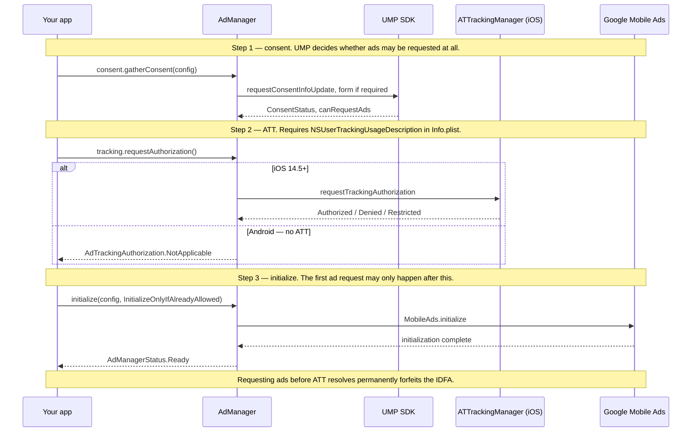
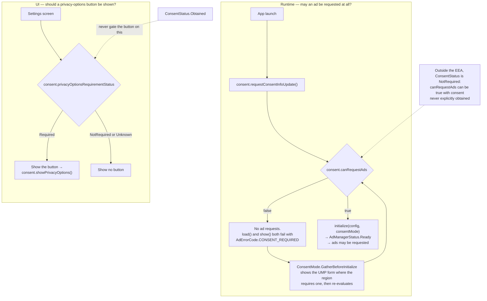

# Visual Diagram System Implementation Plan

> **For agentic workers:** REQUIRED SUB-SKILL: Use superpowers:subagent-driven-development (recommended) or superpowers:executing-plans to implement this plan task-by-task. Steps use checkbox (`- [ ]`) syntax for tracking.

**Goal:** Ship eight theme-aware, build-time-static, WCAG-AA diagrams as Astro components in `docs-site/src/components/diagrams/`, each with a prose equivalent that survives into the `llms.txt` bundle, so Plans 3 and 5 can import them by exact name.

**Architecture:** One shared visual language (`diagrams.css` + `DiagramFigure.astro` + `DiagramFrame.astro`) defines stroke weights, type scale, colour roles derived entirely from Plan 2's `--admob-*` tokens, and the accessibility contract. Five diagrams are hand-authored inline SVG whose body is slotted into `DiagramFrame`, which emits the `<svg>` shell with `role="img"`, `<title>`, `<desc>` and namespaced arrow markers. Two (sequence and decision flow) are authored as Mermaid fences in `.md` files imported into `.astro` components, so Plan 2's already-configured `rehype-mermaid` renders them to inline SVG at build time. The eighth, the platform support matrix, is tabular data and ships as a semantic `<table>`. Every diagram's text alternative lives once in `descriptions.json` and is emitted into a generated Starlight page, `/reference/diagrams-in-words/`, which is real Markdown and therefore lands in `llms-full.txt`.

**Tech Stack:** Astro 7.1.6, `@astrojs/starlight` 0.41.5, `rehype-mermaid` 3.0.0 (`strategy: 'inline-svg'`, already wired by Plan 2), `starlight-llms-txt` 0.11.0, Vitest 4.1.10, Node ≥ 22.12.0. No client-side JavaScript of any kind.

## Global Constraints

- **Prerequisite: Plan 2 is merged.** `docs-site/` exists with `package.json`, `astro.config.mjs`, `src/styles/tokens.css`, `test/`, `scripts/`, and Vitest 4.1.10 installed. Every `npm` command in this plan runs from `docs-site/`.
- **Absolute repo root:** `/Users/meetmiyani/Documents/MeetMiyani/MEET/AdmobCMP`. Docs site root: `/Users/meetmiyani/Documents/MeetMiyani/MEET/AdmobCMP/docs-site`.
- **Diagram components live at `docs-site/src/components/diagrams/`.** Plans 3 and 5 import these eight names verbatim: `ModuleMap.astro`, `InitSequence.astro`, `FullScreenLifecycle.astro`, `NativePoolLifecycle.astro`, `BannerGeometry.astro`, `ConsentDecisionTree.astro`, `RetryTimeline.astro`, `PlatformMatrix.astro`.
- **Style only against Plan 2's 19-property token contract.** Never invent a token name and never hardcode a colour in `diagrams.css` or in any component: `--admob-paper` `--admob-surface` `--admob-code` `--admob-ink` `--admob-slate` `--admob-hair` `--admob-accent` `--admob-accent-contrast` `--admob-accent-soft` `--admob-font-display` `--admob-font-body` `--admob-font-mono` `--admob-tracking-tight` `--admob-tracking-tighter` `--admob-radius` `--admob-radius-lg` `--admob-border` `--admob-shadow` `--admob-content-max`.
- **Theme selectors.** Plan 2 defines the dark theme on `:root, :root[data-theme='dark']` and the light theme on `:root[data-theme='light']`. Starlight's `ThemeProvider` stamps `data-theme` on `<html>` before first paint. Diagrams therefore need **no** theme-specific CSS of their own for colour — they consume `var(--admob-*)` and re-theme for free. The one exception is the Mermaid bridge (Task 1, Step 4), which must override colours Mermaid bakes in at render time.
- **Measured contrast of the token contract (computed from Plan 2's literal hex values, both themes):**

  | Pair | Light | Dark | Verdict |
  |---|---|---|---|
  | `--admob-ink` on `--admob-paper` | 16.13 | 16.48 | AA text |
  | `--admob-ink` on `--admob-surface` | 15.02 | 15.28 | AA text |
  | `--admob-slate` on `--admob-paper` | 5.85 | 7.14 | AA text |
  | `--admob-slate` on `--admob-surface` | 5.45 | 6.62 | AA text |
  | `--admob-accent` on `--admob-paper` | 3.62 | 4.81 | non-text / large text only |
  | `--admob-accent` on `--admob-surface` | 3.37 | 4.45 | non-text / large text only |
  | `--admob-surface` on `--admob-paper` | 1.07 | 1.08 | decorative fill only |
  | `--admob-hair` on `--admob-paper` | 1.28 | 1.37 | decorative only |

- **Three rules follow from that table and are non-negotiable:**
  1. **All diagram text is `--admob-ink` (≥ 15:1) or `--admob-slate` (≥ 5.45:1). `--admob-accent` never carries text below 24px** — it fails AA for normal-size text in the light theme (3.37:1).
  2. **Every informational boundary is a `--admob-slate` stroke** (≥ 5.45:1, comfortably past the 3:1 non-text minimum). `--admob-surface` node fills and `--admob-hair` gridlines are decorative and carry no information on their own.
  3. **Category is never encoded by hue.** The token contract exposes exactly one accent, so platform/role differences are encoded by stroke dash pattern *plus* an explicit text label. This satisfies WCAG 1.4.1 by construction.
- **Build-time static SVG only.** No `<script>`, no client-side Mermaid, no runtime rendering, no `client:*` directives. The SVG must be present in view-source.
- **Overflow contract.** Every diagram sits in a `.dg-scroll` container with `overflow-x: auto; max-width: 100%`. The SVG carries `width: 100%; min-width: <viewBox width>px; height: auto`, so text never renders below its authored size — narrow viewports scroll the container, never the page body. Plan 2's `npm run check:overflow` is the gate.
- **Accessibility contract (every diagram).** `role="img"` on the SVG; `aria-labelledby` pointing at an in-SVG `<title>` and `<desc>` with ids derived from the diagram id; a visible caption naming the diagram; and a link to that diagram's prose equivalent on `/reference/diagrams-in-words/`. `PlatformMatrix` is the documented exception: it is tabular data and ships as a real `<table>`, which is more accessible and more indexable than SVG text in a grid.
- **Accuracy beats beauty.** A diagram that contradicts an invariant in `admob-cmp/CLAUDE.md` is a defect. Every diagram cites the invariant numbers it encodes, in `descriptions.json` (`invariants`), in the SVG footer text, and on the prose page.
- **Do not modify** `admob-cmp/CLAUDE.md`, `admob-cmp/AGENTS.md`, `admob-cmp/docs/ARCHITECTURE.md`, or any Kotlin source. This plan is documentation-side only.

## File Structure

| File | Responsibility |
|---|---|
| `docs-site/src/styles/diagrams.css` | The entire shared visual language: colour roles mapped from `--admob-*`, stroke weights, type scale, spacing, figure/scroll/caption chrome, `.dg-*` SVG utility classes, the table skin, and the Mermaid theme bridge. Imported once by `DiagramFigure.astro`. |
| `docs-site/src/components/diagrams/descriptions.json` | Single source of truth for every diagram's `title`, `desc`, `invariants`, and multi-paragraph `prose`. Read by both Astro (via `descriptions.ts`) and a Node generator script. |
| `docs-site/src/components/diagrams/descriptions.ts` | Types the JSON and exposes `getDiagram(id)`, which throws on an unknown id. |
| `docs-site/src/components/diagrams/DiagramFigure.astro` | Outer chrome for **all** diagrams: `<figure>`, the `overflow-x: auto` scroll region, the caption, the "read this diagram in words" link. Imports `diagrams.css`. Slot = any content (SVG or table). |
| `docs-site/src/components/diagrams/DiagramFrame.astro` | Composes `DiagramFigure` and emits the `<svg>` shell — `role="img"`, `viewBox`, `--dg-min-w`, `<title>`, `<desc>`, and the two id-namespaced arrow markers. Slot = SVG body only. Used by the five hand-authored SVG diagrams. |
| `docs-site/src/components/diagrams/ModuleMap.astro` | Hand-authored SVG. Invariants 1, 7. |
| `docs-site/src/components/diagrams/mermaid/init-sequence.md` | Mermaid source for the UMP → ATT → initialize sequence. Processed by Plan 2's `rehype-mermaid`. |
| `docs-site/src/components/diagrams/InitSequence.astro` | Imports the `.md` above and wraps its rendered SVG. Invariants 5, 11. |
| `docs-site/src/components/diagrams/FullScreenLifecycle.astro` | Hand-authored SVG. Invariants 1, 2, 9. |
| `docs-site/src/components/diagrams/NativePoolLifecycle.astro` | Hand-authored SVG. Invariants 3, 4, 8. |
| `docs-site/src/components/diagrams/BannerGeometry.astro` | Hand-authored SVG. Invariant 6. |
| `docs-site/src/components/diagrams/mermaid/consent-decision-tree.md` | Mermaid source for the consent decision flow. |
| `docs-site/src/components/diagrams/ConsentDecisionTree.astro` | Imports the `.md` above. Invariant 5. |
| `docs-site/src/components/diagrams/RetryTimeline.astro` | Hand-authored SVG. Invariant 9. |
| `docs-site/src/components/diagrams/PlatformMatrix.astro` | Semantic `<table>`, not SVG. Documents the Android native-video-events upstream gap. |
| `docs-site/src/pages/dev/diagram-gallery.astro` | `noindex` review page rendering all eight diagrams. The manual light/dark/mobile verification surface and the fixture the built-output tests assert against. |
| `docs-site/scripts/generate-diagram-prose.mjs` | Reads `descriptions.json`, writes `src/content/docs/reference/diagrams-in-words.mdx`. |
| `docs-site/src/content/docs/reference/diagrams-in-words.mdx` | **Generated, committed.** Real Markdown, so `starlight-llms-txt` puts every diagram's prose into `llms-full.txt`. |
| `docs-site/test/diagram-contrast.test.ts` | Parses the literal hex values out of `src/styles/tokens.css` and asserts every colour pairing `diagrams.css` relies on meets its WCAG threshold, in both themes. |
| `docs-site/test/diagram-descriptions.test.ts` | Asserts every component has a `descriptions.json` entry, and every entry has a component, non-empty prose, and at least one cited invariant. |
| `docs-site/test/diagram-prose-freshness.test.ts` | Regenerates the prose page in memory and fails if the committed file differs. |
| `docs-site/test/diagram-build-output.test.ts` | Reads `dist/dev/diagram-gallery/index.html` and asserts static SVG, the a11y contract, and the absence of any Mermaid client script. |
| `docs-site/package.json` | Modified: adds the `diagrams:prose` script. |

**Sequencing note.** Task 1 must land first — every later task consumes `DiagramFrame`, `DiagramFigure`, `descriptions.json` and `diagrams.css`. Tasks 2–9 are independent of each other. Task 10 needs all eight `descriptions.json` entries. Task 11 is the merge gate.

---

### Task 1: The shared visual language

**Files:**
- Create: `docs-site/test/helpers/css-tokens.ts`
- Create: `docs-site/test/diagram-contrast.test.ts`
- Create: `docs-site/src/styles/diagrams.css`
- Create: `docs-site/src/components/diagrams/descriptions.json`
- Create: `docs-site/src/components/diagrams/descriptions.ts`
- Create: `docs-site/src/components/diagrams/DiagramFigure.astro`
- Create: `docs-site/src/components/diagrams/DiagramFrame.astro`
- Create: `docs-site/src/pages/dev/diagram-gallery.astro`
- Modify: `docs-site/astro.config.mjs` (sitemap `filter` — exclude `/dev/`)

**Interfaces:**
- Consumes: `docs-site/src/styles/tokens.css` and its 19 `--admob-*` properties (Plan 2, Task 2); Vitest 4.1.10 and the `npm test` script (Plan 2, Task 1); the `sitemap()` call in `astro.config.mjs` (Plan 2, Task 4).
- Produces:
  - `docs-site/src/styles/diagrams.css` — colour roles `--dg-paper --dg-node --dg-ink --dg-muted --dg-stroke --dg-accent --dg-hair`; metrics `--dg-sw --dg-sw-strong --dg-sw-hair --dg-r --dg-fs-title --dg-fs-label --dg-fs-body --dg-fs-caption --dg-dash-android --dg-dash-ios --dg-dash-flow`; SVG classes `dg-node dg-node--android dg-node--ios dg-node--accent dg-panel dg-title dg-label dg-sub dg-note dg-mono dg-edge dg-edge--flow dg-edge--accent dg-axis dg-grid dg-arrow dg-arrow--accent dg-fill-hair dg-fill-accent-soft`; HTML classes `dg-figure dg-scroll dg-svg dg-caption dg-caption-title dg-caption-invariants dg-alt-link dg-table dg-mark dg-mermaid`.
  - `getDiagram(id: string): DiagramDescription` from `docs-site/src/components/diagrams/descriptions.ts`, where `DiagramDescription = { id: string; title: string; desc: string; invariants: number[]; prose: string[] }`. Throws on an unknown id.
  - `DiagramFigure.astro` with props `{ id: string; minWidth?: number }`.
  - `DiagramFrame.astro` with props `{ id: string; width: number; height: number }`. Inside its slot, arrow markers are referenced as `url(#<id>-arrow)` and `url(#<id>-arrow-accent)`.
  - `descriptions.json` containing all eight entries, keyed `module-map`, `init-sequence`, `full-screen-lifecycle`, `native-pool-lifecycle`, `banner-geometry`, `consent-decision-tree`, `retry-timeline`, `platform-matrix`. Tasks 2–9 consume these; they do not add to the file.

**Why the descriptions land here and not in each diagram's task.** `getDiagram(id)` throws on an unknown id, so a component cannot render before its entry exists. Writing all eight entries once makes this task the single contract task and every later task a pure rendering of an already-agreed contract — which is also what makes Tasks 2–9 independent of each other.

- [ ] **Step 1: Write the CSS-token test helper**

Create `docs-site/test/helpers/css-tokens.ts`:

```ts
/**
 * Reads the ACTUAL shipped CSS rather than a duplicated copy of the palette, so
 * these tests cannot drift from what the site renders.
 *
 * `tokens.css` (Plan 2) holds the literal hex values per theme. `diagrams.css`
 * (this plan) maps diagram roles onto those tokens through bare `var()`
 * references. Resolving a role therefore proves two things at once: that the
 * pairing meets its WCAG threshold, and that no diagram role hardcodes a colour.
 */
import { readFileSync } from 'node:fs';

export type Declarations = Record<string, string>;

function readDocsSiteFile(relativePath: string): string {
  return readFileSync(new URL(`../../${relativePath}`, import.meta.url), 'utf8');
}

interface Block {
  selector: string;
  body: string;
}

/** Flat top-level rule blocks, comments stripped. Nested at-rules are ignored. */
function blocks(css: string): Block[] {
  const clean = css.replace(/\/\*[\s\S]*?\*\//g, '');
  const found: Block[] = [];
  const rule = /([^{}]+)\{([^{}]*)\}/g;
  let match: RegExpExecArray | null;
  while ((match = rule.exec(clean)) !== null) {
    found.push({ selector: match[1].trim(), body: match[2] });
  }
  return found;
}

function parseDeclarations(body: string): Declarations {
  const out: Declarations = {};
  for (const declaration of body.split(';')) {
    const colon = declaration.indexOf(':');
    if (colon === -1) continue;
    const name = declaration.slice(0, colon).trim();
    const value = declaration.slice(colon + 1).trim();
    if (name.length > 0 && value.length > 0) out[name] = value;
  }
  return out;
}

/**
 * The `--admob-*` palette for one theme, read out of tokens.css.
 *
 * tokens.css mentions `data-theme='dark'` twice — once for the token block and
 * once for the Starlight `--sl-*` remapping — so the block is identified by the
 * presence of `--admob-paper`, never by source order.
 */
export function admobPalette(theme: 'light' | 'dark'): Declarations {
  const css = readDocsSiteFile('src/styles/tokens.css');
  const needle = theme === 'light' ? "data-theme='light'" : "data-theme='dark'";
  for (const block of blocks(css)) {
    if (!block.selector.includes(needle)) continue;
    const declarations = parseDeclarations(block.body);
    if (declarations['--admob-paper']) return declarations;
  }
  throw new Error(`tokens.css has no --admob-* palette block for the ${theme} theme`);
}

/** The `--dg-*` colour-role block from diagrams.css, identified by `--dg-ink`. */
export function diagramColourRoles(): Declarations {
  const css = readDocsSiteFile('src/styles/diagrams.css');
  for (const block of blocks(css)) {
    const declarations = parseDeclarations(block.body);
    if (declarations['--dg-ink']) return declarations;
  }
  throw new Error('diagrams.css has no --dg-* colour-role block (expected one declaring --dg-ink)');
}

/** Declarations of a single rule in diagrams.css, by exact selector text. */
export function diagramRule(selector: string): Declarations {
  const css = readDocsSiteFile('src/styles/diagrams.css');
  for (const block of blocks(css)) {
    if (block.selector === selector) return parseDeclarations(block.body);
  }
  throw new Error(`diagrams.css has no rule with the exact selector "${selector}"`);
}

/** Resolves a `--dg-*` role to a literal hex, rejecting anything but a bare var(). */
export function resolveRole(role: string, roles: Declarations, palette: Declarations): string {
  const value = roles[role];
  if (!value) throw new Error(`diagrams.css does not declare ${role}`);
  const reference = /^var\(\s*(--admob-[a-z-]+)\s*\)$/.exec(value);
  if (!reference) {
    throw new Error(
      `${role} must be a bare var() reference to an --admob-* token so it re-themes, ` +
        `but diagrams.css sets it to "${value}"`
    );
  }
  const hex = palette[reference[1]];
  if (!hex) throw new Error(`${reference[1]} is not defined in this theme's tokens.css block`);
  return hex;
}

function channel(value: number): number {
  const srgb = value / 255;
  return srgb <= 0.03928 ? srgb / 12.92 : ((srgb + 0.055) / 1.055) ** 2.4;
}

function relativeLuminance(hex: string): number {
  const digits = hex.trim().replace('#', '');
  if (!/^[0-9a-fA-F]{6}$/.test(digits)) {
    throw new Error(`Expected a 6-digit hex colour, got "${hex}"`);
  }
  const r = channel(Number.parseInt(digits.slice(0, 2), 16));
  const g = channel(Number.parseInt(digits.slice(2, 4), 16));
  const b = channel(Number.parseInt(digits.slice(4, 6), 16));
  return 0.2126 * r + 0.7152 * g + 0.0722 * b;
}

/** WCAG 2.1 contrast ratio, 1..21. */
export function contrastRatio(foreground: string, background: string): number {
  const a = relativeLuminance(foreground);
  const b = relativeLuminance(background);
  const lighter = Math.max(a, b);
  const darker = Math.min(a, b);
  return (lighter + 0.05) / (darker + 0.05);
}
```

- [ ] **Step 2: Write the failing contrast test**

Create `docs-site/test/diagram-contrast.test.ts`:

```ts
import { describe, expect, it } from 'vitest';
import {
  admobPalette,
  contrastRatio,
  diagramColourRoles,
  diagramRule,
  resolveRole,
} from './helpers/css-tokens';

const THEMES = ['light', 'dark'] as const;

/**
 * Every pairing the diagrams actually paint. `min` is the WCAG 2.1 threshold
 * that applies to how the pairing is used: 4.5 for normal-size text (1.4.3),
 * 3 for graphical objects and component boundaries (1.4.11).
 */
const PAIRINGS = [
  { fg: '--dg-ink', bg: '--dg-paper', min: 4.5, use: 'primary text on the diagram background' },
  { fg: '--dg-ink', bg: '--dg-node', min: 4.5, use: 'primary text inside a node' },
  { fg: '--dg-muted', bg: '--dg-paper', min: 4.5, use: 'secondary text on the background' },
  { fg: '--dg-muted', bg: '--dg-node', min: 4.5, use: 'sub-labels inside a node' },
  { fg: '--dg-stroke', bg: '--dg-paper', min: 3, use: 'node borders and edges' },
  { fg: '--dg-stroke', bg: '--dg-node', min: 3, use: 'dividers drawn inside a node' },
  { fg: '--dg-accent', bg: '--dg-paper', min: 3, use: 'emphasised stroke (non-text only)' },
  { fg: '--dg-accent', bg: '--dg-node', min: 3, use: 'emphasised stroke (non-text only)' },
] as const;

/**
 * SVG text classes. `--admob-accent` measures 3.37:1 on `--admob-surface` in the
 * light theme, which fails AA for normal-size text, so no text class may use it.
 */
const TEXT_RULES = ['.dg-title', '.dg-label', '.dg-sub', '.dg-note', '.dg-mono'] as const;
const ALLOWED_TEXT_FILLS = ['var(--dg-ink)', 'var(--dg-muted)'];

describe.each(THEMES)('diagram palette — %s theme', (theme) => {
  const palette = admobPalette(theme);
  const roles = diagramColourRoles();

  it.each(PAIRINGS)('$fg on $bg meets $min:1 ($use)', ({ fg, bg, min }) => {
    const ratio = contrastRatio(resolveRole(fg, roles, palette), resolveRole(bg, roles, palette));
    expect(ratio).toBeGreaterThanOrEqual(min);
  });

  it('defines every colour role as a bare var() reference to an --admob-* token', () => {
    for (const role of Object.keys(roles)) {
      expect(() => resolveRole(role, roles, palette)).not.toThrow();
    }
  });
});

describe('diagram text never uses the accent colour', () => {
  it.each(TEXT_RULES)('%s fills with ink or muted', (selector) => {
    expect(ALLOWED_TEXT_FILLS).toContain(diagramRule(selector).fill);
  });

  it('the HTML caption uses ink or muted, not accent', () => {
    expect(ALLOWED_TEXT_FILLS.map((v) => v.replace('--dg', '--dg'))).toContain(
      diagramRule('.dg-caption').color
    );
  });
});
```

- [ ] **Step 3: Run the test to verify it fails**

```bash
cd /Users/meetmiyani/Documents/MeetMiyani/MEET/AdmobCMP/docs-site
npx vitest run test/diagram-contrast.test.ts
```

Expected: FAIL. Every case errors with `ENOENT: no such file or directory` for `src/styles/diagrams.css`.

- [ ] **Step 4: Write `src/styles/diagrams.css`**

Create `docs-site/src/styles/diagrams.css`:

```css
/* docs-site/src/styles/diagrams.css
 *
 * The shared visual language for every component in src/components/diagrams/.
 * Imported once, by DiagramFigure.astro.
 *
 * COLOUR: this file declares no literal colour. Every diagram role is a bare
 * var() reference to one of Plan 2's 19 --admob-* tokens, which are themselves
 * defined per theme in tokens.css. Diagrams therefore re-theme with Starlight's
 * data-theme switch and need no theme-specific rules of their own.
 * test/diagram-contrast.test.ts re-derives the WCAG ratios from tokens.css for
 * BOTH themes and fails on a literal colour.
 *
 * The token contract exposes exactly one accent, so diagrams never encode a
 * category by hue: platform and role differences are carried by stroke dash
 * pattern PLUS an explicit text label (WCAG 1.4.1 by construction).
 */

/* ------------------------------------------------------------ colour roles */

:root {
  /* Diagram background. Matches the page so a diagram reads as part of it. */
  --dg-paper: var(--admob-paper);
  /* Node fill. Decorative only — 1.07:1 against paper. The informational
     boundary is always the --dg-stroke border, never this fill. */
  --dg-node: var(--admob-surface);
  /* Primary text. 16.13:1 light / 16.48:1 dark on paper. */
  --dg-ink: var(--admob-ink);
  /* Secondary text. 5.85:1 light / 7.14:1 dark on paper. */
  --dg-muted: var(--admob-slate);
  /* Every informational boundary. 5.85:1 light / 7.14:1 dark on paper. */
  --dg-stroke: var(--admob-slate);
  /* Emphasis. 3.62:1 light / 4.81:1 dark on paper — STROKES AND LARGE TEXT
     ONLY. It fails AA for normal-size text in the light theme. */
  --dg-accent: var(--admob-accent);
  /* Decorative gridlines that carry no information on their own. */
  --dg-hair: var(--admob-hair);
}

/* ----------------------------------------------------------------- metrics */

:root {
  --dg-sw: 1.5;
  --dg-sw-strong: 2.25;
  --dg-sw-hair: 1;
  --dg-r: 8;
  --dg-fs-title: 14px;
  --dg-fs-label: 13px;
  --dg-fs-body: 12px;
  --dg-fs-caption: 11px;
  --dg-dash-android: 6 4;
  --dg-dash-ios: 2 4;
  --dg-dash-flow: 4 4;
}

/* -------------------------------------------------------------- the figure */

.dg-figure {
  margin: 2rem 0;
}

/* The overflow contract. The scroll region — never the page body — absorbs a
   diagram wider than the viewport. `tabindex` makes it keyboard-scrollable,
   which a focusable scrollable region needs to satisfy WCAG 2.1.1. */
.dg-scroll {
  max-width: 100%;
  overflow-x: auto;
  background: var(--dg-paper);
  border: var(--admob-border);
  border-radius: var(--admob-radius);
  padding: 1rem;
}

.dg-scroll:focus-visible {
  outline: 2px solid var(--dg-accent);
  outline-offset: 2px;
}

/* `min-width` is the authored viewBox width, set per diagram as --dg-min-w.
   min-width beats max-width in CSS, so the SVG never renders below its authored
   size and its text never shrinks — the container scrolls instead. */
.dg-svg {
  display: block;
  width: 100%;
  min-width: var(--dg-min-w, 0px);
  height: auto;
}

.dg-caption {
  display: flex;
  flex-wrap: wrap;
  align-items: baseline;
  gap: 0.25rem 0.75rem;
  margin-top: 0.6rem;
  color: var(--dg-muted);
  font-family: var(--admob-font-body);
  font-size: 0.85rem;
  line-height: 1.5;
}

.dg-caption-title {
  color: var(--dg-ink);
  font-weight: 600;
}

.dg-caption-invariants {
  font-family: var(--admob-font-mono);
  font-size: 0.78rem;
}

/* Ink, not accent: this is normal-size text and accent fails AA in light. */
.dg-alt-link {
  color: var(--dg-ink);
  text-decoration: underline;
  text-underline-offset: 2px;
}

/* --------------------------------------------------------- SVG primitives */

.dg-node {
  fill: var(--dg-node);
  stroke: var(--dg-stroke);
  stroke-width: var(--dg-sw);
}

.dg-node--android {
  stroke-dasharray: var(--dg-dash-android);
}

.dg-node--ios {
  stroke-dasharray: var(--dg-dash-ios);
}

.dg-node--accent {
  stroke: var(--dg-accent);
  stroke-width: var(--dg-sw-strong);
}

.dg-panel {
  fill: var(--dg-node);
  stroke: var(--dg-stroke);
  stroke-width: var(--dg-sw-hair);
}

.dg-title {
  fill: var(--dg-ink);
  font-family: var(--admob-font-display);
  font-size: var(--dg-fs-title);
  font-weight: 600;
  letter-spacing: var(--admob-tracking-tight);
}

.dg-label {
  fill: var(--dg-ink);
  font-family: var(--admob-font-body);
  font-size: var(--dg-fs-label);
  font-weight: 500;
}

.dg-sub {
  fill: var(--dg-muted);
  font-family: var(--admob-font-body);
  font-size: var(--dg-fs-body);
  font-weight: 400;
}

.dg-note {
  fill: var(--dg-muted);
  font-family: var(--admob-font-body);
  font-size: var(--dg-fs-caption);
  font-weight: 400;
}

.dg-mono {
  fill: var(--dg-ink);
  font-family: var(--admob-font-mono);
  font-size: var(--dg-fs-body);
}

.dg-edge {
  fill: none;
  stroke: var(--dg-stroke);
  stroke-width: var(--dg-sw);
}

.dg-edge--flow {
  stroke-dasharray: var(--dg-dash-flow);
}

.dg-edge--accent {
  stroke: var(--dg-accent);
  stroke-width: var(--dg-sw-strong);
}

.dg-axis {
  fill: none;
  stroke: var(--dg-stroke);
  stroke-width: var(--dg-sw-hair);
}

.dg-grid {
  fill: none;
  stroke: var(--dg-hair);
  stroke-width: var(--dg-sw-hair);
}

.dg-arrow {
  fill: var(--dg-stroke);
}

.dg-arrow--accent {
  fill: var(--dg-accent);
}

.dg-fill-hair {
  fill: var(--dg-hair);
}

.dg-fill-accent-soft {
  fill: var(--admob-accent-soft);
}

/* -------------------------------------------------------------- the table */
/* PlatformMatrix is tabular data, so it ships as a real <table>: better for
   assistive technology and better for indexing than SVG text in a grid. */

.dg-table {
  width: 100%;
  /* Same overflow contract as the SVGs: below --dg-min-w the scroll region
     scrolls rather than crushing the columns. */
  min-width: var(--dg-min-w, 0px);
  border-collapse: collapse;
  color: var(--dg-ink);
  font-family: var(--admob-font-body);
  font-size: 0.9rem;
}

.dg-table + .dg-table {
  margin-top: 1.5rem;
}

.dg-table caption {
  caption-side: top;
  padding-bottom: 0.5rem;
  color: var(--dg-muted);
  font-size: 0.85rem;
  text-align: left;
}

.dg-table th,
.dg-table td {
  border: 1px solid var(--dg-stroke);
  padding: 0.5rem 0.7rem;
  text-align: left;
  vertical-align: top;
}

.dg-table thead th {
  background: var(--dg-node);
  font-weight: 600;
}

.dg-table tbody th {
  background: var(--dg-node);
  font-weight: 500;
}

/* The glyph is decoration; the adjacent word carries the meaning. */
.dg-mark {
  font-family: var(--admob-font-mono);
}

/* ------------------------------------------------------- the Mermaid bridge */
/* Plan 2 configures rehype-mermaid with `strategy: 'inline-svg'` and light-theme
   themeVariables, so Mermaid bakes light colours into the SVG at build time and
   they would survive a switch to the dark theme.
 *
 * Because the SVG is INLINE in the document, our CSS cascades into it, so these
 * rules re-point every painted surface at the --dg-* roles.
 *
 * `!important` is required, not stylistic: Mermaid emits an in-SVG <style> whose
 * selectors are id-scoped (`#mermaid-0 .node rect`) and would otherwise win.
 *
 * font-family is deliberately NOT overridden. Mermaid measured every label with
 * Inter in a headless Chromium at build time; changing the family afterwards
 * would desynchronise the text from the boxes drawn around it. */

.dg-mermaid svg {
  display: block;
  width: 100% !important;
  max-width: none !important;
  min-width: var(--dg-min-w, 0px);
  height: auto !important;
  background: transparent !important;
}

.dg-mermaid .node rect,
.dg-mermaid .node polygon,
.dg-mermaid .node circle,
.dg-mermaid .node path,
.dg-mermaid .cluster rect,
.dg-mermaid .actor,
.dg-mermaid rect.actor,
.dg-mermaid .labelBox,
.dg-mermaid .note,
.dg-mermaid rect.note,
.dg-mermaid .activation0,
.dg-mermaid .activation1,
.dg-mermaid .activation2 {
  fill: var(--dg-node) !important;
  stroke: var(--dg-stroke) !important;
  stroke-width: 1.5px !important;
}

.dg-mermaid .nodeLabel,
.dg-mermaid .edgeLabel,
.dg-mermaid .label,
.dg-mermaid text.actor,
.dg-mermaid text.actor > tspan,
.dg-mermaid .messageText,
.dg-mermaid .noteText,
.dg-mermaid .noteText > tspan,
.dg-mermaid .labelText,
.dg-mermaid .loopText,
.dg-mermaid .loopText > tspan,
.dg-mermaid .cluster-label text,
.dg-mermaid .titleText,
.dg-mermaid foreignObject div {
  fill: var(--dg-ink) !important;
  color: var(--dg-ink) !important;
}

/* Edge labels sit on top of their line, so their backing plate must be paper. */
.dg-mermaid .edgeLabel rect,
.dg-mermaid .labelBkg {
  fill: var(--dg-paper) !important;
  background-color: var(--dg-paper) !important;
  opacity: 1 !important;
}

.dg-mermaid .edgePath .path,
.dg-mermaid .flowchart-link,
.dg-mermaid .messageLine0,
.dg-mermaid .messageLine1,
.dg-mermaid .actor-line,
.dg-mermaid .loopLine,
.dg-mermaid line {
  stroke: var(--dg-stroke) !important;
}

.dg-mermaid .messageLine1,
.dg-mermaid .actor-line {
  stroke-dasharray: 3 3 !important;
}

.dg-mermaid .arrowheadPath,
.dg-mermaid marker path,
.dg-mermaid .marker {
  fill: var(--dg-stroke) !important;
  stroke: var(--dg-stroke) !important;
}
```

- [ ] **Step 5: Run the test to verify it passes**

```bash
cd /Users/meetmiyani/Documents/MeetMiyani/MEET/AdmobCMP/docs-site
npx vitest run test/diagram-contrast.test.ts
```

Expected: PASS, 20 tests. The lowest measured ratio is `--dg-accent` on `--dg-node` at 3.37:1 in the light theme, against a 3:1 threshold.

- [ ] **Step 6: Write `descriptions.json` — the text alternative for all eight diagrams**

JSON, not TypeScript, because both Astro and the plain-Node generator in Task 10 must read it, and `node` cannot import a `.ts` module without a loader flag.

Create `docs-site/src/components/diagrams/descriptions.json`:

```json
{
  "module-map": {
    "id": "module-map",
    "title": "Module map: one shared core, two thin platform adapters",
    "desc": "How admob-cmp, admob-cmp-core and admob-cmp-compose relate, and which code lives in commonMain, androidMain and iosMain.",
    "invariants": [1, 7],
    "prose": [
      "dev.avinya.ads:admob-cmp is an umbrella artifact. It holds essentially no code of its own; it exists so that a consumer adds one dependency and gets both real modules, which it re-exports with Gradle api scope: admob-cmp-core and admob-cmp-compose.",
      "admob-cmp-core has no Compose dependency. Its commonMain holds the public API — AdManager, the per-format controllers, AdPlacement, AdConfig, AdEvent, AdError, consent and diagnostics — plus the internal shared state machines in dev.avinya.ads.internal: FullScreenSlotCore, BannerCore, NativePoolCore and AdRetry. dev.avinya.ads.appopen holds AppOpenAdCoordinator; dev.avinya.ads.nativead holds the native pool contract, its options and media info.",
      "admob-cmp-compose holds everything that needs Compose: the dev.avinya.ads.ui composables BannerAdView and NativeAdView, the adLayout {} DSL with its validator and templates in dev.avinya.ads.nativead.layout, and the debug screen in dev.avinya.ads.debug.",
      "androidMain supplies AndroidGoogleAdManager and the Android slots, pool and banner over the GMA Next-Gen SDK on API 26 and above, the AdMob.manager(context) singleton, and a ProcessLifecycleOwner foreground signal. iosMain supplies IosGoogleAdManager and the iOS slots, pool, banner and consent over Kotlin/Native cinterop bindings against GMA 13.x on iOS 15 and above, a UIKit native-ad renderer, and an NSNotificationCenter foreground signal.",
      "The shape of the split is the whole point. Platform classes implement only loadAd, presentAd, destroyAd, canPresent and getResponseInfo for full-screen formats, and only the BannerPlatform and NativePoolPlatform interfaces for banners and native ads. Load, show, cache, retry and consent-gating logic all live in the shared core (invariants 1 and 7). Exactly three things stay platform-side by construction and must never migrate into commonMain: native batch-assembly locking, iOS delegate creation, retention and ordering, and iOS's activeLoad and activeLoads in-flight registries."
    ]
  },
  "init-sequence": {
    "id": "init-sequence",
    "title": "Initialization order: UMP consent, then ATT, then initialize",
    "desc": "The required call order on iOS — gather UMP consent, request App Tracking Transparency authorisation, then initialize the ads SDK — and what Android reports instead.",
    "invariants": [5, 11],
    "prose": [
      "This is the highest-value correctness trap in the library. Three calls must happen in this order, and the order is not interchangeable.",
      "Step one: adManager.consent.gatherConsent(config). This runs Google's User Messaging Platform consent-info update and, under ConsentMode.GatherBeforeInitialize, shows the consent form where the user's region requires one. UMP returns a ConsentStatus and sets canRequestAds, which is the gate on whether any ad may be requested at all. The gate is checked in both load() and show(), and canPresent() is re-checked at present time (invariant 5).",
      "Step two: adManager.tracking.requestAuthorization(). On iOS 14.5 and later this shows the system App Tracking Transparency prompt and resolves to Authorized, Denied, Restricted or NotDetermined. The prompt cannot appear at all unless NSUserTrackingUsageDescription is present in the app target's Info.plist; without that key iOS silently withholds the IDFA and every request serves non-personalised ads at materially lower eCPM. Android has no ATT: adManager.tracking is a no-op there and always reports AdTrackingAuthorization.NotApplicable.",
      "Step three: adManager.initialize(config, ConsentMode.InitializeOnlyIfAlreadyAllowed). Only now does the Google Mobile Ads SDK initialize and the first ad request become possible. AdManagerStatus moves to Ready, and UI should gate on that.",
      "Why the order is load-bearing: requesting ads before ATT resolves permanently forfeits the IDFA for those requests (invariant 11). It is not a delay or a degradation that later recovers — those requests are served without the identifier for good. Consent must precede ATT in turn, because UMP is what decides whether requests are permitted at all."
    ]
  },
  "full-screen-lifecycle": {
    "id": "full-screen-lifecycle",
    "title": "Full-screen ad lifecycle: load, cache, show, reload",
    "desc": "The FullScreenSlotCore state machine, its TTL'd FIFO cache, the generation counter bumped by clear(), and why show() is not reentrant per controller.",
    "invariants": [1, 2, 9],
    "prose": [
      "FullScreenSlotCore is the shared state machine behind interstitial, rewarded, rewarded-interstitial and app-open ads. A controller starts Idle. load() moves it to Loading; success moves it to Loaded and admits the ad into the cache; failure moves it to Failed, after AdRetry's capped exponential backoff has been exhausted for retryable errors. show() presents the head of the cache.",
      "The cache is a per-slot deque of at most AdCachePolicy.maxSize entries, default 1, shown first-in-first-out, with expired entries pruned on every touch. Time-to-live comes from AdExpirationPolicy: one hour for full-screen formats, four hours for app-open.",
      "presentAd suspends until the ad is dismissed. A presented ad is destroyed on normal return only, never on cancellation — cancelling mid-show means the ad is still on screen (invariant 2). Presentation ownership is a one-shot FullScreenPresentationHandle: the core owns it until the platform slot calls tryHandOffToCallbacks() immediately before invoking the SDK's show, and from that moment only the SDK's terminal callback, or a cancellation that raced in before hand-off, may close it.",
      "Because of that hand-off, show() is not reentrant per controller. A second show() while a presentation is live on the same controller returns AdShowResult.NotReady immediately rather than queuing behind it. Await one show()'s result before calling it again.",
      "After dismissal, if AdCachePolicy.reloadAfterShow is true the core schedules a reload; otherwise the controller returns to Loaded if the cache still holds an ad, or Idle if it is empty.",
      "clear() bumps a generation counter and retires the cached ads. Every load and every scheduled reload carries the generation it started with and re-checks it before publishing a result, so a load that was already in flight when clear() ran is discarded instead of repopulating a cache the caller just asked to be emptied.",
      "Every suspending operation is bounded (invariant 9). Loads run inside withTimeoutOrNull(placement.timeoutPolicy.loadTimeout) in the shared core — never per platform — and that timeout bounds the whole attempt sequence including retry backoff. Presentation bounds only the pre-hand-off window; once the SDK owns the presentation it is never force-closed."
    ]
  },
  "native-pool-lifecycle": {
    "id": "native-pool-lifecycle",
    "title": "Native ad pool lifecycle and maxSize accounting",
    "desc": "preload, acquire, render and release for the native ad pool, and how maxSize budgets available plus in-use ads.",
    "invariants": [3, 4, 8],
    "prose": [
      "The native pool serves per-item ads to a feed from a single placement id. pool.preload(count) asks the platform to run one batch load; the loaded ads enter the pool's available inventory. pool.acquire() leases one and returns a token; NativeAdView renders it; pool.release(token) hands it back.",
      "AdCachePolicy.maxSize budgets available plus in-use ads together, and must not be redefined (invariant 8). With maxSize = 1 and one row already holding the ad, preload() returns early and acquire() returns null for every other row — deterministically, not as a race.",
      "pool.availableAds is a StateFlow<Int> that publishes only the available half of that budget. It is the signal that lets a view recover from a null acquire, so views key their acquisition effect on it.",
      "The subtle part: release() destroys the ad, because native ads are single-use. It therefore frees a maxSize slot without incrementing availableAds. A view must re-run preload(), not just acquire(), or the freed slot is never refilled. The bundled NativeAdView composables already do this.",
      "clear() drains and destroys available inventory only. Ads currently leased stay alive until their release(), because a live view is still rendering them, so peek(token) keeps resolving after a clear(). One consequence follows directly: clearing a fully-leased pool frees no capacity at all until those views dispose.",
      "A generation counter guards in-flight batches the same way it does for full-screen slots, so a batch completing after clear() cannot repopulate the pool.",
      "Two things stay platform-side by construction. Batch assembly is touched from two threads — the SDK callbacks on Dispatchers.Main.immediate and invokeOnCancellation from any thread — so every read and write of the pending list and the cancelled flag goes through the platform's own lock (invariant 3). And on iOS, ObjC delegates are weak, so the platform ad handle carries strong Kotlin references to them (invariant 4); because the core retains the ad handle, the delegate is alive by construction and the core never has to know delegates exist."
    ]
  },
  "banner-geometry": {
    "id": "banner-geometry",
    "title": "Banner geometry: host-supplied width to resolved adaptive size",
    "desc": "How a banner's width reaches the SDK — measured by BannerAdView, supplied as BannerGeometry, or read from a nullable platform fallback that leaves BannerCore owning the failure policy.",
    "invariants": [6],
    "prose": [
      "Banner controllers have no layout context, and must never acquire one. Geometry is a host-supplied input (invariant 6).",
      "The normal path: BannerAdView measures its own container and passes the measured width in as BannerGeometry(widthDp). A headless caller driving the controller directly supplies it explicitly: adManager.banner(placement).load(geometry = BannerGeometry(widthDp = 320)).",
      "BannerCore then resolves the width as geometry?.widthDp ?: platform.fallbackWidthDp(). The fallback is nullable on both platforms, deliberately, so that BannerCore — not the platform — owns the failure policy. When it resolves to null the load fails with an explicit error telling the caller to supply a width or use BannerAdView, rather than guessing one.",
      "On Android the fallback comes from the current Activity and is null when there is none. On iOS it reads the key window's bounds, never UIScreen.mainScreen: window bounds are what is correct in Split View, Slide Over and popovers. The earlier UIScreen-based code silently produced full-screen width in those configurations, sizing every banner wrong with no error at all.",
      "With a width in hand, the core calls platform.resolveSize(sizePolicy, widthDp) to produce the platform's own ad-size type, then loadBanner(size, sizePolicy, requestOptions, requiredGeneration).",
      "refresh() replays the whole resolved request — geometry, size policy and request options — from the most recent load, not just the resolved size. registerGeometry() records a measured width without triggering a load, which is what lets a BannerRefreshPolicy.Manual placement refresh at the right width even though it performs no automatic load."
    ]
  },
  "consent-decision-tree": {
    "id": "consent-decision-tree",
    "title": "Consent decision tree: canRequestAds and the privacy-options button",
    "desc": "What gates ad requests (canRequestAds) versus what gates the privacy-options button (privacyOptionsRequirementStatus), and why ConsentStatus.Obtained gates neither.",
    "invariants": [5],
    "prose": [
      "Two independent decisions are routinely confused, and conflating them is the most common consent bug.",
      "The first decision is runtime: may an ad be requested at all? The answer is consent.canRequestAds, a StateFlow<Boolean> that UMP sets after a consent-info update. When it is false, the consent gate rejects the request — and it is checked in both load() and show(), with canPresent() re-checked at present time, so neither check may be removed (invariant 5). Callers see AdErrorCode.CONSENT_REQUIRED. ConsentMode.GatherBeforeInitialize is what shows the UMP form where the region requires one and re-evaluates the gate afterwards.",
      "The second decision is user interface: should the app show a privacy-settings entry point? The answer is consent.privacyOptionsRequirementStatus == PrivacyOptionsRequirementStatus.Required, and only that. When it is Required, show the button and wire it to consent.showPrivacyOptions().",
      "ConsentStatus.Obtained gates neither decision. It mirrors UMP's own consent status and is distinct from canRequestAds, which can be true even when consent was never explicitly obtained — for example ConsentStatus.NotRequired outside the EEA, where no form is ever shown and ads still serve normally. Gating the privacy-options button on Obtained hides the button from exactly the users who are entitled to it."
    ]
  },
  "retry-timeline": {
    "id": "retry-timeline",
    "title": "Retry timeline: capped exponential backoff",
    "desc": "AdRetryPolicy's default of two attempts, how each backoff delay is computed and capped, which GMA failures are retried, and the timeout that bounds the whole sequence.",
    "invariants": [9],
    "prose": [
      "AdRetryPolicy defaults to maxAttempts = 2, and maxAttempts counts the initial attempt. The default therefore means one initial attempt plus at most one retry. Set maxAttempts = 1 for no retry at all.",
      "The delay before retry number n is min(initialDelay × backoffMultiplier^(n−1), maxDelay). With the defaults — initialDelay 2s, backoffMultiplier 2.0, maxDelay 30s — the delays run 2s, 4s, 8s, 16s and then flatten at 30s however many attempts are configured.",
      "Only transient failures are retried. On Android, LoadAdError.code is an enum in the GMA Next-Gen SDK, so its toString() yields the enum name, and the retryable set matches on those names: NETWORK_ERROR, TIMEOUT and INTERNAL_ERROR. On iOS the codes arrive as numeric strings, and the retryable set is 2 (network), 5 (timeout) and 11 (internal).",
      "No fill is never retried: NO_FILL on Android, code 1 on iOS. It means the ad server had no inventory for this request, so retrying burns requests and depresses fill rate rather than recovering anything. Configuration failures — INVALID_REQUEST, APP_ID_MISSING, INVALID_AD_RESPONSE — are equally permanent and equally not retried. The gates consent_required and sdk_not_ready are not load failures at all and never enter the retry path.",
      "The whole sequence, backoff included, runs inside withTimeoutOrNull(placement.timeoutPolicy.loadTimeout) in the shared core (invariant 9). The timeout deliberately bounds the sequence rather than each attempt: a listener that never calls back would otherwise restart the clock on every retry and still never finish."
    ]
  },
  "platform-matrix": {
    "id": "platform-matrix",
    "title": "Platform support matrix: six formats on Android and iOS",
    "desc": "Which ad formats and capabilities are supported on each platform, including the Android native-video-events gap in the upstream GMA Next-Gen SDK.",
    "invariants": [11],
    "prose": [
      "All six ad formats are supported on both platforms: banner (anchored adaptive, inline adaptive, fixed and fluid, including collapsible), interstitial, rewarded, rewarded interstitial, app-open and native. Android requires API 26 or later on the GMA Next-Gen SDK; iOS requires iOS 15 or later on GMA 13.x.",
      "UMP consent, the privacy-options form, mediation adapters, and paid/revenue events via AdEvent.Paid all work identically on both platforms.",
      "App Tracking Transparency is iOS-only. Android has no equivalent and adManager.tracking always reports AdTrackingAuthorization.NotApplicable; advertising-id access there is governed instead by the AD_ID manifest permission. On iOS, ATT must be requested after UMP consent and before the first ad request (invariant 11).",
      "One genuine gap exists, and it is upstream. iOS emits five native video events — VideoStarted, VideoPlayed, VideoPaused, VideoEnded and VideoMuted — through GADVideoControllerDelegate. The Android GMA Next-Gen SDK exposes no equivalent callback surface on NativeAd, so Android emits none. This is a Google SDK gap, not an admob-cmp omission, and it means cross-platform logic must not depend on native video events.",
      "Five request options are Android-only and are silently ignored on iOS: immersiveMode, customClickGesture, publisherProvidedId, categoryExclusions and skipUninitializedAdapters. By contrast customTargeting and placementId are mapped on both platforms."
    ]
  }
}
```

- [ ] **Step 7: Write `descriptions.ts`**

Create `docs-site/src/components/diagrams/descriptions.ts`:

```ts
import descriptions from './descriptions.json';

export interface DiagramDescription {
  /** Stable slug. Matches the JSON key, the SVG title/desc id prefix, the arrow
   *  marker id prefix, and the anchor on /reference/diagrams-in-words/. */
  id: string;
  /** Shown in the figure caption and used as the SVG <title>. */
  title: string;
  /** One sentence. Used as the SVG <desc>. */
  desc: string;
  /** admob-cmp/CLAUDE.md invariant numbers this diagram encodes. */
  invariants: number[];
  /** Paragraphs of the text alternative, joined with a blank line. */
  prose: string[];
}

export const diagramDescriptions = descriptions as Record<string, DiagramDescription>;

export function getDiagram(id: string): DiagramDescription {
  const description = diagramDescriptions[id];
  if (!description) {
    throw new Error(
      `Unknown diagram id "${id}". Add an entry to src/components/diagrams/descriptions.json.`
    );
  }
  return description;
}
```

- [ ] **Step 8: Write `DiagramFigure.astro`**

Create `docs-site/src/components/diagrams/DiagramFigure.astro`:

```astro
---
/**
 * Outer chrome shared by every diagram: the figure, the overflow-x scroll
 * region, the caption, the invariant citation, and the link to the diagram's
 * prose equivalent.
 *
 * This is the only place diagrams.css is imported. Astro emits it as a normal
 * unlayered stylesheet, so it beats Starlight's own layered rules.
 */
import '../../styles/diagrams.css';
import { getDiagram } from './descriptions';

interface Props {
  /** Key in descriptions.json. */
  id: string;
  /** Authored viewBox width in SVG user units. Below this the frame scrolls
   *  rather than shrinking the text. Omit for non-SVG content. */
  minWidth?: number;
}

const { id, minWidth } = Astro.props;
const diagram = getDiagram(id);
const invariants = diagram.invariants.map((n) => `#${n}`).join(', ');
// Custom properties inherit, so setting this on the scroll region reaches the SVG.
const scrollStyle = minWidth ? `--dg-min-w:${minWidth}px` : undefined;
---

<figure class="dg-figure" data-diagram={id}>
  <div
    class="dg-scroll"
    tabindex="0"
    role="group"
    aria-label={`${diagram.title} — scrollable diagram`}
    style={scrollStyle}
  >
    <slot />
  </div>
  <figcaption class="dg-caption">
    <span class="dg-caption-title">{diagram.title}</span>
    <span class="dg-caption-invariants">CLAUDE.md invariants {invariants}</span>
    <a class="dg-alt-link" href={`/reference/diagrams-in-words/#${id}`}>
      Read this diagram in words
    </a>
  </figcaption>
</figure>
```

- [ ] **Step 9: Write `DiagramFrame.astro`**

Create `docs-site/src/components/diagrams/DiagramFrame.astro`:

```astro
---
/**
 * The <svg> shell for the five hand-authored SVG diagrams. Emitting it here rather
 * than in each component makes the accessibility contract structural: a diagram
 * physically cannot ship without role="img", a <title> and a <desc>.
 *
 * Arrow markers are namespaced by diagram id because several diagrams can share
 * one page and SVG marker ids are document-global.
 */
import DiagramFigure from './DiagramFigure.astro';
import { getDiagram } from './descriptions';

interface Props {
  id: string;
  /** viewBox width in user units. Also becomes the scroll threshold. */
  width: number;
  /** viewBox height in user units. */
  height: number;
}

const { id, width, height } = Astro.props;
const diagram = getDiagram(id);
---

<DiagramFigure id={id} minWidth={width}>
  <svg
    class="dg-svg"
    role="img"
    viewBox={`0 0 ${width} ${height}`}
    aria-labelledby={`${id}-title ${id}-desc`}
    xmlns="http://www.w3.org/2000/svg"
  >
    <title id={`${id}-title`}>{diagram.title}</title>
    <desc id={`${id}-desc`}>{diagram.desc}</desc>
    <defs>
      <marker
        id={`${id}-arrow`}
        viewBox="0 0 10 10"
        refX="9"
        refY="5"
        markerWidth="7"
        markerHeight="7"
        orient="auto-start-reverse"
      >
        <path class="dg-arrow" d="M0 0 L10 5 L0 10 Z" />
      </marker>
      <marker
        id={`${id}-arrow-accent`}
        viewBox="0 0 10 10"
        refX="9"
        refY="5"
        markerWidth="7"
        markerHeight="7"
        orient="auto-start-reverse"
      >
        <path class="dg-arrow--accent" d="M0 0 L10 5 L0 10 Z" />
      </marker>
    </defs>
    <slot />
  </svg>
</DiagramFigure>
```

- [ ] **Step 10: Write the review gallery page**

This page is the manual verification surface for Task 11 and the fixture the built-output test reads. It is a plain Astro page, not a Starlight doc, so it imports `tokens.css` itself. Tasks 2–9 each append one import and one element.

Create `docs-site/src/pages/dev/diagram-gallery.astro`:

```astro
---
/**
 * Internal review surface for the diagram set. noindex, excluded from the
 * sitemap, and never linked from the site.
 *
 * To review the light theme, edit the `data-theme` attribute on <html> in
 * devtools. Nothing here reads it at runtime — the diagrams re-theme purely
 * through tokens.css, which is exactly what makes that swap sufficient.
 */
import '../../styles/tokens.css';
---

<!doctype html>
<html lang="en" data-theme="dark">
  <head>
    <meta charset="utf-8" />
    <meta name="viewport" content="width=device-width, initial-scale=1" />
    <meta name="robots" content="noindex, nofollow" />
    <title>Diagram gallery (internal review)</title>
    <style is:global>
      body {
        margin: 0;
        padding: 2rem 1rem 6rem;
        background: var(--admob-paper);
        color: var(--admob-ink);
        font-family: var(--admob-font-body);
      }
      main {
        max-width: var(--admob-content-max);
        margin: 0 auto;
      }
      h1 {
        font-family: var(--admob-font-display);
        letter-spacing: var(--admob-tracking-tight);
      }
    </style>
  </head>
  <body>
    <main>
      <h1>Diagram gallery</h1>
      <p>
        Internal review page. Flip the <code>data-theme</code> attribute on
        <code>&lt;html&gt;</code> between <code>dark</code> and <code>light</code> in devtools to
        check both themes.
      </p>
    </main>
  </body>
</html>
```

- [ ] **Step 11: Exclude `/dev/` from the sitemap, then build**

In `docs-site/astro.config.mjs`, replace the `filter` line inside the `sitemap({ … })` call:

```js
      filter: (page) => !page.includes('/og/') && !page.includes('/api/'),
```

with:

```js
      // `/dev/` is the noindex diagram review gallery (Plan 4). It must not
      // appear in the sitemap of an SEO-focused host.
      filter: (page) =>
        !page.includes('/og/') && !page.includes('/api/') && !page.includes('/dev/'),
```

Then:

```bash
cd /Users/meetmiyani/Documents/MeetMiyani/MEET/AdmobCMP/docs-site
npm run build
grep -c '/dev/diagram-gallery' dist/sitemap-0.xml || echo "GALLERY NOT IN SITEMAP OK"
```

Expected: the build finishes with `Complete!`; `dist/dev/diagram-gallery/index.html` exists; the grep prints `GALLERY NOT IN SITEMAP OK`.

- [ ] **Step 12: Commit**

```bash
cd /Users/meetmiyani/Documents/MeetMiyani/MEET/AdmobCMP
git add docs-site/src/styles/diagrams.css docs-site/src/components/diagrams docs-site/src/pages/dev docs-site/test/helpers docs-site/test/diagram-contrast.test.ts docs-site/astro.config.mjs
git commit -m "feat(docs): add the shared diagram visual language and accessibility contract"
```

---

### Task 2: `ModuleMap.astro`

**Files:**
- Create: `docs-site/src/components/diagrams/ModuleMap.astro`
- Modify: `docs-site/src/pages/dev/diagram-gallery.astro`

**Interfaces:**
- Consumes: `DiagramFrame.astro` with props `{ id: 'module-map', width: 920, height: 570 }`; the `module-map` entry of `descriptions.json`; arrow marker `url(#module-map-arrow)`; classes `dg-node dg-node--accent dg-node--android dg-node--ios dg-title dg-label dg-sub dg-mono dg-note dg-edge dg-grid`.
- Produces: `ModuleMap.astro`, imported by name from Plan 3's `/reference/architecture/` page.

**Encodes CLAUDE.md invariants #1 and #7.** Facts are taken from `admob-cmp/docs/ARCHITECTURE.md` (module map) and the three `build.gradle.kts` files: `admob-cmp` is an umbrella whose `commonMain` declares `api(project(":admob-cmp-core"))` and `api(project(":admob-cmp-compose"))` and contains only `BundleModuleMarker.kt`.

- [ ] **Step 1: Write the component**

Create `docs-site/src/components/diagrams/ModuleMap.astro`:

```astro
---
import DiagramFrame from './DiagramFrame.astro';
---

<DiagramFrame id="module-map" width={920} height={570}>
  {/* published artifacts */}
  <rect class="dg-node dg-node--accent" x="330" y="16" width="260" height="54" rx="8" />
  <text class="dg-title" x="460" y="40" text-anchor="middle">dev.avinya.ads:admob-cmp</text>
  <text class="dg-sub" x="460" y="58" text-anchor="middle">umbrella — api(core) + api(compose)</text>

  <path class="dg-edge" d="M460 70 V92 H200 V112" marker-end="url(#module-map-arrow)" />
  <path class="dg-edge" d="M460 70 V92 H720 V112" marker-end="url(#module-map-arrow)" />

  <rect class="dg-node" x="60" y="116" width="280" height="54" rx="8" />
  <text class="dg-title" x="200" y="140" text-anchor="middle">admob-cmp-core</text>
  <text class="dg-sub" x="200" y="158" text-anchor="middle">no Compose dependency</text>

  <rect class="dg-node" x="580" y="116" width="280" height="54" rx="8" />
  <text class="dg-title" x="720" y="140" text-anchor="middle">admob-cmp-compose</text>
  <text class="dg-sub" x="720" y="158" text-anchor="middle">Compose UI + adLayout DSL</text>

  {/* source-set band */}
  <text class="dg-note" x="24" y="193">source sets — both library modules</text>
  <path class="dg-grid" d="M24 200 H896" />

  {/* commonMain */}
  <rect class="dg-node" x="24" y="222" width="300" height="280" rx="8" />
  <text class="dg-title" x="40" y="250">commonMain</text>
  <text class="dg-sub" x="40" y="268">shared, platform-free</text>
  <text class="dg-mono" x="40" y="294">core · dev.avinya.ads</text>
  <text class="dg-sub" x="40" y="312">AdManager, controllers, AdPlacement,</text>
  <text class="dg-sub" x="40" y="330">AdConfig, AdEvent, AdError, consent</text>
  <text class="dg-mono" x="40" y="348">core · …ads.internal</text>
  <text class="dg-sub" x="40" y="366">FullScreenSlotCore, BannerCore,</text>
  <text class="dg-sub" x="40" y="384">NativePoolCore, AdRetry</text>
  <text class="dg-mono" x="40" y="402">core · …appopen / …nativead</text>
  <text class="dg-mono" x="40" y="420">compose · …ads.ui</text>
  <text class="dg-sub" x="40" y="438">BannerAdView, NativeAdView</text>
  <text class="dg-mono" x="40" y="456">compose · …nativead.layout</text>
  <text class="dg-sub" x="40" y="474">adLayout {'{}'} DSL, validator, templates</text>

  {/* androidMain */}
  <rect class="dg-node dg-node--android" x="340" y="222" width="264" height="280" rx="8" />
  <text class="dg-title" x="356" y="250">androidMain</text>
  <text class="dg-sub" x="356" y="268">thin adapter</text>
  <text class="dg-mono" x="356" y="294">AndroidGoogleAdManager</text>
  <text class="dg-sub" x="356" y="312">slots / pool / banner over the</text>
  <text class="dg-sub" x="356" y="330">GMA Next-Gen SDK (API 26+)</text>
  <text class="dg-mono" x="356" y="348">AdMob.manager(context)</text>
  <text class="dg-sub" x="356" y="366">ProcessLifecycleOwner foreground</text>
  <text class="dg-sub" x="356" y="384">signal</text>
  <text class="dg-sub" x="356" y="402">batch-assembly locking stays</text>
  <text class="dg-sub" x="356" y="420">platform-side (invariant 3)</text>
  <text class="dg-sub" x="356" y="438">implements loadAd · presentAd ·</text>
  <text class="dg-sub" x="356" y="456">destroyAd · canPresent</text>

  {/* iosMain */}
  <rect class="dg-node dg-node--ios" x="620" y="222" width="276" height="280" rx="8" />
  <text class="dg-title" x="636" y="250">iosMain</text>
  <text class="dg-sub" x="636" y="268">thin adapter</text>
  <text class="dg-mono" x="636" y="294">IosGoogleAdManager</text>
  <text class="dg-sub" x="636" y="312">slots / pool / banner / consent over</text>
  <text class="dg-sub" x="636" y="330">cinterop bindings (GMA 13.x, iOS 15+)</text>
  <text class="dg-sub" x="636" y="348">UIKit native-ad renderer</text>
  <text class="dg-sub" x="636" y="366">NSNotificationCenter foreground signal</text>
  <text class="dg-sub" x="636" y="384">strong Kotlin refs hold the weak</text>
  <text class="dg-sub" x="636" y="402">ObjC delegates (invariant 4)</text>
  <text class="dg-sub" x="636" y="420">activeLoad / activeLoads registries</text>
  <text class="dg-sub" x="636" y="438">stay platform-side (invariant 7)</text>

  <text class="dg-note" x="24" y="528">
    Platform classes implement only loadAd / presentAd / destroyAd / canPresent, plus the
    BannerPlatform and NativePoolPlatform interfaces.
  </text>
  <text class="dg-note" x="24" y="546">
    Load, show, cache, retry and consent gating all live in the shared core — CLAUDE.md invariants
    #1 and #7.
  </text>
</DiagramFrame>
```

- [ ] **Step 2: Register it in the gallery**

In `docs-site/src/pages/dev/diagram-gallery.astro`, add this as the last line of the frontmatter import block:

```astro
import ModuleMap from '../../components/diagrams/ModuleMap.astro';
```

and add this as the last child of `<main>`, after the closing `</p>`:

```astro
      <ModuleMap />
```

- [ ] **Step 3: Build and verify the SVG is in the static HTML**

```bash
cd /Users/meetmiyani/Documents/MeetMiyani/MEET/AdmobCMP/docs-site
npm run build
grep -c 'data-diagram="module-map"' dist/dev/diagram-gallery/index.html
grep -c 'id="module-map-title"' dist/dev/diagram-gallery/index.html
grep -c 'role="img"' dist/dev/diagram-gallery/index.html
grep -c 'FullScreenSlotCore' dist/dev/diagram-gallery/index.html
```

Expected: build finishes with `Complete!`; each grep prints `1` or more. The last one proves the SVG's *text* is in the served HTML — that is what makes the diagram indexable rather than an opaque image.

- [ ] **Step 4: Commit**

```bash
cd /Users/meetmiyani/Documents/MeetMiyani/MEET/AdmobCMP
git add docs-site/src/components/diagrams/ModuleMap.astro docs-site/src/pages/dev/diagram-gallery.astro
git commit -m "feat(docs): add the ModuleMap diagram"
```

---

### Task 3: `InitSequence.astro`

**Files:**
- Create: `docs-site/src/components/diagrams/mermaid/init-sequence.md`
- Create: `docs-site/src/components/diagrams/InitSequence.astro`
- Modify: `docs-site/src/pages/dev/diagram-gallery.astro`

**Interfaces:**
- Consumes: `DiagramFigure.astro` with props `{ id: 'init-sequence', minWidth: 760 }`; the `init-sequence` entry of `descriptions.json`; the `dg-mermaid` class from `diagrams.css`; the `rehype-mermaid` markdown pipeline configured by Plan 2, Task 7.
- Produces: `InitSequence.astro`, imported by name from Plan 3's `/privacy/app-tracking-transparency/` and `/start/ios-setup/` pages and from Plan 5's landing page.

**Encodes CLAUDE.md invariants #5 and #11.** This is the highest-value diagram in the set: requesting ads before ATT resolves permanently forfeits the IDFA for those requests.

**How Mermaid becomes build-time static SVG here.** Plan 2 wires `rehype-mermaid` with `strategy: 'inline-svg'` into Astro's **markdown** pipeline, so it processes `.md` files — not `.astro` files. Astro compiles a Markdown file imported from a component through that same pipeline and exposes the result as a `Content` component. Authoring the Mermaid source in a `.md` file and importing it therefore reuses Plan 2's configuration exactly, with no second renderer, no committed generated artefacts, and no client-side JavaScript. Task 11 asserts the built HTML contains `<svg` and contains no unprocessed `class="mermaid"`, which fails loudly if that ever regresses.

- [ ] **Step 1: Write the Mermaid source**

Create `docs-site/src/components/diagrams/mermaid/init-sequence.md`. The file contains nothing but the fence — no frontmatter.

````markdown

````

- [ ] **Step 2: Write the component**

Create `docs-site/src/components/diagrams/InitSequence.astro`:

```astro
---
/**
 * The Mermaid source is rendered to inline SVG at build time by the
 * rehype-mermaid plugin Plan 2 registered on the markdown pipeline. Importing
 * the .md file runs it through that pipeline; `Content` is the rendered result.
 *
 * `role="img"` on the wrapper prunes the SVG subtree from the accessibility
 * tree, so the diagram is announced once, from the title and desc below, rather
 * than read out as a soup of disconnected labels.
 *
 * The referenced spans are `hidden`: per the accessible-name computation,
 * aria-labelledby uses a hidden element's text content, so this is a label
 * without a duplicate visible string.
 */
import DiagramFigure from './DiagramFigure.astro';
import { getDiagram } from './descriptions';
import { Content as MermaidDiagram } from './mermaid/init-sequence.md';

const id = 'init-sequence';
const diagram = getDiagram(id);
---

<DiagramFigure id={id} minWidth={760}>
  <div class="dg-mermaid" role="img" aria-labelledby={`${id}-title ${id}-desc`}>
    <span id={`${id}-title`} hidden>{diagram.title}</span>
    <span id={`${id}-desc`} hidden>{diagram.desc}</span>
    <MermaidDiagram />
  </div>
</DiagramFigure>
```

- [ ] **Step 3: Register it in the gallery**

In `docs-site/src/pages/dev/diagram-gallery.astro`, add this as the last line of the frontmatter import block:

```astro
import InitSequence from '../../components/diagrams/InitSequence.astro';
```

and add this as the last child of `<main>`:

```astro
      <InitSequence />
```

- [ ] **Step 4: Build and verify the Mermaid rendered to static SVG**

`rehype-mermaid` drives a headless Chromium. If Plan 2 Task 7 Step 1 was skipped, the build fails with a Playwright "Executable doesn't exist" error; run `npx playwright install chromium` and retry.

```bash
cd /Users/meetmiyani/Documents/MeetMiyani/MEET/AdmobCMP/docs-site
npm run build
grep -c 'data-diagram="init-sequence"' dist/dev/diagram-gallery/index.html
grep -c 'class="mermaid"' dist/dev/diagram-gallery/index.html || echo "NO UNPROCESSED FENCE OK"
grep -c 'requestTrackingAuthorization' dist/dev/diagram-gallery/index.html
grep -ci 'mermaid.*\.js\|mermaid.esm' dist/dev/diagram-gallery/index.html || echo "NO CLIENT MERMAID OK"
```

Expected: `1` for the first and third greps; `NO UNPROCESSED FENCE OK`; `NO CLIENT MERMAID OK`. The third grep proves the sequence text is real, indexable HTML.

- [ ] **Step 5: Commit**

```bash
cd /Users/meetmiyani/Documents/MeetMiyani/MEET/AdmobCMP
git add docs-site/src/components/diagrams/mermaid/init-sequence.md docs-site/src/components/diagrams/InitSequence.astro docs-site/src/pages/dev/diagram-gallery.astro
git commit -m "feat(docs): add the UMP consent to ATT to initialize sequence diagram"
```

---

### Task 4: `FullScreenLifecycle.astro`

**Files:**
- Create: `docs-site/src/components/diagrams/FullScreenLifecycle.astro`
- Modify: `docs-site/src/pages/dev/diagram-gallery.astro`

**Interfaces:**
- Consumes: `DiagramFrame.astro` with props `{ id: 'full-screen-lifecycle', width: 940, height: 650 }`; the `full-screen-lifecycle` entry of `descriptions.json`; arrow marker `url(#full-screen-lifecycle-arrow)`; classes `dg-node dg-panel dg-title dg-label dg-sub dg-note dg-edge dg-edge--flow`.
- Produces: `FullScreenLifecycle.astro`, imported by name from Plan 3's `/formats/interstitial/`, `/formats/rewarded/`, `/formats/app-open/` and `/advanced/caching-retry-timeouts/` pages.

**Encodes CLAUDE.md invariants #1, #2 and #9.** Facts come from `FullScreenSlotCore.kt` (generation-tagged `slotState`, `publicationLock`, `scheduleReload` guarded by `wasShown && placement.cachePolicy.reloadAfterShow`), `AdPlacement.kt` (`AdCachePolicy.maxSize` default 1; `AdExpirationPolicy` 1h full-screen / 4h app-open) and `ARCHITECTURE.md`.

- [ ] **Step 1: Write the component**

Create `docs-site/src/components/diagrams/FullScreenLifecycle.astro`:

```astro
---
import DiagramFrame from './DiagramFrame.astro';
---

<DiagramFrame id="full-screen-lifecycle" width={940} height={650}>
  {/* happy path */}
  <rect class="dg-node" x="30" y="64" width="130" height="54" rx="8" />
  <text class="dg-title" x="95" y="96" text-anchor="middle">Idle</text>

  <rect class="dg-node" x="230" y="64" width="150" height="54" rx="8" />
  <text class="dg-title" x="305" y="88" text-anchor="middle">Loading</text>
  <text class="dg-sub" x="305" y="106" text-anchor="middle">AdRetry backoff</text>

  <rect class="dg-node" x="450" y="64" width="190" height="54" rx="8" />
  <text class="dg-title" x="545" y="88" text-anchor="middle">Loaded</text>
  <text class="dg-sub" x="545" y="106" text-anchor="middle">admitted to the cache</text>

  <rect class="dg-node dg-node--accent" x="710" y="64" width="200" height="54" rx="8" />
  <text class="dg-title" x="810" y="88" text-anchor="middle">Presenting</text>
  <text class="dg-sub" x="810" y="106" text-anchor="middle">SDK owns the screen</text>

  <path class="dg-edge" d="M160 91 H224" marker-end="url(#full-screen-lifecycle-arrow)" />
  <text class="dg-sub" x="192" y="80" text-anchor="middle">load()</text>
  <path class="dg-edge" d="M380 91 H444" marker-end="url(#full-screen-lifecycle-arrow)" />
  <text class="dg-sub" x="412" y="80" text-anchor="middle">success</text>
  <path class="dg-edge" d="M640 91 H704" marker-end="url(#full-screen-lifecycle-arrow)" />
  <text class="dg-sub" x="672" y="80" text-anchor="middle">show()</text>

  {/* the cache under Loaded */}
  <rect class="dg-panel" x="452" y="132" width="52" height="22" rx="4" />
  <rect class="dg-panel" x="512" y="132" width="52" height="22" rx="4" />
  <rect class="dg-panel" x="572" y="132" width="52" height="22" rx="4" />
  <text class="dg-note" x="545" y="170" text-anchor="middle">
    FIFO · maxSize (default 1) · TTL 1h, app-open 4h
  </text>

  {/* failure path */}
  <path class="dg-edge" d="M230 91 H186 V224 H184" marker-end="url(#full-screen-lifecycle-arrow)" />
  <text class="dg-sub" x="192" y="215">load failed</text>
  <rect class="dg-node" x="30" y="200" width="150" height="48" rx="8" />
  <text class="dg-title" x="105" y="222" text-anchor="middle">Failed</text>
  <text class="dg-sub" x="105" y="240" text-anchor="middle">load() again to retry</text>

  {/* dismissal and the reload decision */}
  <path class="dg-edge" d="M810 118 V234" marker-end="url(#full-screen-lifecycle-arrow)" />
  <text class="dg-sub" x="820" y="160">presentAd suspends</text>
  <text class="dg-sub" x="820" y="176">until dismissal</text>

  <rect class="dg-node" x="710" y="240" width="200" height="54" rx="8" />
  <text class="dg-title" x="810" y="264" text-anchor="middle">Dismissed</text>
  <text class="dg-sub" x="810" y="282" text-anchor="middle">SDK terminal callback</text>

  <polygon class="dg-node" points="545,225 665,267 545,309 425,267" />
  <text class="dg-label" x="545" y="271" text-anchor="middle">reloadAfterShow?</text>
  <path class="dg-edge" d="M710 267 H671" marker-end="url(#full-screen-lifecycle-arrow)" />

  <path class="dg-edge" d="M425 267 H305 V122" marker-end="url(#full-screen-lifecycle-arrow)" />
  <text class="dg-sub" x="314" y="180">yes → scheduleReload</text>

  <path class="dg-edge" d="M545 309 V336" marker-end="url(#full-screen-lifecycle-arrow)" />
  <text class="dg-sub" x="553" y="326">no</text>
  <rect class="dg-node" x="430" y="340" width="230" height="48" rx="8" />
  <text class="dg-sub" x="545" y="362" text-anchor="middle">Idle if the cache is empty,</text>
  <text class="dg-sub" x="545" y="378" text-anchor="middle">Loaded if it is not</text>

  {/* explanatory panels */}
  <rect class="dg-panel" x="24" y="400" width="440" height="190" rx="8" />
  <text class="dg-title" x="40" y="426">clear() and the generation counter</text>
  <text class="dg-sub" x="40" y="452">clear() bumps slotState.generation and</text>
  <text class="dg-sub" x="40" y="470">retires the cached ads.</text>
  <text class="dg-sub" x="40" y="488">A load or scheduled reload carries the</text>
  <text class="dg-sub" x="40" y="506">generation it started with and re-checks</text>
  <text class="dg-sub" x="40" y="524">it before publishing, so it can never</text>
  <text class="dg-sub" x="40" y="542">repopulate a cache the caller just emptied.</text>

  <rect class="dg-panel" x="484" y="400" width="430" height="190" rx="8" />
  <text class="dg-title" x="500" y="426">Presentation ownership</text>
  <text class="dg-sub" x="500" y="452">presentAd suspends until dismissal. A</text>
  <text class="dg-sub" x="500" y="470">presented ad is destroyed on normal return</text>
  <text class="dg-sub" x="500" y="488">only — never on cancellation.</text>
  <text class="dg-sub" x="500" y="506">FullScreenPresentationHandle is one-shot:</text>
  <text class="dg-sub" x="500" y="524">after tryHandOffToCallbacks() the SDK owns</text>
  <text class="dg-sub" x="500" y="542">the presentation and it is never force-closed.</text>
  <text class="dg-sub" x="500" y="560">show() is not reentrant per controller — a</text>
  <text class="dg-sub" x="500" y="578">second call returns NotReady, not a queue.</text>

  <text class="dg-note" x="24" y="614">
    Every suspending operation is bounded: withTimeoutOrNull(loadTimeout) wraps the whole attempt
    sequence, retry backoff included.
  </text>
  <text class="dg-note" x="24" y="632">CLAUDE.md invariants #1, #2 and #9.</text>
</DiagramFrame>
```

- [ ] **Step 2: Register it in the gallery**

In `docs-site/src/pages/dev/diagram-gallery.astro`, add as the last frontmatter import:

```astro
import FullScreenLifecycle from '../../components/diagrams/FullScreenLifecycle.astro';
```

and as the last child of `<main>`:

```astro
      <FullScreenLifecycle />
```

- [ ] **Step 3: Build and verify**

```bash
cd /Users/meetmiyani/Documents/MeetMiyani/MEET/AdmobCMP/docs-site
npm run build
grep -c 'data-diagram="full-screen-lifecycle"' dist/dev/diagram-gallery/index.html
grep -c 'reloadAfterShow?' dist/dev/diagram-gallery/index.html
grep -c 'tryHandOffToCallbacks' dist/dev/diagram-gallery/index.html
```

Expected: build finishes with `Complete!`; each grep prints `1` or more.

- [ ] **Step 4: Commit**

```bash
cd /Users/meetmiyani/Documents/MeetMiyani/MEET/AdmobCMP
git add docs-site/src/components/diagrams/FullScreenLifecycle.astro docs-site/src/pages/dev/diagram-gallery.astro
git commit -m "feat(docs): add the full-screen ad lifecycle state machine diagram"
```

---

### Task 5: `NativePoolLifecycle.astro`

**Files:**
- Create: `docs-site/src/components/diagrams/NativePoolLifecycle.astro`
- Modify: `docs-site/src/pages/dev/diagram-gallery.astro`

**Interfaces:**
- Consumes: `DiagramFrame.astro` with props `{ id: 'native-pool-lifecycle', width: 940, height: 620 }`; the `native-pool-lifecycle` entry of `descriptions.json`; arrow marker `url(#native-pool-lifecycle-arrow)`; classes `dg-node dg-panel dg-title dg-label dg-sub dg-note dg-edge dg-edge--flow dg-fill-accent-soft`.
- Produces: `NativePoolLifecycle.astro`, imported by name from Plan 3's `/formats/native/` page.

**Encodes CLAUDE.md invariants #3, #4 and #8.** Facts come from `NativePoolCore.kt` (the clear contract, the generation counter, `availableAds`, `withPoolLock`), `NativePoolPlatform` (batch assembly and its locking are platform-side by construction) and `AGENTS.md`'s availability section.

**Note the `<Int>` escape.** Astro parses the component template as JSX-like markup, so a bare `StateFlow<Int>` inside a text node would be read as an element. It is written as a string expression below. Do not "simplify" it back.

- [ ] **Step 1: Write the component**

Create `docs-site/src/components/diagrams/NativePoolLifecycle.astro`:

```astro
---
import DiagramFrame from './DiagramFrame.astro';
---

<DiagramFrame id="native-pool-lifecycle" width={940} height={620}>
  {/* load path */}
  <rect class="dg-node" x="24" y="56" width="170" height="54" rx="8" />
  <text class="dg-title" x="109" y="80" text-anchor="middle">pool.preload(count)</text>
  <text class="dg-sub" x="109" y="98" text-anchor="middle">one batch requested</text>

  <rect class="dg-node" x="234" y="56" width="210" height="54" rx="8" />
  <text class="dg-title" x="339" y="80" text-anchor="middle">platform.loadBatch()</text>
  <text class="dg-sub" x="339" y="98" text-anchor="middle">locking stays platform-side</text>

  <rect class="dg-node" x="484" y="56" width="170" height="54" rx="8" />
  <text class="dg-title" x="569" y="80" text-anchor="middle">pool inventory</text>
  <text class="dg-sub" x="569" y="98" text-anchor="middle">TTL 1h, FIFO</text>

  <rect class="dg-node dg-node--accent" x="694" y="56" width="170" height="54" rx="8" />
  <text class="dg-title" x="779" y="80" text-anchor="middle">pool.acquire()</text>
  <text class="dg-sub" x="779" y="98" text-anchor="middle">returns a token</text>

  <path class="dg-edge" d="M194 83 H228" marker-end="url(#native-pool-lifecycle-arrow)" />
  <path class="dg-edge" d="M444 83 H478" marker-end="url(#native-pool-lifecycle-arrow)" />
  <path class="dg-edge" d="M654 83 H688" marker-end="url(#native-pool-lifecycle-arrow)" />

  {/* the maxSize budget */}
  <rect class="dg-node" x="444" y="134" width="250" height="26" rx="4" />
  <rect class="dg-fill-accent-soft" x="446" y="136" width="136" height="22" rx="3" />
  <path class="dg-edge" d="M584 134 V160" />
  <text class="dg-note" x="514" y="178" text-anchor="middle">available</text>
  <text class="dg-note" x="639" y="178" text-anchor="middle">in-use (leased)</text>
  <text class="dg-note" x="569" y="196" text-anchor="middle">maxSize = available + in-use</text>

  {/* render and release */}
  <path class="dg-edge" d="M779 110 V224" marker-end="url(#native-pool-lifecycle-arrow)" />
  <text class="dg-sub" x="789" y="170">token</text>

  <rect class="dg-node" x="694" y="230" width="170" height="54" rx="8" />
  <text class="dg-title" x="779" y="254" text-anchor="middle">NativeAdView</text>
  <text class="dg-sub" x="779" y="272" text-anchor="middle">renders the leased ad</text>

  <rect class="dg-node" x="454" y="230" width="180" height="54" rx="8" />
  <text class="dg-title" x="544" y="254" text-anchor="middle">pool.release(token)</text>
  <text class="dg-sub" x="544" y="272" text-anchor="middle">destroys the ad</text>

  <rect class="dg-node" x="214" y="230" width="200" height="54" rx="8" />
  <text class="dg-title" x="314" y="254" text-anchor="middle">slot freed</text>
  <text class="dg-sub" x="314" y="272" text-anchor="middle">availableAds unchanged</text>

  <path class="dg-edge" d="M694 257 H638" marker-end="url(#native-pool-lifecycle-arrow)" />
  <path class="dg-edge" d="M454 257 H418" marker-end="url(#native-pool-lifecycle-arrow)" />

  <path
    class="dg-edge dg-edge--flow"
    d="M314 230 V204 H109 V114"
    marker-end="url(#native-pool-lifecycle-arrow)"
  />
  <text class="dg-sub" x="120" y="200">re-run preload(), not just acquire()</text>

  {/* explanatory panels */}
  <rect class="dg-panel" x="24" y="320" width="440" height="230" rx="8" />
  <text class="dg-title" x="40" y="346">maxSize accounting</text>
  <text class="dg-sub" x="40" y="372">AdCachePolicy.maxSize budgets available</text>
  <text class="dg-sub" x="40" y="390">plus in-use ads. Do not redefine it.</text>
  <text class="dg-sub" x="40" y="408">{'pool.availableAds: StateFlow<Int> publishes'}</text>
  <text class="dg-sub" x="40" y="426">the available half only.</text>
  <text class="dg-sub" x="40" y="444">release() destroys the ad — native ads are</text>
  <text class="dg-sub" x="40" y="462">single-use — so it frees a maxSize slot</text>
  <text class="dg-sub" x="40" y="480">without incrementing availableAds.</text>
  <text class="dg-sub" x="40" y="498">Views key their acquisition effect on</text>
  <text class="dg-sub" x="40" y="516">availableAds and re-run preload().</text>

  <rect class="dg-panel" x="484" y="320" width="430" height="230" rx="8" />
  <text class="dg-title" x="500" y="346">clear() contract</text>
  <text class="dg-sub" x="500" y="372">clear() drains and destroys available</text>
  <text class="dg-sub" x="500" y="390">inventory only.</text>
  <text class="dg-sub" x="500" y="408">Leased ads stay alive until their release()</text>
  <text class="dg-sub" x="500" y="426">— peek(token) keeps resolving afterwards.</text>
  <text class="dg-sub" x="500" y="444">Clearing a fully-leased pool frees no</text>
  <text class="dg-sub" x="500" y="462">capacity until those views dispose.</text>
  <text class="dg-sub" x="500" y="480">A generation counter invalidates in-flight</text>
  <text class="dg-sub" x="500" y="498">batches, so a completing load cannot</text>
  <text class="dg-sub" x="500" y="516">repopulate a pool that was just cleared.</text>

  <text class="dg-note" x="24" y="576">
    Batch-assembly locking (the pending list and the cancelled flag) and iOS delegate retention stay
    platform-side by construction;
  </text>
  <text class="dg-note" x="24" y="594">
    the core never sees a delegate — CLAUDE.md invariants #3, #4 and #8.
  </text>
</DiagramFrame>
```

- [ ] **Step 2: Register it in the gallery**

In `docs-site/src/pages/dev/diagram-gallery.astro`, add as the last frontmatter import:

```astro
import NativePoolLifecycle from '../../components/diagrams/NativePoolLifecycle.astro';
```

and as the last child of `<main>`:

```astro
      <NativePoolLifecycle />
```

- [ ] **Step 3: Build and verify**

```bash
cd /Users/meetmiyani/Documents/MeetMiyani/MEET/AdmobCMP/docs-site
npm run build
grep -c 'data-diagram="native-pool-lifecycle"' dist/dev/diagram-gallery/index.html
grep -c 'maxSize = available + in-use' dist/dev/diagram-gallery/index.html
grep -c 'availableAds unchanged' dist/dev/diagram-gallery/index.html
```

Expected: build finishes with `Complete!`; each grep prints `1` or more.

- [ ] **Step 4: Commit**

```bash
cd /Users/meetmiyani/Documents/MeetMiyani/MEET/AdmobCMP
git add docs-site/src/components/diagrams/NativePoolLifecycle.astro docs-site/src/pages/dev/diagram-gallery.astro
git commit -m "feat(docs): add the native ad pool lifecycle diagram"
```

---

### Task 6: `BannerGeometry.astro`

**Files:**
- Create: `docs-site/src/components/diagrams/BannerGeometry.astro`
- Modify: `docs-site/src/pages/dev/diagram-gallery.astro`

**Interfaces:**
- Consumes: `DiagramFrame.astro` with props `{ id: 'banner-geometry', width: 920, height: 650 }`; the `banner-geometry` entry of `descriptions.json`; arrow marker `url(#banner-geometry-arrow)`; classes `dg-node dg-node--accent dg-panel dg-title dg-label dg-sub dg-mono dg-note dg-edge`.
- Produces: `BannerGeometry.astro`, imported by name from Plan 3's `/formats/banner/` page.

**Encodes CLAUDE.md invariant #6.** Facts come from `BannerCore.kt` (`resolveWidthDp` is `geometry?.widthDp ?: platform.fallbackWidthDp()`; the explicit failure message when both are absent; `refresh()` replays `ResolvedBannerRequest`; `registerGeometry()` exists for `BannerRefreshPolicy.Manual`) and `BannerPlatform.fallbackWidthDp(): Int?`, whose KDoc states the nullability on both platforms is deliberate so the core owns the failure policy.

- [ ] **Step 1: Write the component**

Create `docs-site/src/components/diagrams/BannerGeometry.astro`:

```astro
---
import DiagramFrame from './DiagramFrame.astro';
---

<DiagramFrame id="banner-geometry" width={920} height={650}>
  {/* the two ways a width arrives */}
  <rect class="dg-node" x="24" y="26" width="240" height="72" rx="8" />
  <text class="dg-title" x="144" y="56" text-anchor="middle">BannerAdView</text>
  <text class="dg-sub" x="144" y="74" text-anchor="middle">measures its own container</text>

  <rect class="dg-node" x="24" y="128" width="240" height="72" rx="8" />
  <text class="dg-title" x="144" y="158" text-anchor="middle">Headless caller</text>
  <text class="dg-sub" x="144" y="176" text-anchor="middle">load(geometry = null)</text>

  {/* the core's spine */}
  <rect class="dg-node" x="560" y="26" width="330" height="72" rx="8" />
  <text class="dg-title" x="725" y="54" text-anchor="middle">BannerCore.load()</text>
  <text class="dg-sub" x="725" y="74" text-anchor="middle">geometry · sizePolicy · requestOptions</text>

  <rect class="dg-node" x="560" y="128" width="330" height="72" rx="8" />
  <text class="dg-title" x="725" y="154" text-anchor="middle">resolve the width</text>
  <text class="dg-mono" x="725" y="178" text-anchor="middle">geometry?.widthDp ?: fallbackWidthDp()</text>

  <path class="dg-edge" d="M264 62 H554" marker-end="url(#banner-geometry-arrow)" />
  <path class="dg-edge" d="M264 164 H554" marker-end="url(#banner-geometry-arrow)" />
  <path class="dg-edge" d="M725 98 V122" marker-end="url(#banner-geometry-arrow)" />

  {/* the decision the CORE owns */}
  <polygon class="dg-node" points="725,210 835,246 725,282 615,246" />
  <text class="dg-label" x="725" y="250" text-anchor="middle">widthDp resolved?</text>
  <path class="dg-edge" d="M725 200 V206" marker-end="url(#banner-geometry-arrow)" />

  <rect class="dg-node dg-node--accent" x="180" y="214" width="300" height="64" rx="8" />
  <text class="dg-label" x="330" y="240" text-anchor="middle">load fails with an explicit error</text>
  <text class="dg-sub" x="330" y="260" text-anchor="middle">BannerCore owns the failure policy</text>
  <path class="dg-edge" d="M615 246 H484" marker-end="url(#banner-geometry-arrow)" />
  <text class="dg-sub" x="550" y="238" text-anchor="middle">no</text>

  <rect class="dg-node" x="560" y="296" width="330" height="64" rx="8" />
  <text class="dg-title" x="725" y="320" text-anchor="middle">platform.resolveSize()</text>
  <text class="dg-sub" x="725" y="340" text-anchor="middle">sizePolicy + widthDp → platform ad size</text>
  <path class="dg-edge" d="M725 282 V290" marker-end="url(#banner-geometry-arrow)" />
  <text class="dg-sub" x="737" y="294">yes</text>

  <rect class="dg-node" x="560" y="390" width="330" height="64" rx="8" />
  <text class="dg-title" x="725" y="414" text-anchor="middle">platform.loadBanner()</text>
  <text class="dg-sub" x="725" y="434" text-anchor="middle">size · sizePolicy · options · generation</text>
  <path class="dg-edge" d="M725 360 V384" marker-end="url(#banner-geometry-arrow)" />

  {/* explanatory panels */}
  <rect class="dg-panel" x="24" y="474" width="430" height="150" rx="8" />
  <text class="dg-title" x="40" y="500">The fallback is nullable on both platforms</text>
  <text class="dg-sub" x="40" y="524">Android: the current Activity; null when</text>
  <text class="dg-sub" x="40" y="542">there is none.</text>
  <text class="dg-sub" x="40" y="560">iOS: the key window's bounds — never</text>
  <text class="dg-sub" x="40" y="578">UIScreen.mainScreen, which sized banners</text>
  <text class="dg-sub" x="40" y="596">wrong in Split View, Slide Over, popovers.</text>

  <rect class="dg-panel" x="474" y="474" width="422" height="150" rx="8" />
  <text class="dg-title" x="490" y="500">refresh() and registerGeometry()</text>
  <text class="dg-sub" x="490" y="524">refresh() replays the WHOLE resolved</text>
  <text class="dg-sub" x="490" y="542">request: geometry + size policy + options.</text>
  <text class="dg-sub" x="490" y="560">registerGeometry() records a measured width</text>
  <text class="dg-sub" x="490" y="578">without loading, for the Manual policy.</text>
  <text class="dg-sub" x="490" y="596">A controller never reaches for an Activity</text>
  <text class="dg-sub" x="490" y="614">or a UIScreen.</text>

  <text class="dg-note" x="24" y="642">
    CLAUDE.md invariant #6 — geometry is a host-supplied input, never something the controller
    reaches for.
  </text>
</DiagramFrame>
```

- [ ] **Step 2: Register it in the gallery**

In `docs-site/src/pages/dev/diagram-gallery.astro`, add as the last frontmatter import:

```astro
import BannerGeometry from '../../components/diagrams/BannerGeometry.astro';
```

and as the last child of `<main>`:

```astro
      <BannerGeometry />
```

- [ ] **Step 3: Build and verify**

```bash
cd /Users/meetmiyani/Documents/MeetMiyani/MEET/AdmobCMP/docs-site
npm run build
grep -c 'data-diagram="banner-geometry"' dist/dev/diagram-gallery/index.html
grep -c 'key window' dist/dev/diagram-gallery/index.html
grep -c 'UIScreen.mainScreen' dist/dev/diagram-gallery/index.html
```

Expected: build finishes with `Complete!`; each grep prints `1` or more.

- [ ] **Step 4: Commit**

```bash
cd /Users/meetmiyani/Documents/MeetMiyani/MEET/AdmobCMP
git add docs-site/src/components/diagrams/BannerGeometry.astro docs-site/src/pages/dev/diagram-gallery.astro
git commit -m "feat(docs): add the banner geometry resolution diagram"
```

---

### Task 7: `ConsentDecisionTree.astro`

**Files:**
- Create: `docs-site/src/components/diagrams/mermaid/consent-decision-tree.md`
- Create: `docs-site/src/components/diagrams/ConsentDecisionTree.astro`
- Modify: `docs-site/src/pages/dev/diagram-gallery.astro`

**Interfaces:**
- Consumes: `DiagramFigure.astro` with props `{ id: 'consent-decision-tree', minWidth: 820 }`; the `consent-decision-tree` entry of `descriptions.json`; the `dg-mermaid` class; Plan 2's `rehype-mermaid` markdown pipeline.
- Produces: `ConsentDecisionTree.astro`, imported by name from Plan 3's `/privacy/consent/` page.

**Encodes CLAUDE.md invariant #5** (the consent gate is checked in both `load()` and `show()`, and `canPresent()` is re-checked at present time) and the `AGENTS.md` rule that a privacy-options button is shown **only** when `privacyOptionsRequirementStatus == Required`, never on `ConsentStatus.Obtained`.

**Edge labels use pipe syntax** (`-->|label|`), which every Mermaid 10/11 flowchart parser accepts, rather than the `-- "label" -->` form.

- [ ] **Step 1: Write the Mermaid source**

Create `docs-site/src/components/diagrams/mermaid/consent-decision-tree.md`, containing nothing but the fence:

````markdown

````

- [ ] **Step 2: Write the component**

Create `docs-site/src/components/diagrams/ConsentDecisionTree.astro`:

```astro
---
/**
 * Rendered to inline SVG at build time by Plan 2's rehype-mermaid pipeline. See
 * InitSequence.astro for why the Mermaid source lives in a .md file.
 */
import DiagramFigure from './DiagramFigure.astro';
import { getDiagram } from './descriptions';
import { Content as MermaidDiagram } from './mermaid/consent-decision-tree.md';

const id = 'consent-decision-tree';
const diagram = getDiagram(id);
---

<DiagramFigure id={id} minWidth={820}>
  <div class="dg-mermaid" role="img" aria-labelledby={`${id}-title ${id}-desc`}>
    <span id={`${id}-title`} hidden>{diagram.title}</span>
    <span id={`${id}-desc`} hidden>{diagram.desc}</span>
    <MermaidDiagram />
  </div>
</DiagramFigure>
```

- [ ] **Step 3: Register it in the gallery**

In `docs-site/src/pages/dev/diagram-gallery.astro`, add as the last frontmatter import:

```astro
import ConsentDecisionTree from '../../components/diagrams/ConsentDecisionTree.astro';
```

and as the last child of `<main>`:

```astro
      <ConsentDecisionTree />
```

- [ ] **Step 4: Build and verify**

```bash
cd /Users/meetmiyani/Documents/MeetMiyani/MEET/AdmobCMP/docs-site
npm run build
grep -c 'data-diagram="consent-decision-tree"' dist/dev/diagram-gallery/index.html
grep -c 'privacyOptionsRequirementStatus' dist/dev/diagram-gallery/index.html
grep -c 'never gate the button on this' dist/dev/diagram-gallery/index.html
```

Expected: build finishes with `Complete!`; each grep prints `1` or more.

- [ ] **Step 5: Commit**

```bash
cd /Users/meetmiyani/Documents/MeetMiyani/MEET/AdmobCMP
git add docs-site/src/components/diagrams/mermaid/consent-decision-tree.md docs-site/src/components/diagrams/ConsentDecisionTree.astro docs-site/src/pages/dev/diagram-gallery.astro
git commit -m "feat(docs): add the consent decision tree diagram"
```

---

### Task 8: `RetryTimeline.astro`

**Files:**
- Create: `docs-site/src/components/diagrams/RetryTimeline.astro`
- Modify: `docs-site/src/pages/dev/diagram-gallery.astro`

**Interfaces:**
- Consumes: `DiagramFrame.astro` with props `{ id: 'retry-timeline', width: 920, height: 520 }`; the `retry-timeline` entry of `descriptions.json`; arrow marker `url(#retry-timeline-arrow)`; classes `dg-node dg-panel dg-title dg-sub dg-note dg-edge dg-axis dg-grid`.
- Produces: `RetryTimeline.astro`, imported by name from Plan 3's `/advanced/caching-retry-timeouts/` and `/reference/troubleshooting/` pages.

**Encodes CLAUDE.md invariant #9.** Facts come from `AdPlacement.kt` (`AdRetryPolicy` defaults: `maxAttempts = 2`, `initialDelay = 2.seconds`, `maxDelay = 30.seconds`, `backoffMultiplier = 2.0`), `AdRetry.kt` (`delay = min(initialDelay × multiplier^(attemptIndex−1), maxDelay)`; the loop condition is `attemptIndex < policy.maxAttempts`, so `maxAttempts` counts the initial attempt), `AdError.kt` (`retryableLoadFailureCodes` = `INTERNAL_ERROR`, `NETWORK_ERROR`, `TIMEOUT`, `"2"`, `"5"`, `"11"`) and `AndroidAdMappersTest.kt`, which pins that Android's `LoadAdError.code` is an **enum**, so `toString()` yields the enum NAME and that is what the retry set matches on.

**Time scale used below:** 44 SVG units per second, origin `x = 90`. So `t = 0 → 90`, `t = 2s → 178`, `t = 6s → 354`, `t = 14s → 706`, and the axis ends at `t = 17s → 838`.

- [ ] **Step 1: Write the component**

Create `docs-site/src/components/diagrams/RetryTimeline.astro`:

```astro
---
import DiagramFrame from './DiagramFrame.astro';
---

<DiagramFrame id="retry-timeline" width={920} height={520}>
  <text class="dg-sub" x="24" y="34">
    AdRetryPolicy defaults — maxAttempts 2, initialDelay 2s, backoffMultiplier 2.0, maxDelay 30s
  </text>

  {/* default policy */}
  <text class="dg-note" x="24" y="56">maxAttempts = 2 (default): initial attempt + one retry</text>
  <rect class="dg-node" x="58" y="64" width="64" height="32" rx="6" />
  <text class="dg-sub" x="90" y="84" text-anchor="middle">attempt 1</text>
  <rect class="dg-node" x="146" y="64" width="64" height="32" rx="6" />
  <text class="dg-sub" x="178" y="84" text-anchor="middle">retry 1</text>

  {/* a longer configured policy, to show the shape of the backoff */}
  <text class="dg-note" x="24" y="116">maxAttempts = 4 (configured)</text>
  <rect class="dg-node" x="58" y="124" width="64" height="32" rx="6" />
  <text class="dg-sub" x="90" y="144" text-anchor="middle">attempt 1</text>
  <rect class="dg-node" x="146" y="124" width="64" height="32" rx="6" />
  <text class="dg-sub" x="178" y="144" text-anchor="middle">retry 1</text>
  <rect class="dg-node" x="322" y="124" width="64" height="32" rx="6" />
  <text class="dg-sub" x="354" y="144" text-anchor="middle">retry 2</text>
  <rect class="dg-node" x="674" y="124" width="64" height="32" rx="6" />
  <text class="dg-sub" x="706" y="144" text-anchor="middle">retry 3</text>

  <path class="dg-grid" d="M90 156 V190 M178 156 V190 M354 156 V190 M706 156 V190" />

  {/* time axis */}
  <path class="dg-axis" d="M90 190 H838" />
  <path class="dg-axis" d="M90 190 V196 M178 190 V196 M354 190 V196 M706 190 V196" />
  <text class="dg-note" x="90" y="210" text-anchor="middle">0s</text>
  <text class="dg-note" x="178" y="210" text-anchor="middle">2s</text>
  <text class="dg-note" x="354" y="210" text-anchor="middle">6s</text>
  <text class="dg-note" x="706" y="210" text-anchor="middle">14s</text>

  {/* the backoff itself */}
  <path
    class="dg-edge"
    d="M90 228 H178"
    marker-start="url(#retry-timeline-arrow)"
    marker-end="url(#retry-timeline-arrow)"
  />
  <path
    class="dg-edge"
    d="M178 228 H354"
    marker-start="url(#retry-timeline-arrow)"
    marker-end="url(#retry-timeline-arrow)"
  />
  <path
    class="dg-edge"
    d="M354 228 H706"
    marker-start="url(#retry-timeline-arrow)"
    marker-end="url(#retry-timeline-arrow)"
  />
  <text class="dg-sub" x="134" y="246" text-anchor="middle">+2s</text>
  <text class="dg-sub" x="266" y="246" text-anchor="middle">+4s</text>
  <text class="dg-sub" x="530" y="246" text-anchor="middle">+8s</text>
  <text class="dg-note" x="838" y="246" text-anchor="end">then capped at maxDelay = 30s</text>

  {/* the bound on the whole sequence */}
  <path class="dg-edge dg-edge--accent" d="M90 280 V272 H838 V280" />
  <text class="dg-sub" x="464" y="300" text-anchor="middle">
    withTimeoutOrNull(loadTimeout) bounds the whole sequence, backoff included
  </text>

  {/* classification panels */}
  <rect class="dg-panel" x="24" y="320" width="430" height="170" rx="8" />
  <text class="dg-title" x="40" y="346">Retried — transient failures</text>
  <text class="dg-sub" x="40" y="372">Android (enum names): NETWORK_ERROR,</text>
  <text class="dg-sub" x="40" y="390">TIMEOUT, INTERNAL_ERROR</text>
  <text class="dg-sub" x="40" y="408">iOS (numeric codes): 2 network, 5 timeout,</text>
  <text class="dg-sub" x="40" y="426">11 internal</text>
  <text class="dg-sub" x="40" y="444">delay(n) = min(initialDelay × 2^(n−1), maxDelay)</text>

  <rect class="dg-panel" x="474" y="320" width="422" height="170" rx="8" />
  <text class="dg-title" x="490" y="346">Never retried</text>
  <text class="dg-sub" x="490" y="372">NO_FILL (Android) / code 1 (iOS) — no</text>
  <text class="dg-sub" x="490" y="390">inventory; retrying burns requests and</text>
  <text class="dg-sub" x="490" y="408">depresses fill rate.</text>
  <text class="dg-sub" x="490" y="426">INVALID_REQUEST, APP_ID_MISSING,</text>
  <text class="dg-sub" x="490" y="444">INVALID_AD_RESPONSE — configuration.</text>
  <text class="dg-sub" x="490" y="462">consent_required, sdk_not_ready — gates,</text>
  <text class="dg-sub" x="490" y="480">not load failures.</text>

  <text class="dg-note" x="24" y="510">
    maxAttempts counts the initial attempt, so the default of 2 means one initial attempt plus one
    retry — CLAUDE.md invariant #9.
  </text>
</DiagramFrame>
```

- [ ] **Step 2: Register it in the gallery**

In `docs-site/src/pages/dev/diagram-gallery.astro`, add as the last frontmatter import:

```astro
import RetryTimeline from '../../components/diagrams/RetryTimeline.astro';
```

and as the last child of `<main>`:

```astro
      <RetryTimeline />
```

- [ ] **Step 3: Build and verify**

```bash
cd /Users/meetmiyani/Documents/MeetMiyani/MEET/AdmobCMP/docs-site
npm run build
grep -c 'data-diagram="retry-timeline"' dist/dev/diagram-gallery/index.html
grep -c 'NETWORK_ERROR' dist/dev/diagram-gallery/index.html
grep -c 'maxAttempts counts the initial attempt' dist/dev/diagram-gallery/index.html
```

Expected: build finishes with `Complete!`; each grep prints `1` or more.

- [ ] **Step 4: Commit**

```bash
cd /Users/meetmiyani/Documents/MeetMiyani/MEET/AdmobCMP
git add docs-site/src/components/diagrams/RetryTimeline.astro docs-site/src/pages/dev/diagram-gallery.astro
git commit -m "feat(docs): add the retry backoff timeline diagram"
```

---

### Task 9: `PlatformMatrix.astro`

**Files:**
- Create: `docs-site/src/components/diagrams/PlatformMatrix.astro`
- Modify: `docs-site/src/pages/dev/diagram-gallery.astro`

**Interfaces:**
- Consumes: `DiagramFigure.astro` directly (**not** `DiagramFrame`) with props `{ id: 'platform-matrix', minWidth: 680 }`; the `platform-matrix` entry of `descriptions.json`; classes `dg-table dg-mark`.
- Produces: `PlatformMatrix.astro`, imported by name from Plan 3's `/reference/compatibility/` page and Plan 5's landing page.

**Why this one is a `<table>`, not an SVG.** A support matrix is tabular data. A real `<table>` with `scope`-ed headers is navigable cell-by-cell by a screen reader, is parsed as a table by search engines, reflows, and is selectable text; SVG text laid out in a grid is none of those things. This is the documented exception to the "diagrams are SVG" rule, and it is why `PlatformMatrix` uses `DiagramFigure` rather than `DiagramFrame` — there is no `<svg>`, so there is no `role="img"`, `<title>` or `<desc>` to emit. Its accessible name comes from the two `<caption>` elements and the figure caption.

**Colour is not the signal.** Each support cell carries a decorative glyph marked `aria-hidden` plus the word that actually conveys the state, so the table is unambiguous in greyscale and to assistive technology (WCAG 1.4.1).

**Encodes CLAUDE.md invariant #11** (Android has no ATT and always reports `AdTrackingAuthorization.NotApplicable`) and the `AGENTS.md` platform-gap note on native video events.

- [ ] **Step 1: Write the component**

Create `docs-site/src/components/diagrams/PlatformMatrix.astro`:

```astro
---
import DiagramFigure from './DiagramFigure.astro';
---

<DiagramFigure id="platform-matrix" minWidth={680}>
  <table class="dg-table">
    <caption>Ad formats</caption>
    <thead>
      <tr>
        <th scope="col">Format</th>
        <th scope="col">Android — GMA Next-Gen, API 26+</th>
        <th scope="col">iOS — GMA 13.x, iOS 15+</th>
        <th scope="col">Notes</th>
      </tr>
    </thead>
    <tbody>
      <tr>
        <th scope="row">Banner</th>
        <td><span class="dg-mark" aria-hidden="true">✔</span> Supported</td>
        <td><span class="dg-mark" aria-hidden="true">✔</span> Supported</td>
        <td>Anchored adaptive, inline adaptive, fixed and fluid; collapsible on both platforms</td>
      </tr>
      <tr>
        <th scope="row">Interstitial</th>
        <td><span class="dg-mark" aria-hidden="true">✔</span> Supported</td>
        <td><span class="dg-mark" aria-hidden="true">✔</span> Supported</td>
        <td>TTL'd FIFO cache, 1 hour</td>
      </tr>
      <tr>
        <th scope="row">Rewarded</th>
        <td><span class="dg-mark" aria-hidden="true">✔</span> Supported</td>
        <td><span class="dg-mark" aria-hidden="true">✔</span> Supported</td>
        <td>RewardEarned event</td>
      </tr>
      <tr>
        <th scope="row">Rewarded interstitial</th>
        <td><span class="dg-mark" aria-hidden="true">✔</span> Supported</td>
        <td><span class="dg-mark" aria-hidden="true">✔</span> Supported</td>
        <td>Same controller shape as Rewarded</td>
      </tr>
      <tr>
        <th scope="row">App-open</th>
        <td><span class="dg-mark" aria-hidden="true">✔</span> Supported</td>
        <td><span class="dg-mark" aria-hidden="true">✔</span> Supported</td>
        <td>AppOpenAdCoordinator, cooldowns, blocking; cache TTL 4 hours</td>
      </tr>
      <tr>
        <th scope="row">Native</th>
        <td><span class="dg-mark" aria-hidden="true">✔</span> Supported</td>
        <td><span class="dg-mark" aria-hidden="true">✔</span> Supported</td>
        <td>adLayout DSL and pooling on both; iOS renders through UIKit</td>
      </tr>
    </tbody>
  </table>

  <table class="dg-table">
    <caption>Cross-cutting capabilities</caption>
    <thead>
      <tr>
        <th scope="col">Capability</th>
        <th scope="col">Android</th>
        <th scope="col">iOS</th>
        <th scope="col">Notes</th>
      </tr>
    </thead>
    <tbody>
      <tr>
        <th scope="row">UMP consent and privacy-options form</th>
        <td><span class="dg-mark" aria-hidden="true">✔</span> Supported</td>
        <td><span class="dg-mark" aria-hidden="true">✔</span> Supported</td>
        <td>canRequestAds gates every request on both platforms</td>
      </tr>
      <tr>
        <th scope="row">App Tracking Transparency</th>
        <td><span class="dg-mark" aria-hidden="true">—</span> Not applicable</td>
        <td><span class="dg-mark" aria-hidden="true">✔</span> Supported</td>
        <td>
          Android has no ATT: adManager.tracking always reports
          AdTrackingAuthorization.NotApplicable, and the AD_ID manifest permission governs the
          advertising id there instead
        </td>
      </tr>
      <tr>
        <th scope="row">Mediation adapters</th>
        <td><span class="dg-mark" aria-hidden="true">✔</span> Supported</td>
        <td><span class="dg-mark" aria-hidden="true">✔</span> Supported</td>
        <td>No adapters are bundled; add the ones you need</td>
      </tr>
      <tr>
        <th scope="row">Paid and revenue events</th>
        <td><span class="dg-mark" aria-hidden="true">✔</span> Supported</td>
        <td><span class="dg-mark" aria-hidden="true">✔</span> Supported</td>
        <td>AdEvent.Paid carries AdValue and response info</td>
      </tr>
      <tr>
        <th scope="row">Native video events</th>
        <td><span class="dg-mark" aria-hidden="true">✖</span> Not available</td>
        <td><span class="dg-mark" aria-hidden="true">✔</span> Supported — five events</td>
        <td>
          iOS emits VideoStarted, VideoPlayed, VideoPaused, VideoEnded and VideoMuted through
          GADVideoControllerDelegate. The Android GMA Next-Gen SDK exposes no equivalent callback
          surface on NativeAd, so Android emits none. This is an upstream SDK gap, not an admob-cmp
          omission — do not rely on native video events for cross-platform logic.
        </td>
      </tr>
      <tr>
        <th scope="row">
          immersiveMode, customClickGesture, publisherProvidedId, categoryExclusions,
          skipUninitializedAdapters
        </th>
        <td><span class="dg-mark" aria-hidden="true">✔</span> Supported</td>
        <td><span class="dg-mark" aria-hidden="true">✖</span> Silently ignored</td>
        <td>Android-only request options</td>
      </tr>
      <tr>
        <th scope="row">customTargeting, placementId</th>
        <td><span class="dg-mark" aria-hidden="true">✔</span> Supported</td>
        <td><span class="dg-mark" aria-hidden="true">✔</span> Supported</td>
        <td>Mapped on both platforms; placementId maps to placementID on iOS</td>
      </tr>
    </tbody>
  </table>
</DiagramFigure>
```

- [ ] **Step 2: Register it in the gallery**

In `docs-site/src/pages/dev/diagram-gallery.astro`, add as the last frontmatter import:

```astro
import PlatformMatrix from '../../components/diagrams/PlatformMatrix.astro';
```

and as the last child of `<main>`:

```astro
      <PlatformMatrix />
```

- [ ] **Step 3: Build and verify**

```bash
cd /Users/meetmiyani/Documents/MeetMiyani/MEET/AdmobCMP/docs-site
npm run build
grep -c 'data-diagram="platform-matrix"' dist/dev/diagram-gallery/index.html
grep -c 'scope="row"' dist/dev/diagram-gallery/index.html
grep -c 'upstream SDK gap' dist/dev/diagram-gallery/index.html
```

Expected: build finishes with `Complete!`; the first prints `1`, the second `13`, the third `1`.

- [ ] **Step 4: Commit**

```bash
cd /Users/meetmiyani/Documents/MeetMiyani/MEET/AdmobCMP
git add docs-site/src/components/diagrams/PlatformMatrix.astro docs-site/src/pages/dev/diagram-gallery.astro
git commit -m "feat(docs): add the platform support matrix"
```

---

### Task 10: Prose equivalents and the `llms.txt` degradation path

**Files:**
- Create: `docs-site/scripts/generate-diagram-prose.mjs`
- Create: `docs-site/src/content/docs/reference/diagrams-in-words.mdx` (generated, committed)
- Create: `docs-site/test/diagram-descriptions.test.ts`
- Create: `docs-site/test/diagram-prose-freshness.test.ts`
- Modify: `docs-site/package.json` (add the `diagrams:prose` script)

**Interfaces:**
- Consumes: `descriptions.json` (Task 1); the `dg-alt-link` href `/reference/diagrams-in-words/#<id>` emitted by `DiagramFigure` (Task 1); `starlight-llms-txt` 0.11.0 (Plan 2, Task 6).
- Produces: the page `/reference/diagrams-in-words/`, with a stable `#<diagram-id>` anchor per diagram; `renderProsePage(descriptions): string`, exported from `generate-diagram-prose.mjs` so the freshness test can call it; the `npm run diagrams:prose` script.

**The decision this task records: how a diagram degrades for a text-only consumer.** An LLM reading `llms-full.txt` cannot see an SVG, and `starlight-llms-txt` bundles the **Markdown source** of content-collection entries — it does not execute Astro components, so nothing inside `DiagramFigure`, `DiagramFrame` or a Mermaid `.md` import reaches the bundle. Three alternatives were considered and rejected:

1. *Put the prose in the component* — invisible to `llms-full.txt`, which is the entire point.
2. *Repeat the prose as Markdown under every embed* — it would drift from the diagram and duplicate text on eight pages.
3. *Post-process the built HTML into the bundle* — fragile, and it would ship SVG markup to an LLM rather than sentences.

**The chosen design:** `descriptions.json` is the single source of truth. It feeds the SVG `<title>`/`<desc>` (screen readers), and a generated Starlight page, `/reference/diagrams-in-words/`, which is plain Markdown and therefore lands in `llms-full.txt` verbatim. Every diagram's caption links to its anchor there, so the text alternative is one click away for a sighted reader too. The generated file is committed and a test fails if it goes stale, so no build-order dependency is introduced.

- [ ] **Step 1: Write the generator**

Create `docs-site/scripts/generate-diagram-prose.mjs`:

```js
#!/usr/bin/env node
/**
 * Generates src/content/docs/reference/diagrams-in-words.mdx from
 * src/components/diagrams/descriptions.json.
 *
 * WHY a generated Starlight PAGE rather than something inside the components:
 * starlight-llms-txt bundles the Markdown source of content-collection entries.
 * It does not execute Astro components, so prose living inside DiagramFigure or
 * a Mermaid .md import would never reach llms-full.txt. A real Markdown page
 * does, verbatim — which is what makes every diagram legible to an LLM.
 *
 * Anchors are emitted as explicit <a id="..."> elements rather than relying on
 * heading slugification, so the caption links in DiagramFigure keep working no
 * matter how a title is later worded.
 */
import { readFileSync, writeFileSync } from 'node:fs';
import { fileURLToPath } from 'node:url';

const SOURCE = new URL('../src/components/diagrams/descriptions.json', import.meta.url);
const TARGET = new URL('../src/content/docs/reference/diagrams-in-words.mdx', import.meta.url);

export function renderProsePage(descriptions) {
  const sections = Object.values(descriptions).map((diagram) => {
    const invariants = diagram.invariants.map((n) => `#${n}`).join(', ');
    return [
      `<a id="${diagram.id}"></a>`,
      '',
      `## ${diagram.title}`,
      '',
      `_Encodes \`admob-cmp/CLAUDE.md\` invariants ${invariants}._`,
      '',
      diagram.prose.join('\n\n'),
    ].join('\n');
  });

  return [
    '---',
    'title: Every diagram in words',
    'description: >-',
    '  Plain-text descriptions of every architecture diagram in the AdMob CMP',
    '  documentation, for screen readers, text-only clients and AI agents.',
    '---',
    '',
    '{/* GENERATED FILE — do not edit by hand.',
    '    Source: src/components/diagrams/descriptions.json',
    '    Regenerate: npm run diagrams:prose */}',
    '',
    'Every diagram on this site has a text equivalent here, and each one links',
    'back to this page. Nothing on this page is a summary: it is the same',
    'information the diagram carries, written out.',
    '',
    ...sections,
    '',
  ].join('\n');
}

if (process.argv[1] === fileURLToPath(import.meta.url)) {
  const descriptions = JSON.parse(readFileSync(SOURCE, 'utf8'));
  writeFileSync(TARGET, renderProsePage(descriptions), 'utf8');
  console.log(`Wrote ${fileURLToPath(TARGET)}`);
}
```

- [ ] **Step 2: Add the npm script and generate the page**

In `docs-site/package.json`, add this line to `"scripts"`, immediately after `"astro": "astro",`:

```json
    "diagrams:prose": "node scripts/generate-diagram-prose.mjs",
```

Then:

```bash
cd /Users/meetmiyani/Documents/MeetMiyani/MEET/AdmobCMP/docs-site
npm run diagrams:prose
grep -c '<a id=' src/content/docs/reference/diagrams-in-words.mdx
```

Expected: `Wrote …/diagrams-in-words.mdx`, and the grep prints `8`.

- [ ] **Step 3: Write the descriptions contract test**

Create `docs-site/test/diagram-descriptions.test.ts`:

```ts
import { existsSync } from 'node:fs';
import { describe, expect, it } from 'vitest';
import descriptions from '../src/components/diagrams/descriptions.json';

/** The contract Plans 3 and 5 import against: diagram id → component filename. */
const COMPONENTS: Record<string, string> = {
  'module-map': 'ModuleMap.astro',
  'init-sequence': 'InitSequence.astro',
  'full-screen-lifecycle': 'FullScreenLifecycle.astro',
  'native-pool-lifecycle': 'NativePoolLifecycle.astro',
  'banner-geometry': 'BannerGeometry.astro',
  'consent-decision-tree': 'ConsentDecisionTree.astro',
  'retry-timeline': 'RetryTimeline.astro',
  'platform-matrix': 'PlatformMatrix.astro',
};

const entries = descriptions as Record<string, { id: string; title: string; desc: string; invariants: number[]; prose: string[] }>;

describe('diagram descriptions', () => {
  it('describes exactly the eight diagrams Plans 3 and 5 import', () => {
    expect(Object.keys(entries).sort()).toEqual(Object.keys(COMPONENTS).sort());
  });

  it.each(Object.entries(COMPONENTS))('%s has a component named %s', (id, filename) => {
    const path = new URL(`../src/components/diagrams/${filename}`, import.meta.url);
    expect(existsSync(path), `${filename} is missing`).toBe(true);
  });

  it.each(Object.keys(COMPONENTS))('%s has a complete description', (id) => {
    const entry = entries[id];
    expect(entry.id).toBe(id);
    expect(entry.title.length).toBeGreaterThan(10);
    expect(entry.desc.length).toBeGreaterThan(40);
    // At least one CLAUDE.md invariant, and every number must be a real one (1..12).
    expect(entry.invariants.length).toBeGreaterThan(0);
    for (const n of entry.invariants) {
      expect(n).toBeGreaterThanOrEqual(1);
      expect(n).toBeLessThanOrEqual(12);
    }
    // The text alternative must actually be an alternative, not a caption.
    expect(entry.prose.length).toBeGreaterThanOrEqual(3);
    expect(entry.prose.join(' ').length).toBeGreaterThan(600);
  });
});
```

- [ ] **Step 4: Write the freshness test**

Create `docs-site/test/diagram-prose-freshness.test.ts`:

```ts
import { readFileSync } from 'node:fs';
import { describe, expect, it } from 'vitest';
import descriptions from '../src/components/diagrams/descriptions.json';
import { renderProsePage } from '../scripts/generate-diagram-prose.mjs';

describe('diagrams-in-words.mdx', () => {
  it('is up to date with descriptions.json', () => {
    const committed = readFileSync(
      new URL('../src/content/docs/reference/diagrams-in-words.mdx', import.meta.url),
      'utf8'
    );
    expect(
      committed,
      'diagrams-in-words.mdx is stale — run `npm run diagrams:prose` and commit the result'
    ).toBe(renderProsePage(descriptions));
  });

  it('carries an anchor for every diagram id', () => {
    const committed = readFileSync(
      new URL('../src/content/docs/reference/diagrams-in-words.mdx', import.meta.url),
      'utf8'
    );
    for (const id of Object.keys(descriptions)) {
      expect(committed).toContain(`<a id="${id}"></a>`);
    }
  });
});
```

- [ ] **Step 5: Run both tests**

```bash
cd /Users/meetmiyani/Documents/MeetMiyani/MEET/AdmobCMP/docs-site
npx vitest run test/diagram-descriptions.test.ts test/diagram-prose-freshness.test.ts
```

Expected: PASS. If the freshness test fails, run `npm run diagrams:prose` and re-run.

- [ ] **Step 6: Build and confirm the prose reached the LLM bundle**

```bash
cd /Users/meetmiyani/Documents/MeetMiyani/MEET/AdmobCMP/docs-site
npm run build
grep -c 'permanently forfeits the IDFA' dist/llms-full.txt
grep -c 'maxSize budgets available plus in-use' dist/llms-full.txt
grep -c 'Every diagram in words' dist/llms.txt
```

Expected: each grep prints `1` or more. This is the assertion that matters for this task: a consumer that cannot see an SVG still gets every diagram's content.

- [ ] **Step 7: Commit**

```bash
cd /Users/meetmiyani/Documents/MeetMiyani/MEET/AdmobCMP
git add docs-site/scripts/generate-diagram-prose.mjs docs-site/src/content/docs/reference/diagrams-in-words.mdx docs-site/test/diagram-descriptions.test.ts docs-site/test/diagram-prose-freshness.test.ts docs-site/package.json
git commit -m "feat(docs): generate text equivalents for every diagram into llms.txt"
```

---

### Task 11: Verification — themes, contrast, mobile, and static SVG

**Files:**
- Create: `docs-site/test/diagram-build-output.test.ts`
- Modify: none

**Interfaces:**
- Consumes: everything Tasks 1–10 produced; `dist/dev/diagram-gallery/index.html`; Plan 2's `npm run check:overflow`.
- Produces: no new runtime artefact. This task is the merge gate.

**Preconditions.** Steps 2 onward read `dist/`, so Step 1 must run first in a clean session.

- [ ] **Step 1: Build**

```bash
cd /Users/meetmiyani/Documents/MeetMiyani/MEET/AdmobCMP/docs-site
npm run build
```

Expected: `Complete!`, no warnings about unresolved imports.

- [ ] **Step 2: Write the built-output test**

Create `docs-site/test/diagram-build-output.test.ts`:

```ts
import { existsSync, readFileSync } from 'node:fs';
import { beforeAll, describe, expect, it } from 'vitest';
import descriptions from '../src/components/diagrams/descriptions.json';

const GALLERY = new URL('../dist/dev/diagram-gallery/index.html', import.meta.url);
let html = '';

beforeAll(() => {
  if (!existsSync(GALLERY)) {
    throw new Error('dist/dev/diagram-gallery/index.html is missing — run `npm run build` first');
  }
  html = readFileSync(GALLERY, 'utf8');
});

const ids = Object.keys(descriptions);
// PlatformMatrix is a <table>, not an <svg>, so it is exempt from the SVG contract.
const svgIds = ids.filter((id) => id !== 'platform-matrix');

describe('every diagram is present in the static HTML', () => {
  it.each(ids)('%s renders a figure', (id) => {
    expect(html).toContain(`data-diagram="${id}"`);
  });

  it.each(ids)('%s links to its prose equivalent', (id) => {
    expect(html).toContain(`/reference/diagrams-in-words/#${id}`);
  });
});

describe('accessibility contract', () => {
  it.each(svgIds)('%s declares role=img with a title and desc', (id) => {
    expect(html).toContain(`${id}-title ${id}-desc`);
    expect(html).toContain(`id="${id}-title"`);
    expect(html).toContain(`id="${id}-desc"`);
  });

  it('the platform matrix ships as a real table with scoped headers', () => {
    expect(html).toContain('<table class="dg-table">');
    expect(html).toContain('scope="row"');
    expect(html).toContain('scope="col"');
  });
});

describe('build-time static SVG only', () => {
  it('contains inline svg elements, not img references to svg files', () => {
    expect(html).toContain('<svg');
    expect(html).not.toMatch(/]+\.svg/);
  });

  it('left no unprocessed mermaid fence behind', () => {
    expect(html).not.toContain('class="mermaid"');
    expect(html).not.toContain('language-mermaid');
  });

  it('ships no client-side renderer', () => {
    expect(html.toLowerCase()).not.toContain('mermaid.esm');
    expect(html.toLowerCase()).not.toContain('mermaid.min.js');
  });

  it('exposes diagram text to crawlers rather than burying it in an image', () => {
    // One representative string per hand-authored diagram.
    for (const needle of [
      'FullScreenSlotCore',
      'maxSize = available + in-use',
      'UIScreen.mainScreen',
      'NETWORK_ERROR',
      'upstream SDK gap',
    ]) {
      expect(html).toContain(needle);
    }
  });
});

describe('overflow contract', () => {
  it('every diagram sits in a scroll region carrying its own min-width', () => {
    expect(html).toContain('class="dg-scroll"');
    expect(html).toContain('--dg-min-w:');
  });
});
```

- [ ] **Step 3: Run the whole diagram test suite**

```bash
cd /Users/meetmiyani/Documents/MeetMiyani/MEET/AdmobCMP/docs-site
npx vitest run test/diagram-contrast.test.ts test/diagram-descriptions.test.ts test/diagram-prose-freshness.test.ts test/diagram-build-output.test.ts
```

Expected: PASS, all four files, zero failures.

- [ ] **Step 4: Run the full suite and the overflow gate**

```bash
cd /Users/meetmiyani/Documents/MeetMiyani/MEET/AdmobCMP/docs-site
npm test
npm run preview &
PREVIEW_PID=$!
sleep 4
npm run check:overflow; RESULT=$?
kill $PREVIEW_PID
echo "overflow exit=$RESULT"
```

Expected: `npm test` green; `overflow exit=0`. A non-zero exit means a diagram is forcing the page body to scroll horizontally instead of scrolling inside `.dg-scroll` — check that its component passes `minWidth` and that no ancestor overrides `max-width: 100%`.

- [ ] **Step 5: Verify both themes and the mobile viewport by hand**

```bash
cd /Users/meetmiyani/Documents/MeetMiyani/MEET/AdmobCMP/docs-site
npm run preview
```

Open <http://localhost:4321/dev/diagram-gallery/> and check, for all eight diagrams:

1. **Dark theme** (the page default). Every node border, edge, arrowhead and label is legible; nothing renders as black-on-black; the two Mermaid diagrams have picked up the dark palette rather than the light colours Mermaid baked in at build time.
2. **Light theme.** In devtools, change `<html data-theme="dark">` to `data-theme="light"`. Everything re-themes, including the Mermaid pair. Nothing needs a reload — if a Mermaid diagram stays light-on-light, the `.dg-mermaid` bridge in `diagrams.css` has lost a selector to an upstream Mermaid class rename; add it there rather than hardcoding a colour.
3. **Mobile, 375 × 812.** Devtools device toolbar. Each diagram scrolls **inside its own bordered box**; the page body itself never scrolls sideways; diagram text is the same physical size as on desktop, not shrunk.
4. **Keyboard.** Tab to a diagram — the scroll region takes focus with a visible outline, and the left/right arrow keys scroll it.

- [ ] **Step 6: Confirm the SVG is in view-source, not injected**

```bash
cd /Users/meetmiyani/Documents/MeetMiyani/MEET/AdmobCMP/docs-site
curl -s http://localhost:4321/dev/diagram-gallery/ | grep -c '<svg'
curl -s http://localhost:4321/dev/diagram-gallery/ | grep -c 'AdTrackingAuthorization.NotApplicable'
```

Expected: the first prints `7` or more (five hand-authored plus two Mermaid); the second prints `1` or more. Both come from the raw response body, before any JavaScript could run, which is the definition of indexable.

- [ ] **Step 7: Re-read each diagram against the invariants**

Open `admob-cmp/CLAUDE.md` beside the gallery and confirm, one diagram at a time, that nothing contradicts the numbered invariant it cites. In particular:

| Diagram | Check |
|---|---|
| `ModuleMap` | Platform boxes list only `loadAd` / `presentAd` / `destroyAd` / `canPresent` and the two platform interfaces — no cache, retry or consent logic on the platform side (#1, #7). |
| `InitSequence` | Consent precedes ATT, ATT precedes `initialize`, and Android's branch reports `NotApplicable` (#11); the consent gate is named (#5). |
| `FullScreenLifecycle` | `presentAd` suspends until dismissal and destroys on normal return only (#2); `clear()` bumps the generation; `show()` is stated as non-reentrant; `loadTimeout` bounds the sequence including backoff (#9). |
| `NativePoolLifecycle` | `maxSize` = available + in-use (#8); `release()` frees a slot without raising `availableAds`; `clear()` spares leased ads; locking and delegates are platform-side (#3, #4). |
| `BannerGeometry` | The fallback is nullable on **both** platforms and `BannerCore` owns the failure policy; iOS reads the key window, never `UIScreen.mainScreen` (#6). |
| `ConsentDecisionTree` | The button is gated on `privacyOptionsRequirementStatus == Required`, and `ConsentStatus.Obtained` is explicitly marked as not the gate (#5). |
| `RetryTimeline` | `maxAttempts` counts the initial attempt; Android matches enum **names**, iOS matches numeric strings; no-fill is never retried (#9). |
| `PlatformMatrix` | Android ATT is `NotApplicable` (#11); the native-video-events row says upstream SDK gap, not omission. |

Expected: no contradiction. A contradiction is a defect in the diagram, not in `CLAUDE.md` — fix the diagram.

- [ ] **Step 8: Commit**

```bash
cd /Users/meetmiyani/Documents/MeetMiyani/MEET/AdmobCMP
git add docs-site/test/diagram-build-output.test.ts
git commit -m "test(docs): gate the diagram set on themes, contrast, overflow and static SVG"
```

---

## Self-review

### 1. Spec coverage

Spec §10 names eight diagrams for Plan 4. Every one has a task, and every additional requirement in the Plan 4 brief maps to a task:

| Requirement | Task |
|---|---|
| Shared visual language established **first** — stroke weights, type scale, accessible colour ramp, spacing, accessibility contract | Task 1 (`diagrams.css`, `DiagramFigure`, `DiagramFrame`) |
| 1. Module map — one shared core, two thin adapters; the `admob-cmp` / `-core` / `-compose` split | Task 2 |
| 2. UMP → ATT → `initialize` sequence | Task 3 |
| 3. Full-screen lifecycle with TTL'd FIFO cache, generation counter, non-reentrant `show()` | Task 4 |
| 4. Native pool with `maxSize` accounting, `release()`, `clear()` semantics | Task 5 |
| 5. Banner geometry, nullable fallback on both platforms, iOS key window | Task 6 |
| 6. Consent decision tree, `privacyOptionsRequirementStatus` not `ConsentStatus.Obtained` | Task 7 |
| 7. Retry / backoff timeline, retryable vs no-fill codes | Task 8 |
| 8. Six formats × Android/iOS, including the Android native-video-events gap | Task 9 |
| Hand-authored SVG for signature structural diagrams; Mermaid for sequence and decision flow | Tasks 2, 4, 5, 6, 8 are hand-authored SVG; Tasks 3 and 7 are Mermaid |
| Theme-aware in both Starlight themes, styled against `tokens.css` | Task 1 colour roles + the Mermaid bridge; verified in Task 11 Step 5 |
| WCAG AA in both themes | Task 1 Steps 1–5 (automated), Task 11 Step 3 |
| Build-time static SVG, no client rendering, indexable, no layout shift | Task 3's `.md`-import mechanism; asserted in Task 11 Step 2 and Step 6 |
| Wide diagrams scroll in their own container; body never scrolls | `.dg-scroll` + `--dg-min-w` (Task 1); gated by `npm run check:overflow` in Task 11 Step 4 |
| `llms.txt` degradation — a prose equivalent per diagram | Task 10 |
| Verification task — both themes, contrast, mobile, view-source | Task 11 |
| Cite the `CLAUDE.md` invariant each diagram encodes | `invariants` in `descriptions.json`, the caption, the SVG footer text, and the Task 11 Step 7 table |

**Gaps found and closed during this review.** Tasks 10 and 11 were missing from the first draft — the brief requires both a verification task and a documented `llms.txt` degradation path, and neither existed. Both were added above. Nothing else in §10 or the brief is unaddressed.

### 2. Placeholder scan

No `TBD`, `TODO`, "implement later", "add appropriate error handling", "handle edge cases", or "similar to Task N" appears anywhere. Specifically:

- All five hand-authored diagrams carry **complete SVG source with literal coordinates**, not a description of a diagram. Both Mermaid diagrams carry **complete Mermaid source**. The matrix carries the complete table markup including every cell's text.
- Every code step shows the code. `css-tokens.ts`, both test files in Task 1, the generator in Task 10, and the built-output test in Task 11 are written out in full, not sketched.
- Every command has an exact expected output (`Complete!`, a specific grep count, PASS/FAIL with the reason).
- The one place a value is deliberately not repeated is the gallery registration, where each task states the exact import line and the exact element — that is a two-line insertion, shown verbatim, not a cross-reference.

### 3. Type consistency

- **Component filenames** are identical in the Global Constraints list, the File Structure table, each task's heading, each task's Interfaces block, the gallery import lines, and `COMPONENTS` in `diagram-descriptions.test.ts`: `ModuleMap.astro`, `InitSequence.astro`, `FullScreenLifecycle.astro`, `NativePoolLifecycle.astro`, `BannerGeometry.astro`, `ConsentDecisionTree.astro`, `RetryTimeline.astro`, `PlatformMatrix.astro`.
- **Diagram ids** are identical across `descriptions.json` keys, the `id` prop, the `<title>`/`<desc>` id prefixes, the arrow-marker id prefixes, the `data-diagram` attribute, the `/reference/diagrams-in-words/#<id>` anchors, and every `grep` in the verification steps: `module-map`, `init-sequence`, `full-screen-lifecycle`, `native-pool-lifecycle`, `banner-geometry`, `consent-decision-tree`, `retry-timeline`, `platform-matrix`.
- **Token names** are only ever the 19 from Plan 2, spelled `--admob-*`. `diagrams.css` references `--admob-paper`, `--admob-surface`, `--admob-ink`, `--admob-slate`, `--admob-hair`, `--admob-accent`, `--admob-accent-soft`, `--admob-border`, `--admob-radius`, `--admob-font-body`, `--admob-font-display`, `--admob-font-mono`, `--admob-tracking-tight`, `--admob-content-max` — all real, none invented. `resolveRole()` in the test rejects anything that is not a bare `var(--admob-*)`, so a typo fails the suite rather than silently falling back.
- **Wrapper props** match their definitions: `DiagramFigure { id, minWidth? }` is called with `minWidth` by `InitSequence` (760), `ConsentDecisionTree` (820) and `PlatformMatrix` (680); `DiagramFrame { id, width, height }` is called with all three by the five SVG diagrams, and its `width` is what becomes `--dg-min-w`. `getDiagram(id)` has one signature and one return type, used in `DiagramFigure`, `DiagramFrame`, `InitSequence` and `ConsentDecisionTree`. `renderProsePage(descriptions)` is defined once in Task 10 Step 1 and called under that exact name in Task 10 Step 4.
- **One inconsistency was found and fixed.** The architecture paragraph, the Task 1 Interfaces block and the `DiagramFrame` doc comment all said "six hand-authored diagrams". The real split is five hand-authored SVG + two Mermaid + one table. All three now say five.
- **One CSS gap was found and fixed.** `.dg-table` originally had no `min-width`, so `PlatformMatrix`'s `minWidth={680}` would have had no effect and the table would have crushed on mobile instead of scrolling. `min-width: var(--dg-min-w, 0px)` was added to the `.dg-table` rule in Task 1.

### 4. Accessibility and accuracy

- **`role="img"` + `<title>` + `<desc>`**: emitted structurally by `DiagramFrame` for the five SVG diagrams, and by the wrapper `<div role="img" aria-labelledby>` for the two Mermaid diagrams — where `role="img"` also prunes Mermaid's own subtree so the diagram is announced once rather than read as loose labels. `PlatformMatrix` is the documented exception and is justified in its task: a real `<table>` with `scope`-ed headers beats SVG text in a grid for both assistive technology and indexing. Task 11 Step 2 asserts all of this against the built HTML.
- **Prose equivalent**: all eight have one, in `descriptions.json`, surfaced on `/reference/diagrams-in-words/` and therefore in `llms-full.txt` (asserted in Task 10 Step 6). `diagram-descriptions.test.ts` enforces at least three paragraphs and 600 characters, so a stub cannot pass.
- **Contrast**: derived from Plan 2's literal hex values, both themes, and re-derived by the test rather than copied. Lowest informational ratio is 3.37:1 for an accent **stroke** (threshold 3:1); lowest text ratio is 5.45:1 (threshold 4.5:1). The test also forbids any text class from using the accent, which is the pairing that would fail.
- **Colour is never the only channel**: the token contract has one accent, so category is carried by dash pattern plus an explicit label, and the matrix's support cells carry a word next to an `aria-hidden` glyph.
- **Invariant citations**: every diagram cites its numbers in `descriptions.json`, in the rendered caption, and in the SVG footer text — #1/#7 (ModuleMap), #5/#11 (InitSequence), #1/#2/#9 (FullScreenLifecycle), #3/#4/#8 (NativePoolLifecycle), #6 (BannerGeometry), #5 (ConsentDecisionTree), #9 (RetryTimeline), #11 (PlatformMatrix). Every claim in every diagram was taken from `CLAUDE.md`, `AGENTS.md`, `ARCHITECTURE.md`, or read directly out of the Kotlin source (`AdRetry.kt`, `AdError.kt`, `AdPlacement.kt`, `BannerCore.kt`, `NativePoolCore.kt`, `FullScreenSlotCore.kt`, `AndroidAdMappersTest.kt`). Task 11 Step 7 re-checks each one by hand before merge.
